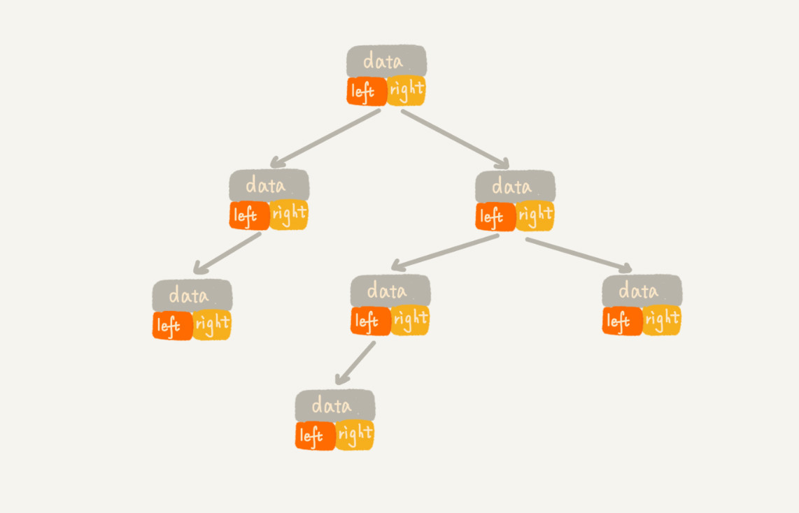
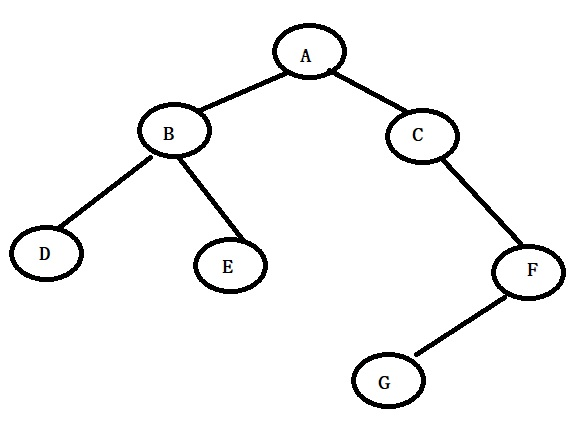
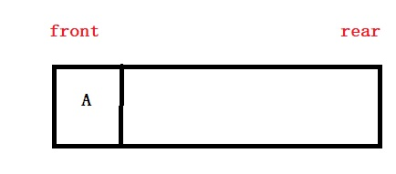
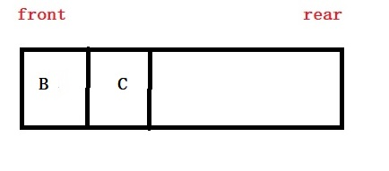
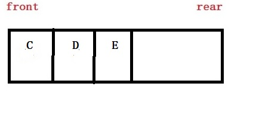
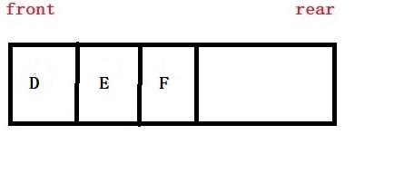
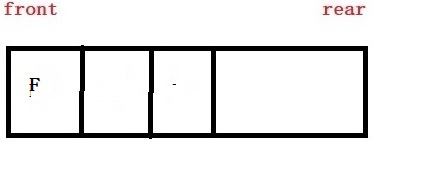
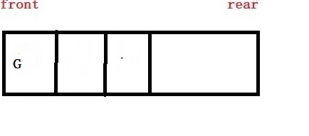
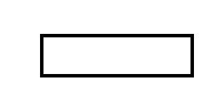
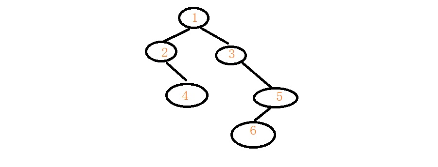

## 二叉树
对于树这块，基础部分都好理解，我仅仅整理树的难点知识

> 我们先想一下，二叉树如何存储？顺序存储还是链式存储？
> 我们尝试用这两种方式都去尝试存储树

#### 1.二叉树的顺序存储

我们用一个数组去顺序存储二叉树的节点。从数组下标1开始存储是为了方便计算孩子位置
每个节点的左孩子下标=2*当前节点位置， 每个节点的右孩子下标=2*当前节点位置+1
对比上图，很容易看出啦。

观察这个二叉树，数组很多空间没有被利用，所以顺序存储造成了巨大浪费。我们对比图1，发现，顺序存储适合存储完全二叉树。

#### 2.二叉树的链式存储

上图就是二叉树的链式存储，我们发现很形象，也很具体的描述了二叉树。
这种存储适合非完全二叉树的存储。

#### 3.二叉树的先序遍历

记住口号：**中左右**

先遍历自己，再左孩子，再右孩子。如图所示，此图的先序遍历结果是ABDECFG

	//先序遍历代码
	void pre_Order(struct Tree * t)
	{
		if (t == NULL)
		{
			return;
		}
		printf("%c", t->data);
		pre_Order(t->left);
		pre_Order(t->right);
	}
#### 4。二叉树的中序遍历

记住口号：**左中右**

先遍历左孩子，再自己，再右孩子。如图所示，此图的先序遍历结果是DBEACGF

	//中序遍历代码
	void mid_Order(struct Tree * t)
	{
		if (t == NULL)
		{
			return;
		}
		mid_Order(t->left);
		printf("%c", t->data);
		mid_Order(t->right);
	}
#### 5。二叉树的后序遍历

记住口号：**左右中**

先遍历左孩子，再右孩子，再自己。如图所示，此图的先序遍历结果是DEBGFCA
	
	//后序遍历代码
	void post_Order(struct Tree * t)
	{
		if (t == NULL)
		{
			return;
		}
		mid_Order(t->left);
		mid_Order(t->right);
		printf("%c", t->data);
	}

#### 6.二叉树的层序遍历

层序遍历满足我们人的视角，就是一层一层的访问树的每个节点，但是二叉树的层序遍历需要借助一种数据结构完成，我们需要让一层一层从左到右逐个访问，那么肯定用队列再合适不过了，先进先出的特性可以很好的解决层序遍历问题。

层序遍历步骤：

+ 让根节点入队
+ 出队一个元素，并打印此元素，将此元素的左右孩子从左到右依次都入队列。
+ 循环执行步骤二，直到队列为空

**模拟过程**

1. 让根节点入队

2.出队元素A，输出A，让它的孩子们逐个入队

3.出队元素B，输出B，让它的孩子逐个入队

4.出队元素C，输出C，让它的孩子们逐个入队

5.出队元素D，输出D，无孩子入队,出队元素E，输出E，无孩子入队。

6.出队元素F，输出F，让它孩子入队。

7.出队元素G，输出G，它无孩子，此时队列为空，遍历结束。

最终我们得到的中序遍历序列就是ABCDEFG

	/************** 层序遍历 ********************/
	void level_Order(struct Tree * t)
	{
		struct Tree* q[MAX];//队列
		struct Tree* temp;
		int front, rear;
		front = rear = 0;
		if (t != NULL)
		{
			q[rear++] = t;
		}
		while (front != rear)
		{
			temp = q[front];
			front++;//模拟出队列
			printf("%c ", temp->data);
			if (temp->left != NULL)
			{
				q[rear++] = temp->left;
			}
			if (temp->right != NULL)
			{
				q[rear++] = temp->right;
			}
		}
	}

#### 7.二叉树求高度
	

观察上图，该树的高度可以递归求得。
...
树高度 = 1 + max(2分支高度,3分支高度);
2分枝高度 = 1 + max(0,4分枝高度);
3分枝高度 = 1 + max(0,5分枝高度);
...
我们可以发现递归公式：某个分枝高度 = 1 + max(左分支高度,右分枝高度);

	int getHigh(struct Tree * t)
	{
		if (t == NULL)
		{
			return 0;
		}
		return getHigh(t->left) > getHigh(t->right) ? getHigh(t->left) + 1 : getHigh(t->right) + 1;
	}

#### 8.二叉树的节点个数

继续观察图片，发现树节点个数还是可以用递归实现

...
树节点个数和 = 1 + 2分枝总个数 + 3分枝总个数
2分枝总个数 = 1 + 0 + 4分枝总个数
3分枝总个数 = 1 + 0 + 5分枝总个数
...

递归公式：节点个数 = 1 + 左分支节点数 +右分枝节点数

	int getCount(struct Tree * t)
	{
		if (t == NULL)
		{
			return 0;
		}
		else
		{
			return getCount(t->left) + getCount(t->right) + 1;
		}
	}