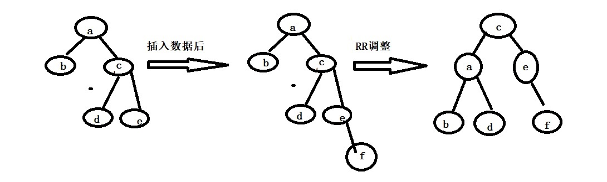
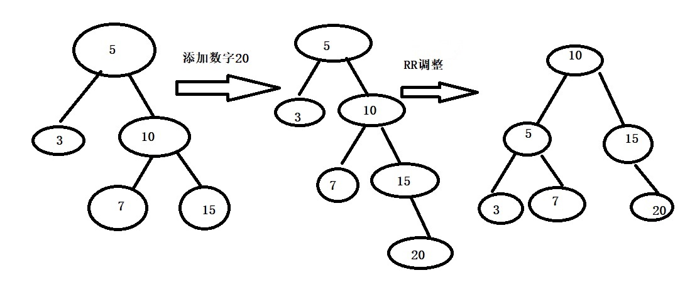
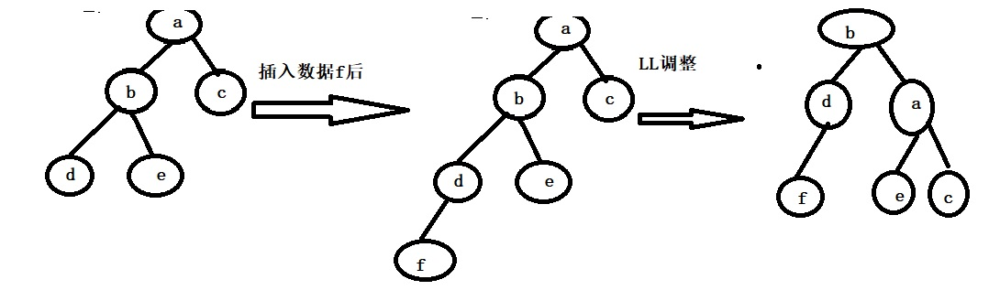
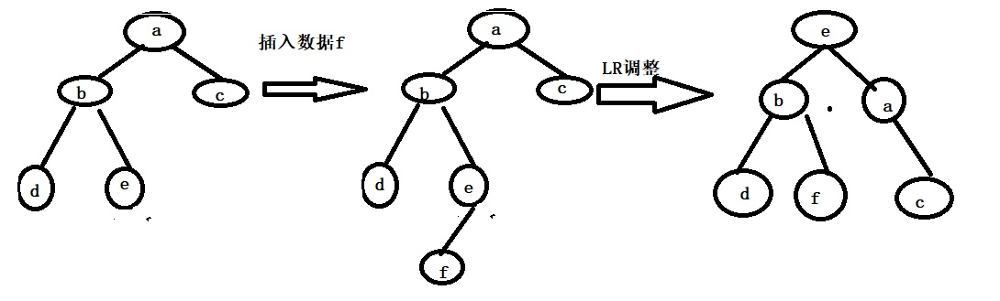
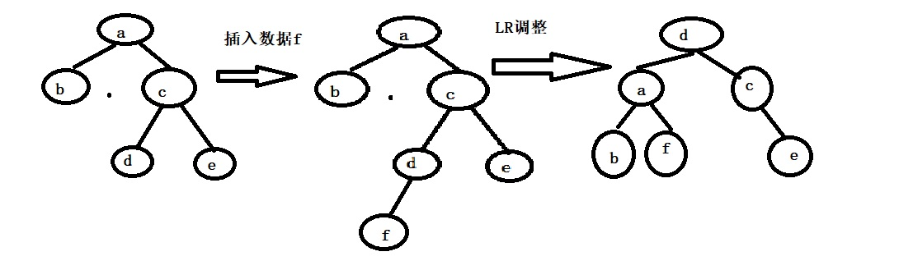
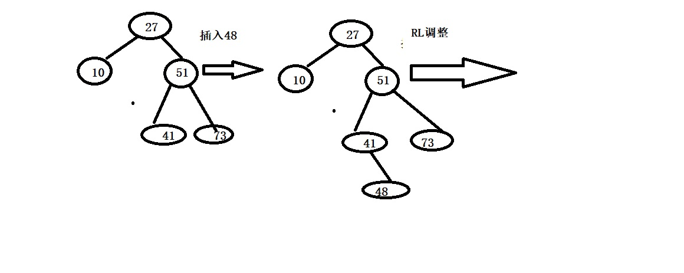

<h2 style = "color:red">平衡二叉树</h2>

> 平衡二叉树就是对二叉查找树的优化升级，它要求每个节点的左右子树的高度相差不大于1

平衡二叉树在插入数据时，当发生了高度的不平衡时，会采取4种旋转操作：LL,RR,LR,RL（左左，右右，左右，右左）旋转，我们来一一分析这4种旋转方式。

<h4 style = "color:blue">RR调整</h4>

针对右孩子的右子树引起的不平衡

**调整策略**

+ 右孩子c左上旋转作为根节点
+ 根节点a左下旋转作为c的左子树
+ c的左子树作为a的右子树

	

<h4 style = "color:blue">LL调整</h4>

针对左孩子的左子树引起的不平衡

**调整策略** 

+ 左孩子b右上旋转作为根节点
+ 根节点a右下旋转作为b的右子树
+ b的右子树作为a的左子树

<h4 style = "color:blue">LR调整</h4>

针对左孩子的右子树引起的不平衡

**调整策略** 

+ 左孩子的右孩子e右上旋转为根节点
+ 根节点a右下旋转为右子树
+ e的左孩子成为b的右孩子，e的右孩子成为a的左孩子

<h4 style = "color:blue">RL调整</h4>

针对右孩子的左子树引起的不平衡

