<h2 style="color:red">B树与B+树</h2>

<h3 style="color:green">B树(B-树)</h3>

> B树的中文名就是平衡树的意思，由于历史问题，B树被赋予了另一种叫法，B-树。为什么要产生B树这种奇怪的数据结构？其实这个是为了解决平衡二叉树的不足，平衡二叉树可以很好的维持查找效率在log(2^n),但是当数据十分庞大时，树的高度就绝对了磁盘的IO次数，我们知道IO的效率是比较低效的，我们尽可能去减少IO次数，所以就产生了B树这种高效率的查找树。

我们先看看一颗B树吧.

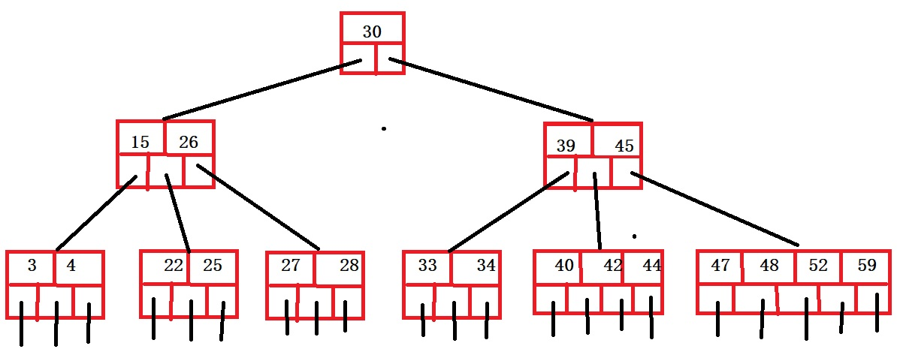

<h4 style="color:red">B树的特点</h4>

+ 每个节点由两部分组成，关键字项和指针项。每个节点的指针数目等于关键字数目加1.
+ B树的阶m，指此树中最大指针数(孩子节点)个数为m,也就是最大关键字个数m-1.上图的b树就是5阶B树。
+ 根节点的指针项(孩子节点)最少2个,当然因为阶数的控制，最多就是m个。
+ 除了根节点外，其它节点至少有(m/2向上取整)个指针项(孩子节点),上图的就是指最少3个孩子。
+ 每个节点的关键字是有序排列的。
+ 每个节点的关键字中左边指针总是小于该关键字，右边总是大于该关键字，如果指针位于两个关键字中间，指针指向的节点的所有关键字都介于这两个关键字之间。

注意点：B树的阶，不是根据B树中目前指针项目最大的那个去确定，实际上，B树的阶数在构造时，就已经确定好B树的阶数。然后在填充数据时，规定了B树中最大指针个数(孩子节点的个数)不超过B树的阶数.

标准B树

假设我们事先定义我们的B树是3阶的。看下图，我们每个节点的指针数组就是确定好的3个。

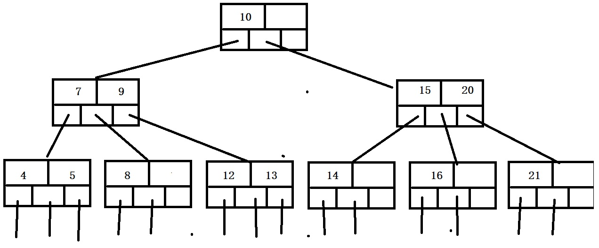

<h4 style="color:red">B树的结构体</h4>

	struct Btree
	{
		int num;//当前树关键字个数	
		int data[MAX];//保存关键字的数组
		struct Btree *parent;//双亲指针
		struct Btree *child[MAX];//指向孩子节点的指针
	};
	

<h4 style="color:red">B树查找</h4>

我们查找数据22和43吧。 
首先查找数据22，来到根节点，发现30大于目标点22，向左走来到了左边的节点，此时逐个遍历该节点的数据，发现22位于15和26之间，所以根据指针，来到了第三层的第二个节点。遍历该节点，找到了数据22。
记下来查找数据43，首先到根节点，发现43大于根20，来到右孩子，发现43位于新节点的39和45之间，右来到了了第三层的第5个节点，遍历该节点的关键字，发现位于该节点关键字的42和44之间，继续往下走，发现到底了，证明没有该关键字。

<h4 style="color:red">B树插入</h4>

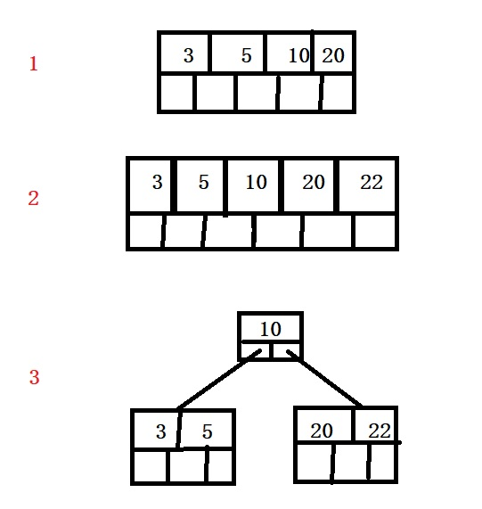

> 插入操作的步骤：首先在B树中按照查找操作寻找合适位置(一直找到叶子节点)，当找到的节点未达到阶数最大，表明可以将关键字插入到此节点里面。如下图，关键字3,5,10,20依次进入同一节点。当找到的节点阶数达到了最大数，此时先将该关键字插入进去，然后进行拆分操作。如下图步骤2和3.

上图是插入需要注意的，首先我们假设此B树是一个5阶树，此时的阶数已经是最大了，现在要插入一个数据22，此时插入，不满足B树的阶了，所以我们在插入时采取从(阶数/2处分离的措施),此时将新节点如图2所示，从10关键字拆分成左右2份，将10指向这两个节点。

接下来，我们来完整的创建一个B树(数据不断插入)
{1,2,6,7,11,4,8,13,10,5,17,9,16,3,20,12,14,18,19,15} 

1.数据1，2，6，7，11依次插入。
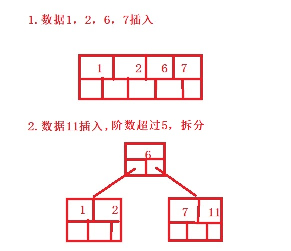
2.数据4，8，13，10依次插入。
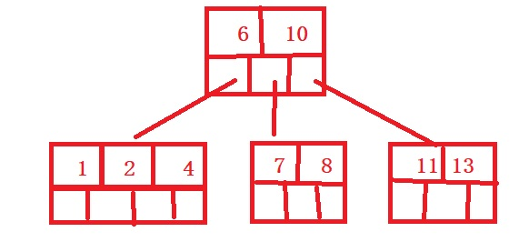
3.插入5,17,9,16,3,20,12,14,18,19
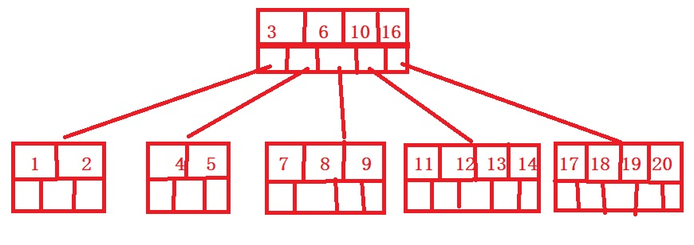
4.插入15
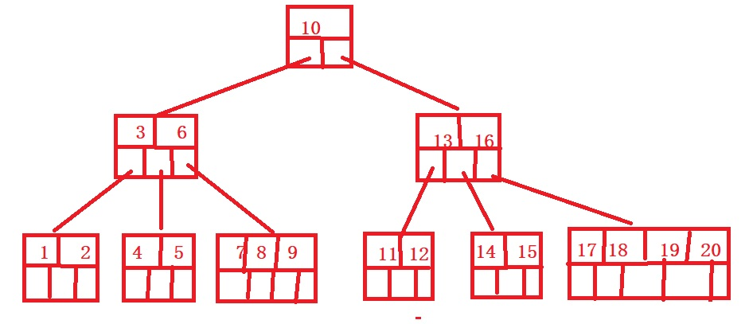

<h4 style="color:red">B树删除</h4>

> B数的删除操作比较复杂，我们可以通过举例子分析问题(5阶B树)

1. 删除叶子节点的关键字后，仍满足B树的特性(每个节点的关键字个数最少是m/2的上界)，那么直接删除此关键字，若不满足B树的特性，可向左右兄弟借关键字，若不能借，采取合并操作。
4. 删除有孩子节点的关键字，类比删除二叉查找树的特性，先向左走一步，再一直向右走，直到叶子，看该节点是否能借关键字，如过不能。就先向右走一步，再一直向左走，直到叶子节点，看该节点能否借关键字，如果不能，采取合并操作。

我们将上图的B树，进行几次删除的举例。

1. 删除关键字8，8是叶子节点，删除后，关键字个数仍然满足B树的特性，直接删除。
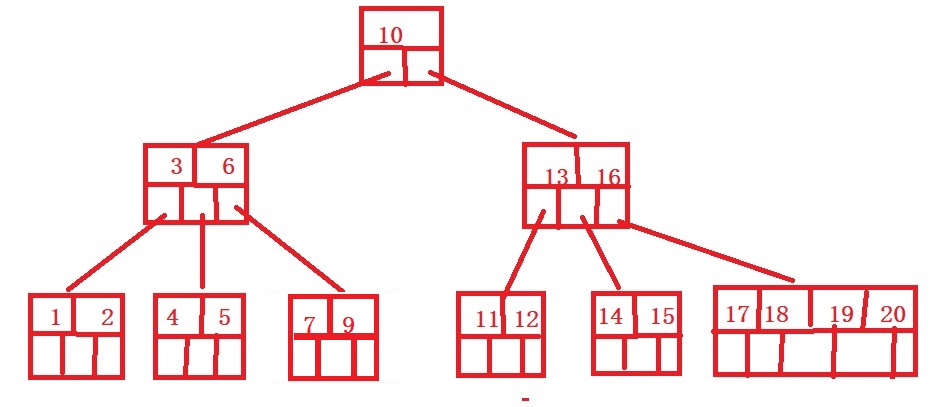
2. 删除关键字16，16不是叶子节点，我们先左走，一直向右走，来到了第三层的第5个节点，此时该节点已经是B树的下限关键字个数了。所以我们重新先向右走一步，一直向左走，来到了第三层的第6个节点，此时它的关键字个数可以借用，所以将17移上去，16删除。
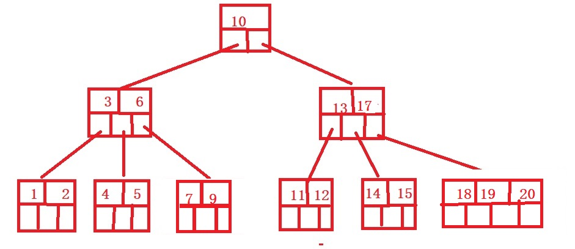
3. 删除关键字15，15是叶子节点，删除后，该节点的关键字个数不满足B树的特性，所以向兄弟借，此时右边的节点可以借。将15的父亲节点的17下来放在15的位置上，将右兄弟的第一个关键字放在父元素的位置上。
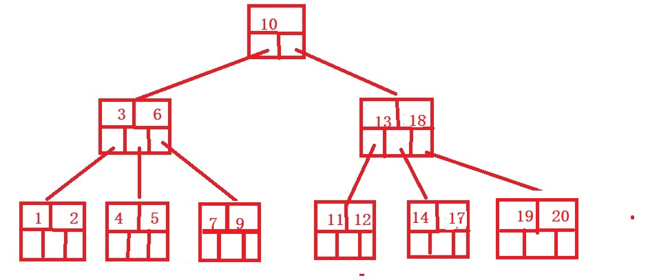
4. 删除关键字4，4是叶子节点，发现该节点的关键字个数已经是最少的，得向左右节点借，发现左右节点的关键字也已经到达了临界值，于是只有合并兄弟节点的操作了。左右兄弟都可以合并，我们选左边去合并，合并的时候，父亲节点3下来，参与合并，之后删除关键字4
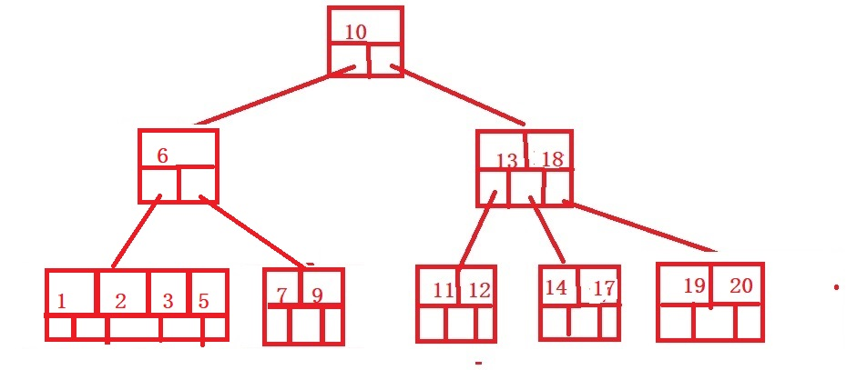
5. 此时我们发现个问题，就是关键字6那个节点，不满足5阶B树的特性，所以必须继续与兄弟合并了。父亲10下来，参与合并。
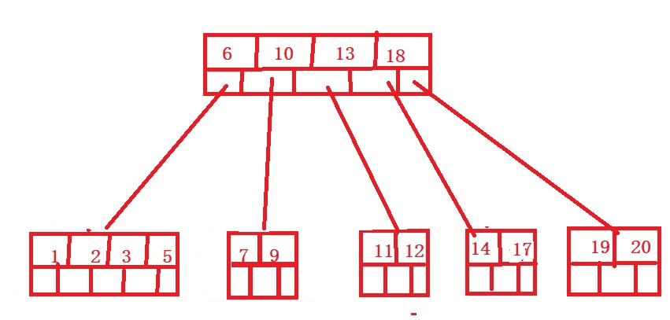

<h3 style="color:green">B+树</h3>

> B+树是B是的变体，其在B树基础上优化了许多，其特点就是保证了数据的稳定有序。

<h4 style="color:red">B+树的特点</h4>
+ 根节点或者没有子树，或者至少两个子树
+ 除了根节点外，其它节点最少有阶数/2的上界棵子树
+ 每个节点有n个关键字那么就有n个子树(不同于B树的一点)
+ 树的非叶子节点存储的只是索引，叶子节点存储的才是关键字，且叶子节点用链表串联起来。
+ 每个节点的索引或者关键字都是有序的，节点的索引值表示的是孩子节点值的最大值。

<h4 style="color:red">B+树的查找</h4>
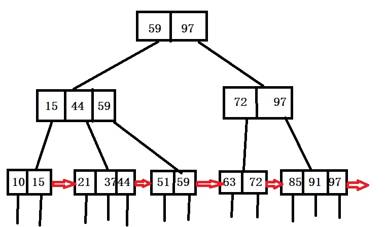

首先上面的图就是好一个B+树,对比B+树的特性。发现，好神奇，好复杂。
> B+树的数据都存储在叶子层，非叶子节点都只是索引，索引的每一项数据存储的是它孩子节点的数据的最大值。(这几句话十分十分重要)

> 查找步骤：从根节点开始，向下找，根据每层节点的数据，判断去下一层的哪个节点，一直找到叶子为止(B树只要在某一层找到数据，就退出)。

1. 假设我们查找数据51，首先来根节点，根节点第一个数据是59，表示左孩子的值都不超过59，所以去左分区，接下来，来到了第二层第一个节点，此时51都大于15，44，且小于59，来到了59的索引分区，继续向下走，到了叶子节点(第三层第三个),遍历该叶子节点的数据，找到了51,成功找到。
2. 假设我们继续找数据60，首先来到根节点，大于59，小于97，来到了97索引的孩子(第二层第二个),继续判断，发现60下于72，就来到72的孩子(第三层第四个),此时已经是叶子层了，遍历该节点的数据，发现无数据60，查找失败。

<h4 style="color:red">B+树的插入</h4>

> B+树的插入操作和B树有许多相似之处，可以说是B树插入的借鉴版并具有自己的插入特点。
> 
> 插入方法：先按照查找到方式，找到该数据合适的节点，就是来到叶子节点项。接下来按照下列总结 
> 
1. 此节点的数据个数是否达到最大，如果没有达到最大，直接插入（保证节点间的数据有序）
2. 如果此节点数据个数已经最大，则进行节点的分裂。先将数据插入该节点，假设此时的数据个数是x,则第⌈x/2⌉的数上升到双亲节点里，且前⌈x/2⌉个数组成一个节点，后⌊x/2⌋个数组成一个节点。如果其双亲在添加数据前也达到了最大，继续添加进去，进行节点分裂操作。
3. 还有一个特殊且重要的一点，当插入的数据是当前节点的最大值，首先需要修改其双亲节点的指针数据，然后一直判断到根节点为止。接着在根据步骤1或者2判断执行插入。

下面，我将插入一堆数据，来演示整个构建一个三阶B+树的过程。(帮助大家理解插入方法)

1,13,5,7,10,2,20,3,6,30

1.插入数据1，13，5，7
 

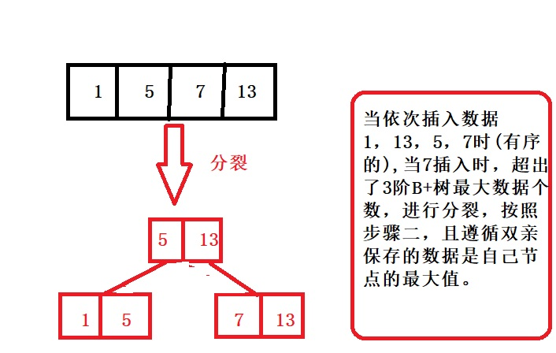

2.插入数据10,2,20

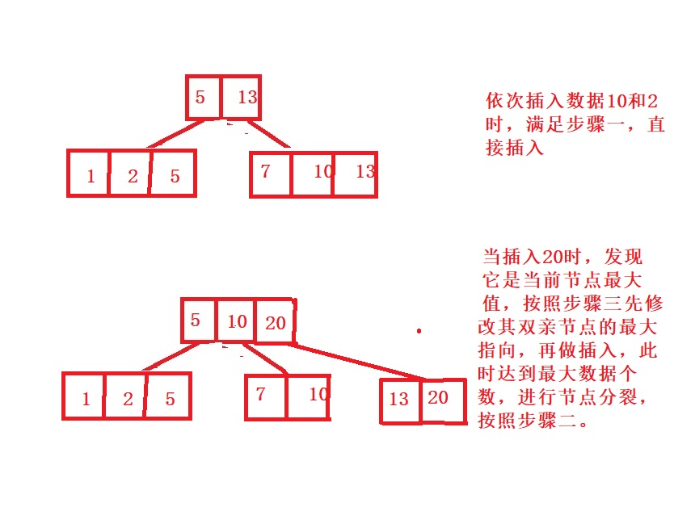

3.插入数据3

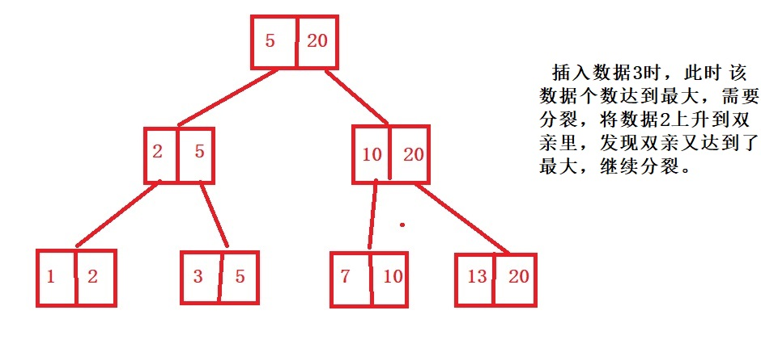

4.插入数据6，30

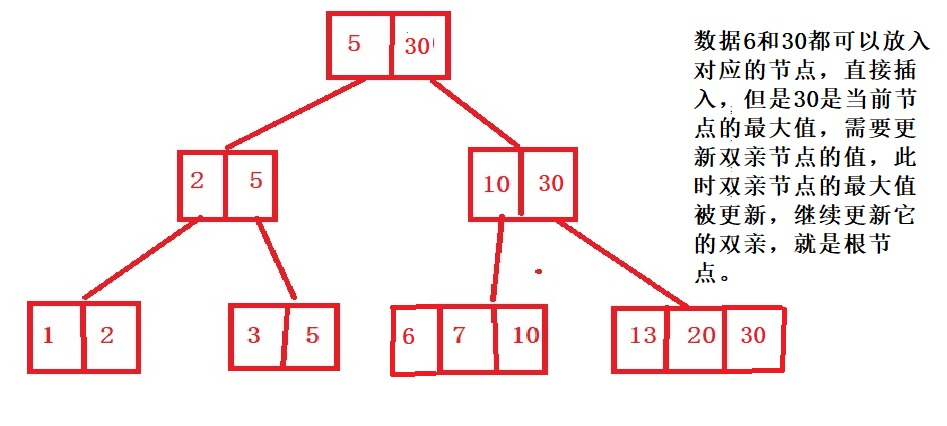

<h4 style="color:red">B+树的删除</h4>

> 删除操作也可以总结为一下几点
> 
1. 如果待删除节点删除一个数据后，仍满足B+树的特性，直接删除数据
2. 如果待删除节点删除一个数据后，不满足B+树的特性，此时其兄弟节点删除一个数据后，满足B+树的特性，可以向兄弟节点借数据。
3. 如果步骤1和2都不满足，采取节点的合并措施。
4. 和插入一样，需要注意一个特殊点，当删除的数据是该节点的最大值，需要从当前节点到根节点判断并修改数据。

我还是通过举例子分析吧，我们还是对3阶B+树进行操作。

1.删除数据37，首先按照查找找到数据37，发现该数据对应的节点删除后，满足B+树的特性，直接删除

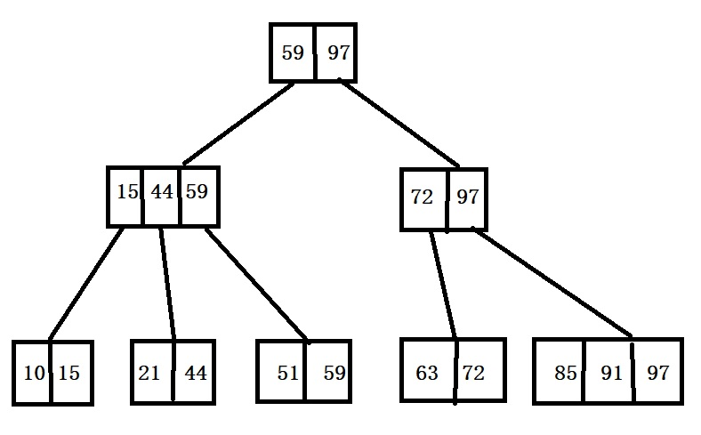

2.删除数据97，因为97是该节点的最大值，先修改其双亲节点的值，继续向上更新到根，发现删除97后，满足B+树的特性，直接删除。

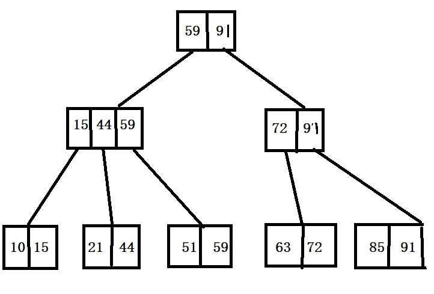

3.删除数据21，发现该节点数据个数已经是下限了，采取步骤二，发现其兄弟节点的数据个数都是下限了，采取步骤三，合并，左右都可以合并，我们合并左边的。

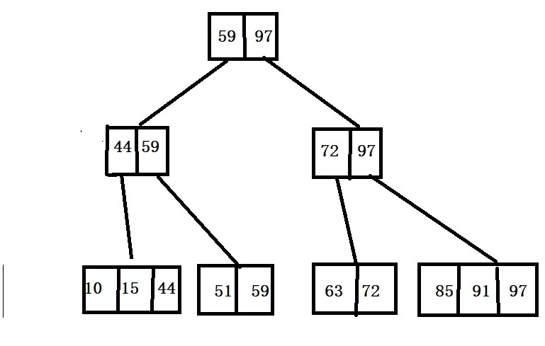

好了，我列举的可能只是删除的一部分，还有许多情况，其实你只要抓住删除的三点，和B+树的特征，就可以保证B+树的删除完整性了。