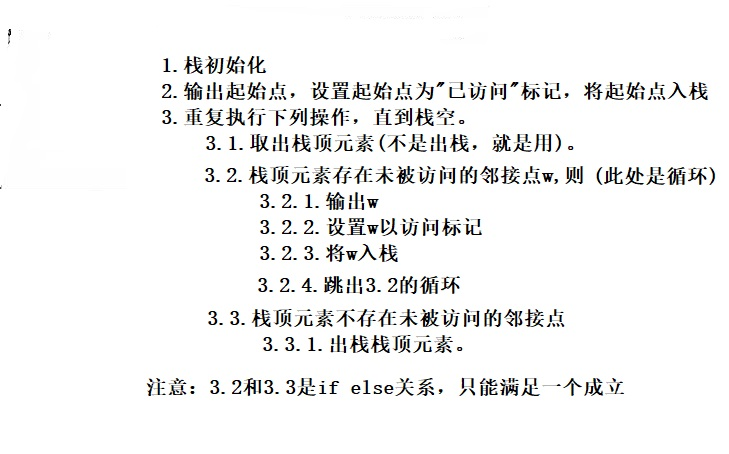
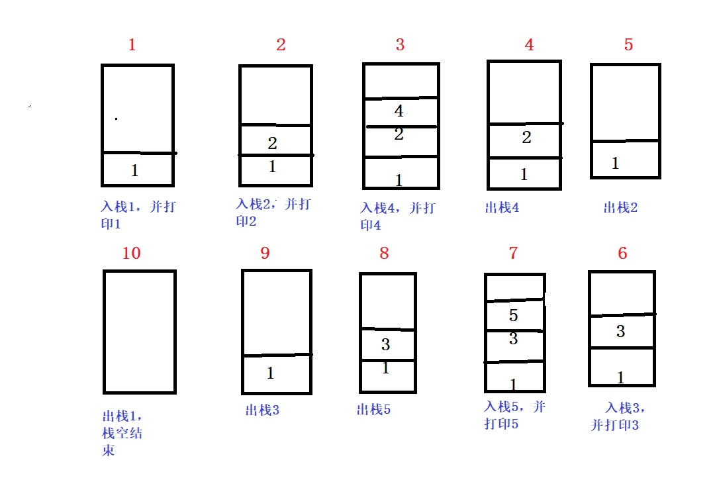
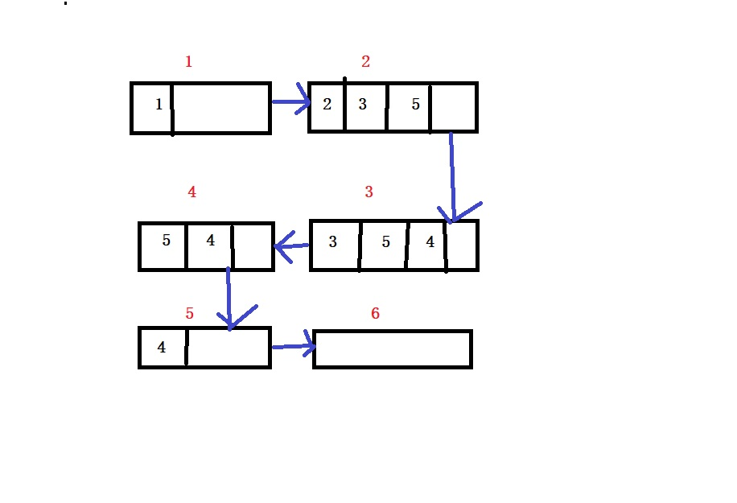

## 图的深度和广搜优先遍历

<h3 style = "color:red">深度优先遍历</h3>

> 深度优先搜索就好比走迷宫，当走到一个岔路口时，你随机选择一条路往下走，当发现走到前面无路可走时，回退到前一个岔路口重新选择另一条道路去重复上述过程。

我们按照上图去走一遍深度优先搜索你就清楚了。
随机选择一个起点，此处是1，有3个岔路口可选择我们随便选，就选数字2，然后继续判断2只有一个岔路口，只能向前走，走到了4，接下来发现4无路可走了，我们要回退一步到2，发现2也无路可走(每次都不包含走过的)继续回退到1上，发现1还有两个岔路口可走，我们选择3，继续向前，3发现前面有一个没走的就是5，，此时发现所有点都走过了，遍历结束。整个过程就是1，2，4，3，5

**总结就是，一直向前走，不碰南墙不回头!**

深度优先搜索过程其实就是回溯，如果你不清楚回溯，可参考算法回溯那一章。

+ <h4 style = "color:blue">深度搜索的递归</h4>

		//深度搜索过程
		void DFS(struct MGraph *g, int index,int *visit)
		{
			printf("%c ", g->vetex[index]);
			visit[index] = 1;//标记走过了
			for (int i = 0; i < g->numVretexes; i++)
			{
				if (visit[i] == 0 && g->data[index][i] != 0)
				{
					DFS(g, i, visit);
				}
			}
			printf("\n");
		}

		//图的深度遍历--邻接矩阵
		void DFS_Matrix(struct MGraph *g)
		{
			int *visit;
			visit = (int*)malloc(sizeof(int)*g->numVretexes);
			for (int i = 0; i < g->numVretexes; i++)
			{
				visit[i] = 0;
			}
			for (int i = 0; i < g->numVretexes; i++)
			{
				if (visit[i] == 0)//该顶点未遍历到，开启深度搜索
				{
					DFS(g, i,visit);
				}
			}
		}
	

+ <h4 style = "color:blue">深度搜索的非递归</h4>

深度遍历的非递归处理就是模拟系统栈的工作方式去表现递归过程。

下面我们用栈模拟非递归过程

	//深度遍历-邻接矩阵-非递归(栈实现)
	void DFS_Matrix_Stack(struct MGraph *g,int index)
	{
		//定义标记顶点是否访问
		int *temp = (int *)malloc(sizeof(int)*g->numVretexes);
		int i, j;
		//定义临时存储栈
		int *stack = (int *)malloc(sizeof(int)*g->numVretexes);
		int top = -1;
		for (i = 0; i < g->numVretexes; i++)
		{
			temp[i] = 0;
		}
		stack[++top] = index;
		printf("%c ", g->vetex[index]);
		temp[index] = 1;
		while (top != -1)
		{
			int num = stack[top];//取栈顶元素
			for (j = 0; j < g->numVretexes; j++)
			{
				if (temp[j] == 0 && g->data[num][j] != 0)
				{
					printf("%c ", g->vetex[j]);
					temp[j] = 1;
					stack[++top] = j;
					break;
				}
			}
			if (j == g->numVretexes)
			{
				top--;
			}
		}
		printf("\n");
	}
	

<h3 style = "color:red">广度优先遍历</h3>

> 广度优先搜索类似于树的层层递进的搜索，其实广度优先搜索就是分支限界的体现，具体的分支限界可参考我写的分支限界算法那一章节。从一个点开始，就类别为根节点，凡是和这个节点有关联的都遍历一遍，然后重新从最左边第一个关联点去重复上述过程，直到整个点都遍历到。

图中的广度优先遍历借助辅助队列完成，我们看一个例子

我们随便选择一个起点假设就是1，然后1入队列。接着出队列一个元素，就是1出去，出去的同时把它所有关联的点都入队，所以2，3，5都入队列如图2所示。继续出队列一个元素，此时2出去了，出去的同时将它所有关联点入队，所以4入队列，继续3出队列，3关联的都已经访问了，所以无元素入队。同样5出队，4出队，队列为空，结束。
此时的一条遍历顺序就是1，2，3，5，4
	
	//邻接矩阵的广度搜素
	void BFS_Matrix(struct MGraph *g)
	{
		int *temp, *queue, front, rear;
		front = rear = 0;
		temp = (int*)malloc(sizeof(int)*g->numVretexes);
		queue = (int*)malloc(sizeof(int)*g->numVretexes);
		for (int i = 0; i < g->numVretexes; i++)
		{
			temp[i] = 0;
		}
		queue[rear++] = 0;
		printf("%c ", g->vetex[0]);
		temp[0] = 1;
		while (front != rear)
		{
			int num = queue[front];
			front++;
			for (int i = 0; i < g->numVretexes; i++)
			{
				if (temp[i] == 0 && g->data[num][i] != 0)
				{
					queue[rear++] = i;
					printf("%c ", g->vetex[i]);
					temp[i] = 1;
				}
			}
		}
	}