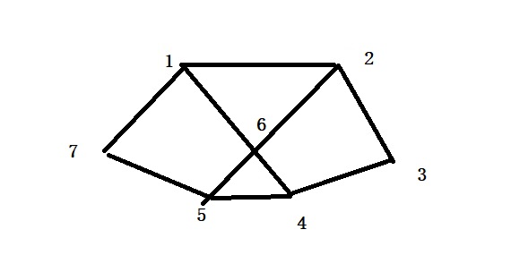
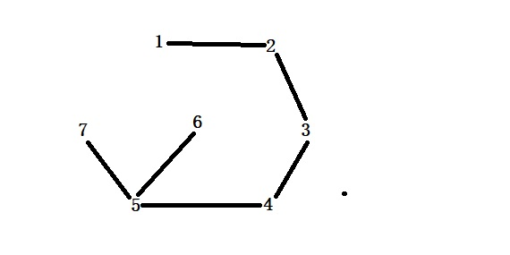
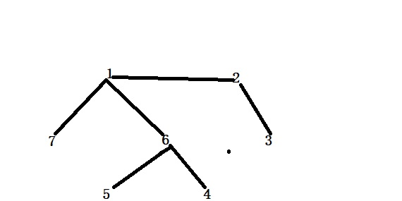
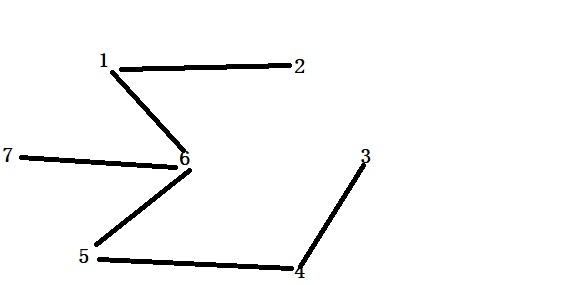
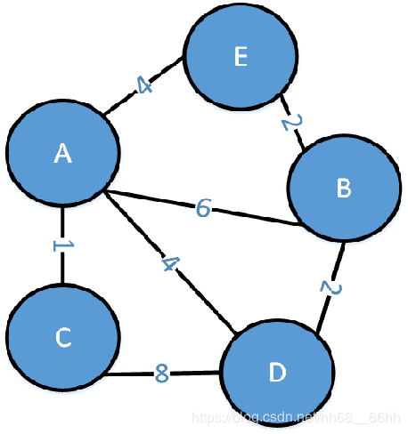
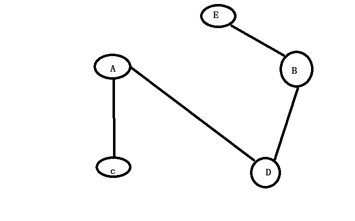
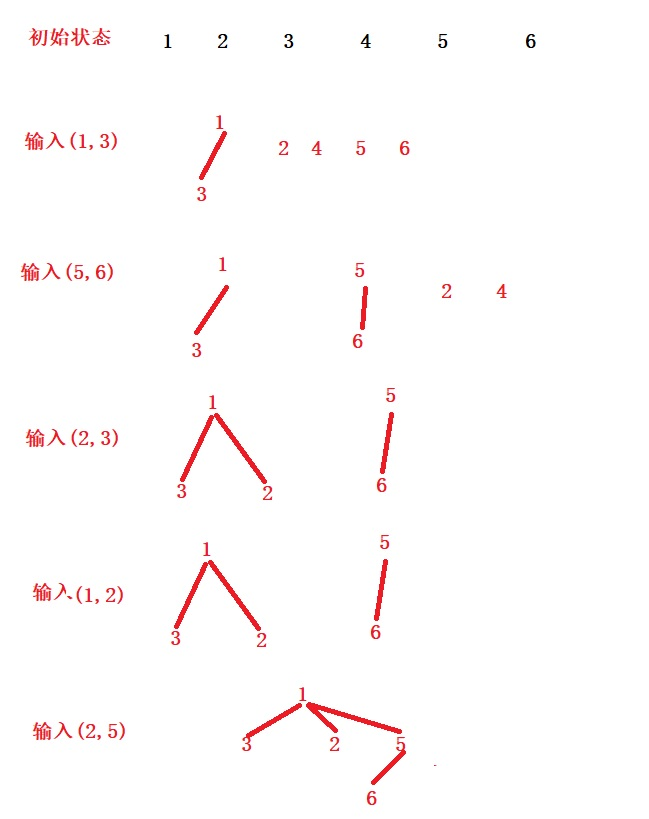
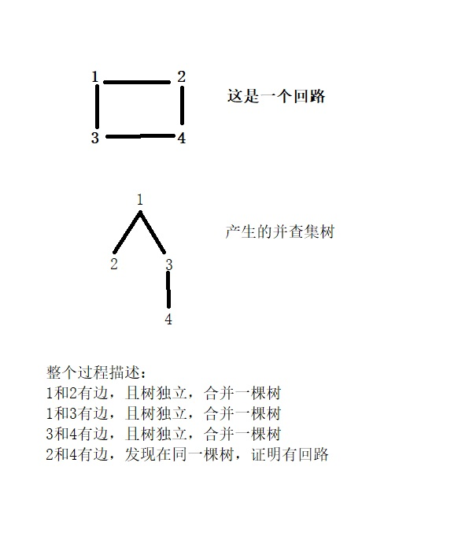

<h2 style = "color:red">最小生成树</h2>

> 引论：研究最小生成树之前，我们还是先搞清楚什么是生成树。子图包含原图的所有顶点且边数等于顶点数减去一，并且要求子图不产生回路。

总结起来就三点：1.包含图所有顶点。2.边个数等于顶点个数减去一。3.围成的新图不能产生回路(就是树了)

概念是死板的，我来画图演示。

根据概念，我们知道生成树的是不唯一的,我们列举出3种生成树。 

<h5 style="color:blue">深度优先遍历</h5>

忘记深度优先遍历可以去看看我写的深度遍历算法，此时利用深度遍历所有顶点就可以构成生成树。
<h5 style="color:blue">广度优先遍历</h5>

<h5 style="color:blue">自己手动随便构造</h5>

好了，看了上面的三种生成树，我们就可以讲解我们的最小生成树了，最小生成树就是在构造生成树时，原图的边是带权值的，我们构造的生成树权值之和要求最小，此时的生成树就是最小生成树。

> 最小生成树主要有两类经典算法，一个是普利姆算法，一个是克鲁斯卡尔算法

<h3 style="color:green">Prime算法</h3>

> Prime算法直接口述，你可能会懵逼，且不好表述，直接上它的算法步骤吧。

1. 随便选择一个顶点作为起点，然后设置数组dis,存储其余点到起点的距离，自己到自己距离0，两个点之间没有直接边相连的距离是无穷大
2. 经过N此操作(N=顶点数-1)
	1. 选择一个未被选择的点k，且dis[k]是当前dis数组最小的
	2. 标记点k被选择
	3. 以k为中介点，但凡未被访问点x点k的距离小于之前dis[x]的距离，就更新dis[x]为点x到点k的距离
3. 得到最小生成树。

看下面这个过程，大家感受下算法步骤吧

1.初始化时各个顶点对应下标

|顶点|A|B|C|D|E|
|----|----|----|----|----|----|
|下标|0|1|2|3|4|

2.假设我们从A开始. 设置权值数组存储各个点到A点距离. 设置前驱下标数组存储各个点前驱下标，初始所有点的前驱下标都是指向A，所以初始化为A下标0. 设置标记点数组，用来标记每个点是否被用，0表示未使用，1代表被使用。

3.0初始的状态,点A是起点，标记被访问

|顶点|A|B|C|D|E|
|----|----|----|----|----|----|
|下标|0|1|2|3|4|
|权值|0|6|1|4|4|
|前驱下标|0|0|0|0|0|
|标记点|1|0|0|0|0|

3.1此时权值数组最小的权值是1，(每次都是从未被访问点中找最小权值)对应的点是C，所以第一次选择点C，c的前驱下标是0,代表它前驱是A，所以选择A-C边，修改C点被标记，设置标记点是1，然后以C点位基础，逐个遍历未被访问点，首先是B，点C到点B的权值是无穷，所以不小于权值6,不修改，接着是点D，点C到点D的权值是8，大于权值数组值4，也不修改。接着是点E，点E到点C的距离也是无穷大，也不修改，结果如下表

|顶点|A|B|C|D|E|
|----|----|----|----|----|----|
|下标|0|1|2|3|4|
|权值|0|6|1|4|4|
|前驱下标|0|0|0|0|0|
|标记点|1|0|1|0|0|

3.2继续选择权值数组里最小的是4，对应的是d和e，随便选择一个点，我们选择d,标记d被用，d的前驱下标是0，对应点A，所以打印A-D,接着遍历未被访问点到d点的距离，首先是点B，点B到点D的距离是2，小于当前权值数组的6，修改B对应权值是2，并且修改B的前驱下标是D的下标3。接着是点E，点E到点D的距离是无穷大，不修改。对应结果如下表

|顶点|A|B|C|D|E|
|----|----|----|----|----|----|
|下标|0|1|2|3|4|
|权值|0|2|1|4|4|
|前驱下标|0|3|0|0|0|
|标记点|1|0|1|1|0|

3.3继续选择权值数组最小的是2，对应点是b,查看B的前驱下标是3，对应点D，打印B-D标记b被使用，遍历未被访问的点，首先是E，点E到点B的距离是2，修改权值数组E的权值是2，并且修改E的前驱点下标是b的下标1.结果如下表

|顶点|A|B|C|D|E|
|----|----|----|----|----|----|
|下标|0|1|2|3|4|
|权值|0|2|1|4|2|
|前驱下标|0|3|0|0|1|
|标记点|1|1|1|1|0|

3.4继续选择权值数组最小的是2，对应点e,e的前驱下标是1，打印b-e,设置E被访问，此时所有点都被访问到，结束

|顶点|A|B|C|D|E|
|----|----|----|----|----|----|
|下标|0|1|2|3|4|
|权值|0|2|1|4|2|
|前驱下标|0|3|0|0|1|
|标记点|1|1|1|1|1|

最终我们选择的边依次是a--c,a--d,b--d,b--e;构成了最小生成树

	//最下生成树-Prime
	void Prim(struct MGraph *g, char obj)
	{
		int index = 0, min, k;
		//标记数组temp（记录顶点是否被访问）
		int *temp = (int*)malloc(sizeof(int)*g->numVertes);
		//距离数组dis（标记当前最短距离）
		int *dis = (int*)malloc(sizeof(int)*g->numVertes);
		//前驱数组pre（标记每个点前驱节点）
		int *pre = (int*)malloc(sizeof(int)*g->numVertes);
		//寻找起点的下标
		for (int i = 0; i < g->numVertes; i++) {
			if (g->vetes[i] == obj)
			{
				index = i;
				break;
			}
		}
		printf("%d", index);
		//初始化数组
		for (int i = 0; i < g->numVertes; i++)
		{
			dis[i] = g->data[index][i];
			temp[i] = 0;//未访问
			pre[i] = index;//前驱都是起点
		}
		temp[index] = 1;
		for (int i = 1; i < g->numVertes; i++)
		{
			min = MAX;
			//找出最小权值的边,并标记点
			for (int j = 0; j < g->numVertes; j++)
			{
				if (temp[j] == 0 && dis[j] < min)
				{
					min = dis[j];
					k = j;
				}
			}
			//输出边
			printf("%c-->%c\n", g->vetes[index], g->vetes[k]);
			//修改dis,temp,pre数组
			temp[k] = 1;
			index = k;
			for (int j = 0; j < g->numVertes; j++)
			{
				if (temp[j] == 0 && g->data[k][j] < dis[j])
				{
					dis[j] = g->data[k][j];
					pre[j] = k;
				}
			}
		}
	}

<h3 style="color:green">Krusual算法</h3>

> Krusual理解起来十分简单，就是将所有边按照权值进行排序(升序)，然后从第一个边开始取，每次都判断加入新边之后是否构成回路，当遍历完所有边时，也就生成了最小生成树。

1.首先按照边的权值大小进行排序

|编号|起点|终点|权重|
|----|----|----|----|
|1|A|C|1|
|2|B|E|2|
|3|B|D|2|
|4|A|D|4|
|5|A|E|4|
|6|A|B|6|
|7|C|D|8|

2.逐个边的加入，判断每次加入是否构成回路

 + 加入AC
 + 加入BE
 + 加入BD
 + 加入AD
 + 加入AE时，产生了回路，不加入
 + 加入AB时，产生了回路，不加入
 + 加入CD时，产生了回路，不加入

最后结果如下图(最小生成树)

问题：如何判断是否构成回路？在手动时，我们可以自己发现是否有回路，但是在计算机中？这里又出现了一个经典的算法，并查集算法。

<h4 style="color:gold">并查集算法</h4>

我来举例子分析，你就知道这个算法的巧妙了。

假设有1-6号的人，每次输入两个随机的编号对应1-6号某两个人，输入n此后，我来给你随机的两个人，你需要判断出这两个人是否认识。例如我输入(1,2)(3,4)(5,6)表示1号与2号认识，3号与4号认识，5号与6号认识。此时我如果给你(3,5)，你肯定知道这两个人不认识。

接下来用并查集来计算两个人是否认识。我们输入的序列对依次是(1,3)(5,6)(2,3)(2,5)

+ 初始每个编号的人都是一个树
+ 每次输入两个编号时，先判断这两个编号对应树的根是否一样，一样证明两个人在一棵树上，不一样代表二者不认识，进行合并。

看上面整个过程，最后的树就是一个完整的关系树了，此时我问你3和6是否认识，你只需要判断3和6在一颗树？当然它两就在一棵树上。这个就是并查集算法了，它可以用来判断回路问题。你可能问？为什么可以？算了，还是看下图演示吧。

总结：所以我们利用并查集去每次加入新边时，判断这个边两个顶点是否在一棵树，不在一棵树，就证明加入当前边不构成回路，反之亦然。

	//最小生成树-Kruskal
	void Kruskal(struct MGraph *g)
	{
		int min = MAX, temp, num = 0,begin,end;
		struct Edge swap;
		struct Edge *edge = (struct Edge*)malloc(sizeof(struct Edge)*g->numEdges);
		struct UFStree *Utree = (struct UFStree*)malloc(sizeof(struct UFStree)*g->numVertes);
		//初始化edge，Utree
		for (int i = 0; i < g->numVertes; i++)
		{
			Utree[i].high = 0;
			Utree[i].index = i;
			Utree[i].parent = i;
			for (int j = 0; j < g->numVertes; j++)
			{
				if (i<j && g->data[i][j] != 0 && g->data[i][j] != MAX)
				{
					edge[num].begin = i;
					edge[num].end = j;
					edge[num].w = g->data[i][j];
					num++;
				}
			}
		}
		//按照边的权值排序(从小到大)
		for (int i = 0; i < num; i++)
		{
			min = edge[i].w;
			temp = i;
			for(int j = i+1; j < num; j++)
			{
				if (edge[j].w < min)
				{
					min = edge[j].w;
					temp = j;
				}
			}
			if (temp != i)//值拷贝
			{
				swap = edge[i];
				edge[i] = edge[temp];
				edge[temp] = swap;
			}
		}
		//进行逐个边的筛选
		for (int i = 0; i < g->numEdges; i++)
		{
			begin = edge[i].begin;
			end = edge[i].end;
			if (find_Tree(Utree, begin) != find_Tree(Utree, end))
			{
				union_Tree(Utree, begin, end);
				printf("%c-->%c-->%d\n", g->vetes[begin], g->vetes[end],g->data[begin][end]);
			}
		}
		
	}

	//并查集的查找--根节点
	int find_Tree(struct UFStree *tree, int num)
	{
		if (tree[num].parent == num)//到根了//
		{
			return num;
		}
		else
		{
			return find_Tree(tree, tree[num].parent);
		}
	}

	//并查集节点的合并
	void union_Tree(struct UFStree *tree, int x, int y)
	{
		//先找到各自根，判断高度
		int xP = find_Tree(tree, x);
		int yP = find_Tree(tree, y);
		if (tree[xP].high > tree[yP].high)
		{
			tree[y].parent = xP;
		}
		else if (tree[xP].high < tree[yP].high)
		{
			tree[x].parent = yP;
		}
		else
		{
			tree[y].parent = xP;
			tree[xP].high++;
		}
	}

