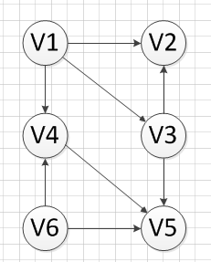
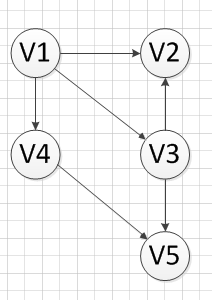
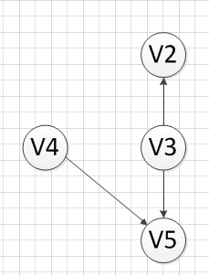
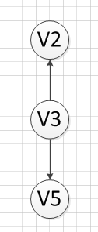
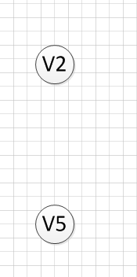
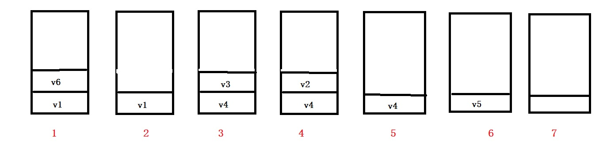

<h2 style="color:red">拓扑排序</h2>

> 拓扑排序是针对有向无环图定义的，此算法可以判断一个有向图是否存在回路。拓扑排序反应的是活动和工程的先后执行顺序。就好比我们CS专业的同学们，学习数据结构前我们得先离散数学这门课，学习算法，我们又得依托数据结构这门课。。。。

拓扑排序主要是根据一个有向图写出活动或工程的序列问题，如何写出该有向无环图的序列？

+ 从有向图中选择一个 没有前驱（即入度为0）的顶点并输出，并删除该顶点和所有以它为起点的有向边。(其实就是删除该点和该点有关联的边)

+ 重复上面过程，直到所有点被输出(此时可证明无环)

下图是一个有向图，我们进行拓扑分析

我们发现顶点v1和v6入度为0，随便选择一个，此处我们选择v6,删除顶点v6和它有关的边，并输出v6,如下图所示

接着我们发现顶点v1入度为0.删除这个点和它有关的边，并输出v1,如下图。

接着我们发现顶点v4入度为0.删除这个点和它有关的边，并输出v4,如下图。

接着我们发现顶点v3入度为0.删除这个点和它有关的边，并输出v3,如下图。

然后输出剩余度为0的v2和v5
 
所以整个过程的拓扑序列是v6-v1-v4-v3-v2-v5,注意拓扑排序的序列不是唯一的，因为每次入度为0的点可能有多个，每次选择不一样。

<h3>拓扑排序的代码实现</h3>

+ Kahn算法
+ 基于DFS的拓扑排序算法

<h4 style="color:red">Kahn算法</h4>

Kahn算法其实就是上面描述的整个过程

1. 初始化一个栈，遍历邻接表，将图中所有入度为0的点都入栈。
2. 出栈栈顶顶点x,并输出x，开始遍历邻接表，凡是由顶点x指向的点，都将该点的入度减去1，然后立即判断该点的入度是否为0，如果入度为0，就将此点入栈。
3. 重复步骤二，当栈空时退出，此时统计打印的顶点个数，如果个数等于图中的点个数，证明有向图无回路，反之证明有向图存在回路。

我们还是用上面的图演示一下。

下图是整个栈的演示过程

1. 初始化栈，将入度为0的所有点入栈，此时图1的v1,v6依次入栈。
2. 出栈栈顶v6,将于v6指向的点入度减去1，判断有没有入度为0的点，即v4和v5点入度减去1，但是它两入度不是0.
3. 出栈栈顶v1,将v1指向的v2,v3,v4入度减去1，此时v3,v4入度为0，将v4,v3依次入栈。
4. 入栈栈顶v3,将v3指向的v2,v5入度减去1，此时v2的入度为0，入栈v2
5. 出栈v2,v2无指向其它点
6. 出栈v4,,将v4指向的v5入度减去1，此时v5的入度是0,将v5入栈
7. 出栈v5,v5无指向其它点，栈空结束。

代码演示

	//拓扑排序的KaHn算法
	void KaHn(struct LGraph_List *g)
	{
		//辅助栈存储入度为0的点
		int *stack, top=-1,i,temp,count=0;
		stack = (int*)malloc(sizeof(int)*g->numVretexes);
		for (i = 0; i < g->numVretexes; i++)
		{
			if (g->list[i].degree == 0)
			{
				stack[++top] = i;//存储的是点的下标
			}
		}
	//栈空退出
		while (top != -1)
		{
			//出栈栈顶元素，并输出栈顶元素
			temp = stack[top--];
			printf_s("%c ", g->list[temp].data);
			count++;
			//与该点有关联的都度数减一,当度数为0，继续入栈。
			for (i = 0; i < g->numVretexes; i++)
			{
				if (temp != i && g->list[i].degree!=0)
				{
					struct Node *p;
					p = g->list[i].head;
					while (p != NULL)
					{
						if (p->index == temp)
						{
							g->list[i].degree--;
						}
						p = p->next;
					}
					if (g->list[i].degree == 0)
					{
						stack[++top] = i;
					}
				}
			}
		}
		//如果输出的顶点个数不等与总顶点个数,证明当前存在环。
		if (g->numVretexes != count)
		{
			printf_s("有向图存在回路!\n");
		}
	}

<h4 style="color:red">基于DFS实现</h4>

这个和DFS遍历顶点的算法一摸一样，只是在最后加入了输出顶点信息，因为递归到最后一层，该点的逆邻接表是空的，此时该顶点的入度就是0.

	//基于DFS的拓扑排序算法
	void DAG_DFS_Init(struct LGraph_List *g)
	{
		int *visit,count=0;
		visit = (int*)malloc(sizeof(int) * g->numVretexes);
		for (int i = 0; i < g->numVretexes; i++)
		{
			visit[i] = 0;
		}
		for (int i = 0; i < g->numVretexes; i++)
		{
			if (visit[i] == 0)
			{
				DAG_DFS(g, visit, i,&count);
			}
		}
	}
	void DAG_DFS(struct LGraph_List *g, int *visit, int num,int *count)
	{
		struct Node *p;
		p = g->list[num].head;
		visit[num] = 1;
		while (p != NULL && visit[p->index]==0)
		{
				DAG_DFS(g, visit, p->index, count);
				p = p->next;
		}
		printf_s("%c ", g->list[num].data);
	}

