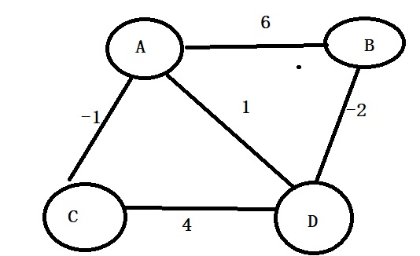

<h2 style="color:red">图的最短路径</h2>

+ 迪杰斯特拉算法
+ 贝尔曼-福特算法
+ 弗洛伊德算法
+ SPFA算法(**中国西南交通大学段凡丁发明**)

> 最短路径问题分为两类，一大类是求一个顶点到其余各顶点的最短路径问题，另一大类是求各个顶点间最短路径问题。

<h3 style="color:blue">迪杰斯特拉</h3>

> 迪杰斯特拉算法就是求解一个点到其余各点的最短路径算法，无向图带权图和有向带权图都适用。缺点是不适用权值为负数的图(后面会讲解原因)

算法步骤

1. 初始的点为起点，我们用s集合存储已经确定最短路径的点的集合，那么s={v},起点加入。其余各个点到v点的权值存储在dis数组里，不是直接连接的点距离都是无穷大
2. 从dis数组选出一个顶点u，这个点u到v点距离最小，把u加入s集合表示u已经确定了最短路径
3. 以点u为中介点，将除了s集合存储的点以外的其余点逐个判断，如果某个点x存在dis[u]+u点到x点距离<dis[x],就更新x的路径。
4. 重复2，3步骤，直到s集合包含了所有点。

我们还是直接上图看完整流程

首先我们先准备几个辅助数组,我们假设从点A为起点，找其它点到点A的最短路径

|节点|A|B|C|D|E|
|----|----|----|----|
|下标|0|1|2|3|4|
|权重|0|4|∞|2|∞|
|标记|1|0|0|0|0|
|前驱|-1|0|-1|0|-1|

我来说明下，这几个数组的作用
权重数组存储每个点到A点的最短距离 
前驱数组存储的是每个点前驱点下标，例如B点前驱是0，表示B和A连接,前驱是A 
标记数组存储的是当前点是否已经找到了最短路径。 
接下来我们准备工作做好了，开始干活了!

1.按照算法步骤，找出没被标记点中权重最小的点，我们找到了D点，将D点标记为1，表示D点以确认最短路径，然后以D点为中介判断未标记点，首先来到了B点，权重数组中B对应的是4，根据算法步骤3，我们计算出权重数组D+BD距离2+1=3 < 4(4就是权重数组B的值)所以B当前有一条路径比之前近，所以修改了B点对应的权重为3，同时更新它的前驱是D的下标。意思就是经过D点到B，更加近。同理继续看下一个未被标记的点C，继续计算权重数组D+CD距离 2+1=3 <∞,拿C点也要修改权重为3，同时更新C点前驱是D，继续看下一个未被标记点E，发现权重数组D+DE=9<∞,所以也修改E点权重为9，同步更新它的前驱是D。如下表就是第一次更新后的结果

|节点|A|B|C|D|E|
|----|----|----|----|
|下标|0|1|2|3|4|
|权重|0|3|3|2|9|
|标记|1|0|0|1|0|
|前驱|-1|3|3|0|3|

2.找出当前表中未标记点权重最小的，来到了B点和C点，我们选择B(随便哪一个都行)将B标记为1，接着逐个判断未被标记点，首先是C，权重数组B+BC距离 3+4 >3所以不修改。又来到了E，权重数组B+BE 3+∞ >9 ,也不修改，如下表就是第二次更新的结果

|节点|A|B|C|D|E|
|----|----|----|----|
|下标|0|1|2|3|4|
|权重|0|3|3|2|9|
|标记|1|1|0|1|0|
|前驱|-1|3|3|0|3|

3.找出当前表中未被标价点权重最小的是C点，将C点标记为1，然后判断未被标记的，只剩E点，权重数组C+CE距离 3+3<9 所以修改E点权重是6，更行E点前驱是C的下标，如下表就是第三次更新的结果

|节点|A|B|C|D|E|
|----|----|----|----|
|下标|0|1|2|3|4|
|权重|0|3|3|2|6|
|标记|1|1|1|1|0|
|前驱|-1|3|3|0|2|

4.找出最小，只剩下E点，直接标记E点是1，结束。

|节点|A|B|C|D|E|
|----|----|----|----|
|下标|0|1|2|3|4|
|权重|0|3|3|2|6|
|标记|1|1|1|1|1|
|前驱|-1|3|3|0|2|

有了上面一张表，我们就可以求出每个点到A点的最短路径了，我举两个点例子。

首先是点B，根据前驱下标进行寻找，B前驱下标是3，对应点D，所以B点前驱是D，接着D点前驱下标是0，对应点A，接着A点前驱下标是-1，退出。所以整个逆序路径就是B-D-A

接着看E点，前驱下标是2就是C点，C点前驱是3是D点，D点前驱下标是0，是A点，A点前驱是-1，退出,整个逆序路径是E-C-D-A

	//迪杰斯特拉算法
	void Dijkstra(struct MGraph *g, char obj)
	{
		int *temp, *dis, *pre,index,min,k;
		temp = (int*)malloc(sizeof(int) * g->numVretexes);
		dis = (int*)malloc(sizeof(int) * g->numVretexes);
		pre = (int*)malloc(sizeof(int) * g->numVretexes);
		//找出源节点的位置
		for (int i = 0; i < g->numVretexes; i++)
		{
			if (g->vetex[i] == obj)
			{
				index = i;
				break;
			}
		}
		//初始化辅助数组
		for (int i = 0; i < g->numVretexes; i++)
		{
			temp[i] = 0;
			pre[i] = -1;
			dis[i] = g->data[index][i];
		}
		temp[index] = 1;
		for (int i = 1; i < g->numVretexes; i++)
		{
			min = MAX;
			//找出当前dis存储最小的下标
			for (int j = 0; j < g->numVretexes; j++)
			{
				if (temp[j] == 0 && g->data[index][j] < min)
				{
					min = g->data[index][j];
					k = j;//标记最小值的位置
				}
			}
			temp[k] = 1;
			index = k;
			//从该点开始，逐个判断并修改dis数组
			for (int j = 0; j < g->numVretexes; j++)
			{
				if (temp[j] == 0 && (g->data[k][j] + dis[k]) < dis[j])
				{
					dis[j] = g->data[k][j] + dis[k];
					pre[j] = k;
				}
			}
		}
	
		//dis数组就是源点到各个点的最短路径
		for (int i = 0; i < g->numVretexes;i++)
		{
			printf("%c-->%c(%d)\n", obj, g->vetex[i], dis[i]);
		}
		printf("\n");
	}

<h3 style="color:blue">贝尔曼-福特</h3>

首先我们在这里回答下，为什么迪杰斯特拉算法不可以计算带负权的图。我们直接举例子分析吧

看这个图，存在带负权的边，现在我们按照迪杰斯特拉算法去求解A点到其它点的最短路径问题。

|节点信息|A|B|C|
|----|----|----|----|
|下标|0|1|2|
|权重|0|3|2|
|前驱|-1|0|0|
|标记|1|0|0|

首先选出权重最小的是点C，标记点C是1，然后判断未被标记点D 权重数组C+CB距离<权重数组B,所以修改点B对应的权重是0，且更行它的前驱是2.接着只剩下点B，标记它，完成。最终的表如下

|节点信息|A|B|C|
|----|----|----|----|
|下标|0|1|2|
|权重|0|0|2|
|前驱|-1|2|0|
|标记|1|1|1|

根据表发现，A点到C点的最短距离是2，可是我们一眼可以发现，从A到B再到C的距离是1，所以迪杰斯特拉不成立啊。什么原因？仔细看迪杰斯特拉算法的特性。它每次都找出当前权重数组最小的，找到后，就确认了这个点已经是最近的。可是如果后面其他边可能会存在负数边，会让这个点距离目标点更近。讲的有点绕，大家还是看图分析吧。

贝尔曼-福特求解思路

>为了能够求解带又负值的单原最短路径问题，贝尔曼-福特从原点逐次绕过其它点，通过松弛操作以达到缩短终点的最短路径方法。 
什么是松弛操作？我举个例子，假设权重数组A存储的是3,权重数组B存储的是10，而点A到B有一条边距离是2，那么你说是不是应该修改权重数组B存储的值了，先到达A点，再到达点B的距离仅仅是3+2=5,表示路过B到达A，比直接到A的路径短，修改A的权重是5。

1. 我们准备两个数组，一个是path数组，就是前驱数组，存储路径的，另一个就是dis数组，存储权重.将它们初始化，path数组全部初始化为-1，dis数组全部初始为无穷大，并初始化原点的dis为0
2. 因为有n个点,所以最多有n-1条边,所以需要执行n-1次循环，每次循环都对每条边进行松弛的判断。

总结下,就是对于图的每条边,将每个点进行边的松弛判断,条件成立,修改dis数组

	void Bellman_Ford(struct MGraph *g, char obj)
	{
		int *dis, *pre,index,temp;
		dis = (int*)malloc(sizeof(int) *g->numVretexes);
		pre = (int*)malloc(sizeof(int) * g->numVretexes);
		//找出目标点位置
		for (int i = 0; i < g->numVretexes; i++)
		{
			if (g->vetex[i] == obj) {
				index = i;
				break;
			}
		}
		//初始化dis数组
		for (int i = 0; i < g->numVretexes; i++)
		{
			dis[i] = MAX;
			pre[i] = -1;
		}
		dis[index] = 0;
		for (int k = 1; k < g->numVretexes; k++)
		{
			for (int i = 0; i < g->numVretexes; i++)
			{
				for (int j = 0; j < g->numVretexes; j++)
				{
					if (j != index && i != j && g->data[i][j] != MAX)
					{
						if (dis[i] + g->data[i][j] < dis[j])
						{
							dis[j] = dis[i] + g->data[i][j];
							pre[j] = i;
						}
					}
				}
			}
		}
		//经过松弛后，如果还可以松弛，表示图中存在负数权回路
		temp = 0;
		for (int i = 0; i < g->numVretexes; i++)
		{
			for (int j = 0; j < g->numVretexes; j++)
			{
				if (j != index && i != j && g->data[i][j] != MAX)
				{
					if (dis[i] + g->data[i][j] < dis[j])
					{
						temp = 1;
						printf_s("图中存在负权回路\n");
						return;
					}
				}
			}
		
		}
		//输出dis数组
		for (int i = 0; i < g->numVretexes; i++)
		{
			printf_s("%d ", dis[i]);
		}
		
	}

<h3 style="color:blue">SPFA算法</h3>

> SPFA算法是中国老师段丁凡老师发明的，用于求单源最短路径问题的负权值问题。不过不久被国际某某组织认定其论文的证明是错误的，我猜测可能段大神，算法是牛逼的，可能在证明自己算法疏忽了细节，不过这个并不会影响我们对段老师的倾佩。此算法的核心就是利用队列去无限的逼近最优解，算法的主题和广度优先遍历算法大体一样，不同于广度优先遍历，出队顶点时，这个点还有可能再次入队。

吐槽下，网上各种代码的描述百分之99都是存在严重问题的，因为，它们对于这个SPFA的约束问题没搞清楚。也可能是老师当年没完善吧，假设图中无负权回路，SPFA算法在求解带负权的无向图是不成立的，在求解带负权的有向图是正确的。这个当时我电脑测试了，当时还不行，又进行了手写测试，发现带负权的无向图还是有BUG。大家有空可以测试下。

算法描述

1. 初始化队列，将源点入队列。设置辅助数组dis初始化为无穷大,数组temp初始化为0,数组path初始化为-1,其中dis数组存储源点到其它点的距离，temp数组存储对应点是否在队列里，path数组存储对应到源点的最短路径。(path和迪杰斯特拉的path原理一样)，设置源点下标对应的dis值为0(自己到自己的距离是0)，设置源点下标对应的temp值为1(源点在队列里)
2. 出队一个点point,设置该点在temp数组的值是0(代表该点出队列),遍历其它所有点i，凡是存在(dis[i]>dis[point]+point到i的距离)，就修改点i的在dis数组的值是dis[point]+point到i的值，并将该点入队列，更新temp数组的i的值为1.更新path数组对用i的值是point(代表该点的前驱点是point)
3. 循环执行步骤2，直到队列为空。

举例分析整个过程,我们假设A是源点(起点)

1.初始化队列，dis数组，temp数组，path数组，让源点A入队列,修改A的temp是1，A的dis值是0，此时的数组情况和队列情况如下图

|顶点信息|A|B|C|D|
|----|----|----|----|----|
|顶点下标|0|1|2|3|
|dis数组|0|∞|∞|∞|
|temp数组|1|0|0|0|
|path数组|-1|-1|-1|-1|

2.出队列队头A，更新temp[0]=0(出队),并逐个与其它点判断(松弛操作),首先是B，发现dis[1]>dis[0]+AB的距离,(此处的dis[1]和dis[0]对应的就是点B，点A，我们用顶点下标代替点)所以修改dis[1] = dis[0]+AB = 6,入队点B，更新temp[1] = 1,path[1] = 0,接着是点C,发现dis[2]>dis[0]+AC，于是修改dis[2] = dis[0]+AC=-1,入队点C，更新path[2] = 0,temp[2] = 1,最后来到了点D,发现dis[3]<dis[0]+AD,不修改.更新后的情况如下图

|顶点信息|A|B|C|D|
|----|----|----|----|----|
|顶点下标|0|1|2|3|
|dis数组|0|6|-1|∞|
|temp数组|0|1|1|0|
|path数组|-1|0|0|-1|

3.出队队头B，更新temp[1] = 0,逐个判断与其它点，首先是A，dis[0]<dis[1]+BA不修改,接着是点C，dis[2]<dis[1]+BC,不修改，接着是点D，dis[3]>dis[1]+BD,修改dis[3]=dis[1]+BD=4,发现D未在队列，让D入队，修改path[3]=1,temp[3]=1。更新后的如下图

|顶点信息|A|B|C|D|
|----|----|----|----|----|
|顶点下标|0|1|2|3|
|dis数组|0|6|-1|4|
|temp数组|0|0|1|1|
|path数组|-1|0|0|1|

4.出队队头C，更新temp[2]=0,逐个点判断，首先是A，dis[0]<dis[2]+CA，不修改，接着是B，dis[1]<dis[2]+CB,不修改，最后是点D，dis[3]>dis[2]+CD,修该dis[3]=dis[2]+CD=3,发现D在队列里，更新path[3] = 2。更新后的如下图

|顶点信息|A|B|C|D|
|----|----|----|----|----|
|顶点下标|0|1|2|3|
|dis数组|0|6|-1|3|
|temp数组|0|0|0|1|
|path数组|-1|0|0|2|

5.出队队头D，更新temp[3]=0,逐个点判断，首先A是源点，dis[0]<dis[3]+DA。接着B，dis[1]<dis[3]+DB,接着是点C，dis[2]<dis[3]+DC,都不修改。此时队列空，退出更新后的如下图。

|顶点信息|A|B|C|D|
|----|----|----|----|----|
|顶点下标|0|1|2|3|
|dis数组|0|6|-1|3|
|temp数组|0|0|0|0|
|path数组|-1|0|0|2|

此时的数组就是点A到其它点的最短距离和最短路径了。path数组存储的时路径，看查看方式和迪杰斯特拉一样，我们举一个例子。AD的最短距离，我们查看dis数组dis[3] = 3。
AD的最短路径是path[3]=2,中间点是2,path[2]=0,中间点是0，path[0]=-1,没点了。
所以AD的最短路径就是A-C-D

代码

	void SPFA(struct MGraph *g, char obj)
	{
		int index,i,*queue,*visit,*dis,*path,front,rear,top;
		queue = (int*)malloc(sizeof(int)*100);//防止队列溢出(此处的队列非循环队列)
		visit = (int*)malloc(sizeof(int)*g->numVretexes);
		dis = (int*)malloc(sizeof(int)*g->numVretexes);
		path = (int*)malloc(sizeof(int)*g->numVretexes);
		//1.找出源点
		for (i = 0; i < g->numVretexes; i++)
		{
			if (g->vetex[i] == obj)
			{
				index = i;
			}
		}
		//2:初始化队列,辅助数组
		for (i = 0; i < g->numVretexes; i++)
		{
			visit[i] = 0;
			dis[i] = MAX;
			path[i] = -1;
		}
		front = rear = 0;
		queue[rear++] = index;
		visit[index] = 1;
		dis[index] = 0;
		while (rear != front)//队列空结束
		{
			top = queue[front++];
			visit[top] = 0;
			for (i = 0; i < g->numVretexes; i++)
			{
				if (i != top)
				{
					if (dis[i] > (dis[top] + g->data[top][i]))
					{
						dis[i] = dis[top] + g->data[top][i];
						path[i] = top;
						if (visit[i] == 0)//没在队列里,入队
						{
							queue[rear++] = i;
							visit[i] = 1;
						}
					}
				}
			}
		}
		//输出最端距离和路径
		for (i = 0; i < g->numVretexes; i++)
		{
			if (i != index)
			{
				printf_s("%c-->%c(%d)\n", g->vetex[index], g->vetex[i], dis[i]);
			}
		}
	}

<h3 style="color:blue">弗洛伊德算法</h3>

> 弗洛伊德算法是求图中每个顶点之间的最短路径算法，它的思想是利用动态规划去得到问题的解。理解起来就是对图中所有两个顶点对，依次采取松弛操作，找到最优解。

算法描述
1. 首先准备两个二维数组dis和path,dis数组存储图中两个点的距离，path数组存储两个点对应的路径，初始dis就是对应点之间的距离，初始path全部是-1。
2. 对于每一对顶点 u 和 v，看看是否存在一个顶点 w 使得从 u 到 w 再到 v 比己知的路径更短。如果是就更新它。(自己到自己的顶点对肯定不用判断)
状态转移方程  如果dis[u][v]>dis[u][w]+dis[w][v]成立 
则：dis[u][v]=dis[u][w]+dis[w][v],,,,,path[u][v] = path[u][w]

看下面的图，我们来分析下

1.初始化dis和path数组

|dis|0|1|2|3|                  
|----|----|----|----|----|
|0|0|6|-1|1|
|1|6|0|∞|-2|
|2|-1|∞|0|4|
|3|1|-2|4|0|

|path|0|1|2|3|
|----|----|----|----|----|
|0|-1|-1|-1|-1|
|1|-1|-1|-1|-1|
|2|-1|-1|-1|-1|
|3|-1|-1|-1|-1|

2.图中所有顶点对有(0,1)(1,0)(0,2)(2,0)(0,3)(3,0)(1,2)(2,1)(1,3)(3,1)(2,3)(3,2)对于以上每一个顶点对，对经过点0(A)的松弛判断，根据状态转移方程进行修改dis和path的值。首先(0,1)顶点对中间点是0的松弛判断，dis[0][1]=dis[0][0]+dis[0][1],所以状态方程不成立。因为此图是无向图，所以(0,1)(1,0)顶点对判断一个就行了。接着(0,2)中间点还是0,dis[0][2]=dis[0][0]+dis[0][2]还是不成立。接着(0,3)此时dis[0][3]=dis[0][0]+dis[0][3]还是不成立，接着(1,2)发现dis[1][2]>dis[1][0]+dis[0][2];所以设置dis[1][2]=dis[1][0]+dis[0][2]=5,并更新path[1][2] =0;并同步更新(2,1)的dis数组和path数组。接着来到(1,3),dis[1][3]<dis[1][0]+dis[0][3]不更新。接着是(2,3)dis[2][3]>dis[2][0]+dis[0][3],所以修改dis[2][3]=dis[2][0]+dis[0][3]=0,并更新path[2][3]=0;，同步修改(3,2)的dis数组和path数组,如下表

|dis|0|1|2|3|                     
|----|----|----|----|----|
|0|0|6|-1|1|
|1|6|0|5|-2|
|2|-1|5|0|0|
|3|1|-2|0|0|

|path|0|1|2|3|
|----|----|----|----|----|
|0|-1|-1|-1|-1|
|1|-1|-1|0|-1|
|2|-1|0|-1|0|
|3|-1|-1|0|-1|

3.接下来还是顶点对(0,1)(1,0)(0,2)(2,0)(0,3)(3,0)(1,2)(2,1)(1,3)(3,1)(2,3)(3,2),对于每一个顶点对经过点1(B)的松弛判断

|dis|0|1|2|3|                     
|----|----|----|----|----|
|0|0|6|-1|1|
|1|6|0|5|-2|
|2|-1|5|0|0|
|3|1|-2|0|0|

|path|0|1|2|3|
|----|----|----|----|----|
|0|-1|-1|-1|-1|
|1|-1|-1|0|-1|
|2|-1|0|-1|0|
|3|-1|-1|0|-1|

4.经过点2(C)的松弛判断

|dis|0|1|2|3|                     
|----|----|----|----|----|
|0|0|4|-1|-1|
|1|4|0|5|-2|
|2|-1|5|0|0|
|3|-1|-2|0|0|

|path|0|1|2|3|
|----|----|----|----|----|
|0|-1|2|-1|2|
|1|2|-1|0|-1|
|2|-1|0|-1|0|
|3|2|-1|0|-1|

5.经过点3(D)的松弛判断

|dis|0|1|2|3|                     
|----|----|----|----|----|
|0|0|-3|-1|-1|
|1|-3|0|-2|-2|
|2|-1|-2|0|0|
|3|-1|-2|0|0|

|path|0|1|2|3|
|----|----|----|----|----|
|0|-1|3|-1|2|
|1|3|-1|3|-1|
|2|-1|3|-1|0|
|3|2|-1|0|-1|

此时dis数组和path数组全部更新完毕，现在dis数组存储的是两个点之间的最短距离，path数组对应的就是两个点间的路径过程。这个path查看路径是个递归的过程。

核心代码
	
	//Floyd算法
	void Floyd(struct MGraph *g)
	{
		int i, j, k,temp=0;
		int **dis, **path;
		dis = (int**)malloc(sizeof(int*) * g->numVretexes);
		path = (int**)malloc(sizeof(int*) * g->numVretexes);
		for (i = 0; i < g->numVretexes; i++)
		{
			dis[i] = (int*)malloc(sizeof(int) *g->numVretexes);
			path[i] = (int*)malloc(sizeof(int) *g->numVretexes);
		}
		//初始化dis和path数组
		for (i = 0; i < g->numVretexes; i++)
		{
			for (j = 0; j < g->numVretexes; j++)
			{
				dis[i][j] = g->data[i][j];
				path[i][j] = -1;
			}
		}
		//开始逐个点p的判断
		for (i = 0; i < g->numVretexes; i++)
		{
			//逐个取出每两个点x,y，判断dis[x][y] > dis[x][p]+dis[p][y]
			for (j = 0; j < g->numVretexes; j++)
			{
				for (k = 0; k < g->numVretexes; k++)
				{
					if (dis[j][k] > dis[j][i] + dis[i][k])
					{
						dis[j][k] = dis[j][i] + dis[i][k];
						path[j][k] = i;
					}
				}
			}
		}
	
		//输出最短距离
		for (i = 0; i < g->numVretexes; i++)
		{
			for (j = 0; j < g->numVretexes; j++)
			{
				if (i != j)
				{
					//printf_s("%c-->%c(%d)", g->vetex[i], g->vetex[j], dis[i][j]);
					print_Path(i, j, g, path);
					printf("%d\n", dis[i][j]);
				}
			}
		}
	}

