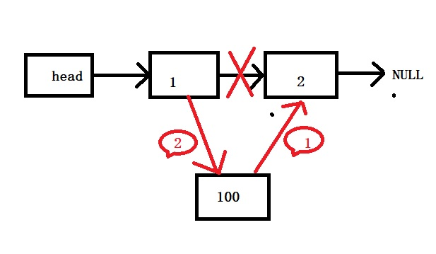
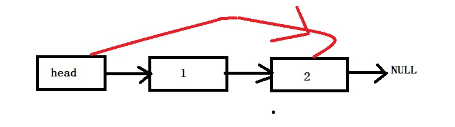
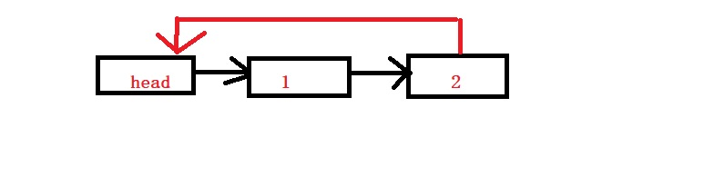
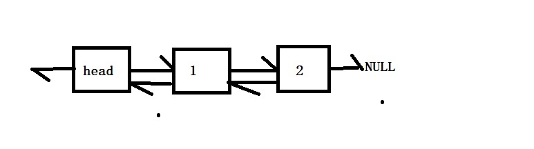
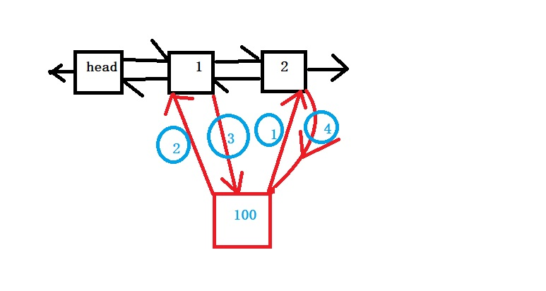
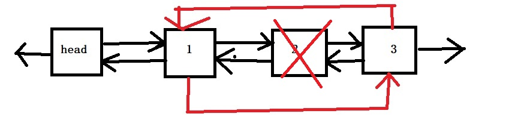

<h2 style="color:red">链表</h2>

> 所谓链表，见名知意就是将数据链接起来，那数据肯定不是连续的排列在一起的，确实链表就是用指针将许多个内存块连接起来的数据结构。

这一模块，我将描述链表的四大类结构，单链表，循环单链表，双链表，循环双链表。

<h3 style="color:green">单链表</h3>

我们先看下单链表的结构体

	/*定义单链表的节点*/
	struct Node
	{
		struct Node* next;
		int data;
	};
	/*定义单链表总体*/
	struct List
	{
		struct Node* head;//链表头节点
		int size;//链表元素个数
	};

单链表引入头节点，是为了容易操作，后续的循环单链表，双链表等都有头节点。

初始化头节点

	
	//初始化头节点
	void List_Init(struct List* list)
	{
		list->size = 0;
		list->head = (struct Node*)malloc(sizeof(struct Node));
		list->head->next = NULL;
	}

单链表的插入

看图，链表的插入必须符合规范。必须先将新节点连接到它后面的节点，再让前面的节点链接自己，否则就会发生断链现象，程序会崩掉。为什么？我们假设一波，先让1节点链接到100，原来1节点的next指针保存的是2节点的地址，现在它保存着100节点的地址，然后，我们将100节点链接到2节点去，可是100节点的next没有保存2节点的地址啊，如何链接？此时可能有人要骂了，那你说第一种为什么100节点就可以直接连接到2节点？问得好，我们并不是直接连接到2节点，因为100节点的next没保存2节点的地址，我们是通过1节点next间接链接的。
就好比100的next保存了1的next的地址，就是100节点的next保存了2号节点的地址。然后再让1节点的next保存了100节点的地址。我好像啰嗦了。

	//尾插法
	void List_Append(struct List* list,int data)
	{
		struct Node* temp,*p;
		p = list->head;
		while (p->next != NULL)
		{
			p = p->next;
		}
		temp = (struct Node*)malloc(sizeof(struct Node));
		temp->data = data;
		temp->next = p->next;
		p->next = temp;
		list->size++;
	}
	//头插法
	void List_Front(struct List* list,int data)
	{
		struct Node *p;
		p = (struct Node*)malloc(sizeof(struct Node));
		p->data = data;
		p->next = list->head->next;
		list->head->next = p;
		list->size++;
	}
	//指定位置插入
	void List_Insert(struct List* list, int index, int data)
	{
		if (index <= 0 || index > (list->size + 1))
		{
			return;
		}
		else {
			//先找到目标位置的前一个位置p
			struct Node *p,*temp;
			p = list->head;
			for (int i = 1; i < index; i++)
			{
				p = p->next;
			}
			temp = (struct Node*)malloc(sizeof(struct Node));
			temp->data = data;
			temp->next = p->next;
			p->next = temp;
			list->size++;
		}
	}

单链表的删除

链表的删除还是比较容易的，只需要知道待删除元素位置的前一个，直接将自己的前一个节点指向自己的后面一个节点，就可以删除自己了。

	//删除指定位置节点
	void List_Del(struct List* list, int index)
	{
		if (index <= 0 || index > list->size)
		{
			return;
		}
		else {
			//先找到目标位置的前一个位置p
			struct Node *p, *temp;
			p = list->head;
			for (int i = 1; i < index; i++)
			{
				p = p->next;
			}
			temp = p->next;
			p->next = p->next->next;
			free(temp);
			temp = NULL;
			list->size--;
		}
		
	}

单链表的查找与修改

这两个操作就很简单了，从第一个往后遍历的找或者修改就ok

单链表的总结

单链表弥补了数组的插入删除的问题，它的插入和删除操作的时间复杂度都是0(1),但是单链表空间存储不是连续的，不支持索引访问，只能逐个从头遍历。所以查找时间复杂度是0(n)

<h3 style="color:green">循环单链表</h3>

> 循环单链表就是将单链表的最后一个节点和头节点链接，和单链表相比，循环链表的优点是从链尾到链头比较方便。当要处理的数据具有环形特点时，循环单链表就派上用场了，比如著名的约瑟夫环问题

循环单链表的增删改查和单链表一摸一样，只是初始化头节点不同

	//初始化
	void CirList_Init(struct CirList* clist)
	{
		clist->size = 0;
		clist->head = (struct Node*)malloc(sizeof(struct Node));
		clist->head->next = clist->head;
	}

<h3 style="color:green">双链表</h3>

> 双链表就是在单链表的基础上，每个节点都多了个前驱指针，其中头节点的前驱和尾节点的后继都是空。

双链表的结构体

	struct Node
	{
		int data;
		struct Node* next;//后继指针
		struct Node* pre;//前驱指针
	};
	
	struct Double_List
	{
		struct Node* head;
		int size;
	};

双链表初始化

	void Double_List_Init(struct Double_List* dlist)
	{
		dlist->size = 0;
		dlist->head = (struct Node*)malloc(sizeof(struct Node));
		dlist->head->pre = NULL;
		dlist->head->next = NULL;
	}

双链表插入

和单链表的插入一样，也要符合规范的插入，执行顺序就是上图。

	void Double_List_Insert(struct Double_List* dlist, int index, int data)
	{
		if (index <= 0 || index > (dlist->size + 1))
		{
			return;
		}
		else {
			struct Node *p,*temp;
			p = dlist->head;
			for (int i = 1; i < index; i++)
			{
				p = p->next;
			}
			temp = (struct Node*)malloc(sizeof(struct Node));
			temp->data = data;
			temp->pre = p;
			temp->next = p->next;
			p->next->pre = temp;
			p->next = temp;
			dlist->size++;
		}
	}
	

双链表删除

	void Double_List_Del(struct Double_List* dlist, int index)
	{
		if (index <= 0 || index > dlist->size)
		{
			return;
		}
		else {
			struct Node *p,*temp;
			p = dlist->head;
			for (int i = 1; i < index; i++)
			{
				p = p->next;
			}
			temp = p->next;//目标节点
			p->next = temp->next;
			temp->next->pre = p;
			free(temp);
			temp = NULL;
			dlist->size--;
		}
	}

双链表总结

双链表实现了可以由一个节点向前访问，也可以向后访问，让链表更加灵活。但是它增加了空间复杂度。不过电脑发展越来越快，存储性已经不是什么大问题了。喜欢Java的同学都用过LinkedHashMap 这个容器吧，它的底层就是双链表。

<h3 style="color:green">循环双链表</h3>

类比循环单链表，就是在单链表的基础上，将尾节点的next指向了头，那么循环双链表也是同样的道理，它也是在双链表的基础上，将尾节点的next指向了头节点。它的操作和双链表一摸一样，就是在初始化不同
	
	//初始化
	void CDouble_List_Init(struct CDouble_List* list)
	{
		list->size = 0;
		list->head = (struct Node*)malloc(sizeof(struct Node));
		list->head->next = list->head;
		list->head->pre = list->head;
	}

<h3 style="color:red">总结</h3>

本节的东西有点多，其实都是从单链表开始的，前面说过数组是十分重要的，那么这里我也要说，链表和它同等重要，它两合体构成了后面复杂的数据结构，因为它两各有优缺点，所以，数据结构的设计都是取其长处，避其短处，柔和链表和数组.希望大家一定动手实现链表这块，不然后面的复杂数据结构就优点懵逼哦

