##字符串匹配

> 这章节，我们会讲到几大典型的字符串匹配算法
> 
    1. BF算法
    2. RK算法
    3. Sunday算法
    4. KMP算法

### BF算法

> BF算法是最最符合正常人逻辑思维的一种匹配模式，它就是采取穷举的方式，一步步进行主串与模式串的比较，匹配成功返回主串匹配开始的位置。

接下来我们一起通过例子来看看这种让人喜欢用的算法吧，假设现在我们有主串abcdefg,待匹配的模式串efg，我们来找出模式串在主串出现的位置。

**准备工作**

表格1是主串在数组的存储格式，表格2是模式串在数组的存储格式，我们设置两个游标i,j
其中i游标始终指向主串，j游标指向模式串。

|a|e|f|d|e|f|g|
|----|----|----|----|----|----|
|0|1|2|3|4|5|6|

|e|f|g|
|----|----|----|
|0|1|2|

1. 首先i和j游标每次指向开始待匹配的字符，第一次i指向了a,j指向了e,结果开始就发现不匹配。继续下一次

2.上次匹配失败,所以模式串的j游标回退到起点e，主串的i向前进1位来到了下标是1的位置。如图所示，此时我们发现主串的i游标和模式串的j游标指向的相等，所以i和j同时前进，此时发现i和j游标指向的又相等，两个继续前进，i指向了d,j指向了给g,所以匹配失败。

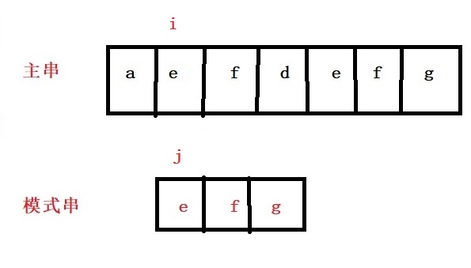

3.上次匹配失败，所以模式串的j游标回退到起点e，主串的i向前进1位来到了下标是2的位置。如图所示，此时我们继续匹配，发现游标i和游标j开始指向的都不匹配，匹配失败

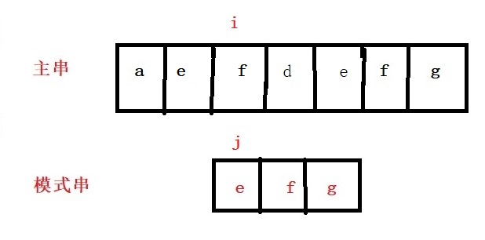

4.上次匹配失败，所以模式串的j游标回退到起点e，主串的i向前进1位来到了下标是3的位置。如图所示，此时发现游标i和游标j开始指向的都不匹配，匹配失败

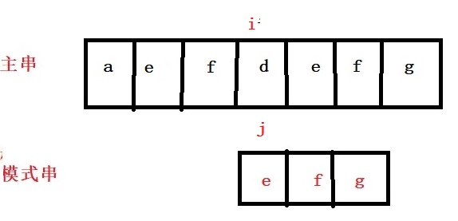

5.上次匹配失败，所以模式串的j游标回退到起点e，主串的i向前进1位来到了下标是4的位置。如图所示，此时我们的游标i指向了e,j也指向了e,二者继续前进，又相等，继续前进，又相等，此时模式串匹配成功，返回i开始指向的位置4.

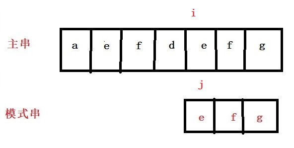

> 上面就是完成的一个BF匹配过程，看起来还是比较容易理解的算法，我们发现BF算法每次都会从主串遍历匹配，而模式串一旦失败，又得回退到起点。所以实践复杂度就是0(m*n),m是主串的长度，n是模式串的长度。

**代码**

	int String::BF()
	{
		int i, j, index,begin,l2;
		if (this->s1.length() < s2.length())
		{
			return -1;
		}
		//开始BF算法
		for (i = 0; i < s1.length(); i++)
		{
			begin = i;//主串起点位置
			j = 0;//模式串起点位置
			while (s1[begin] == s2[j])
			{
				begin++;
				j++;
				if (j == s2.length())
				{
					break;
				}
			}
			if (j == s2.length())
			{
				return i;
			}
			else
			{
				begin++;
			}
		}
		return -1;
	}

### RK算法

> RK匹配算法是对BF算法的升级，它将匹配串的思想了转换成了数值的简单比较，相比较其它类匹配算法，这个算法可谓是真牛逼啊。那么快来欣赏下这位大神之作吧。

对比BF算法，我们看看RK算法如何将串转化成了数值，在BF算法中，假设现在有主串长度是len1,有待匹配的模式串长度是len2,现在我们通过某种计算方式计算出模式串的哈希值，通过比较完善的哈希函数求出对应哈希值，前面的BF算法，我们知道主串有len1-len2+1个子串(看下图),我们依次对这些子串求出对应哈希值。假设子串长度是3，下图显示的是主串的len-len2+1个子串的哈希值.

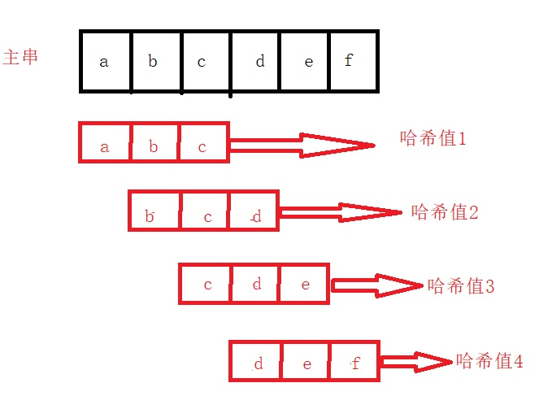

然后我们只需要逐个的将这len1-len2+1个子串与模式串的哈希值进行比较，每个串对应自己的哈希值，所以每次不用移动这移动那，回退啥的，直接数值比较，相等的表示该位置与模式串暂时匹配好了，但是如果不行等，肯定表示这个子串与模式串不匹配啊。好了，此时应该有人要问了，啥叫暂时匹配好了，嗯嗯嗯，你的疑问是正确的，这个我们就要追溯到哈希表那块了，上面我们讲过，每个子串和模式串都通过某种哈希函数计算对应的哈希值，可以别忘了，哈希函数的设计必然产生哈希冲突（忘了的，去看我的哈希表那一章）,只是你设计的哈希函数可以让这个冲突减少，但是不可避免。所以啊，当子串的哈希值和模式串的哈希值一样时，我们还得进行二次检测，就是逐个的比较模式串和当前子串，看它们是否相等，如果相等，匹配成功，反之则失败了。

**哈希函数的选择和哈希值计算**

好了，是时侯讨论下此处匹配算法的哈希函数的选择了，此处的哈希值计算方式是按照进制数来算的，根据你待匹配串的标准来选择，假设现在你的串只包含有0-9这10个字符，那对应的就是10进制数字，假设你的只包含a-z这26个字母，那对应的就是26进制数字，然后不管哪种，都最后将它们转化成10进制数字，如下图，分别是只包含0-9和只包含a-z字符的哈希值算法。

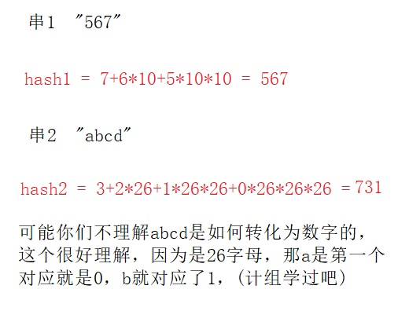

好了，上面就是每个串哈希值的计算，哦，我忘记了两个重要的哈希值计算问题。

####1.哈希值过大问题

因为上面的进制如果很大，如果串很长，假设是26进制的，后面会是26的串长度-1的幂次方，那么这个数字很大很大，这时long long都保存不下了，所以，我们必须对每次求得哈希值都做取余数处理，至于这个余数是多少？当时我网上查到了外国两哥们说设计人员建议是一个质数，且尽可能大一些，假设你设计的小，那么每个串对应哈希值冲突的概率极大提升，那此时该算法的时间复杂度就和BF没区别了。

####2.主串中每个子串的哈希值计算

看了上面的哈希值计算，许多人可能会感到很烦，如果去写代码，此处就是最大的痛点，每个子串的哈希值计算这么长，咋写么。嗯嗯嗯，其实它是有规律的，好了，我不啰嗦了直接看下面图中的推导。

现在我们准备一个主串和一个模式串如下图，主串是"yzadbe"，模式串是"dbe",假设我们已经计算出了待匹配的模式串的哈希值是data4

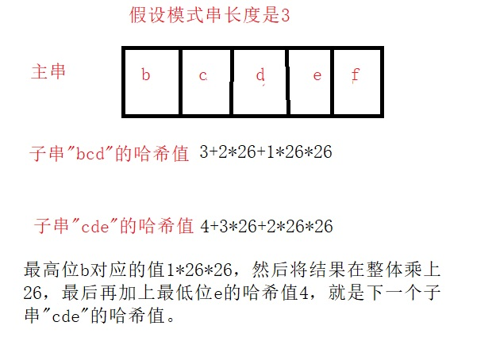

所以说，我们只需要完整的计算出第一个子串的哈希值，后面字串的哈希值都可以由上一层推导来。

####讲解完上面所有的理论后，我们就可以开始模拟整个匹配过程了，其实很简单，就是准备的工作多，首先下图是准备的主串和模式串，并且我们已经计算出模式串的哈希值了。

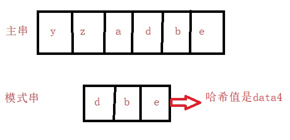

1. 将主串每个对应的子串的哈希值都计算出来,如下图。

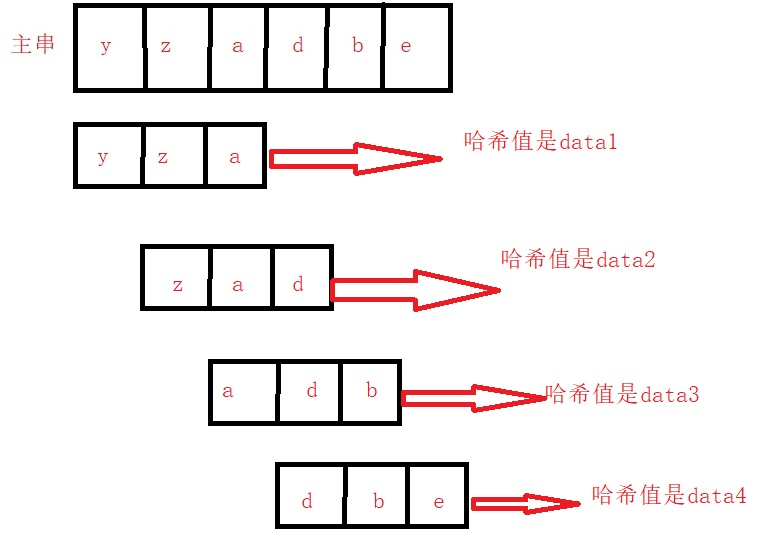

2.逐个的将这些子串的哈希值与模式串的哈希值data4比较，发现主串的子串"dbe"和模式串的哈希值相等，然后可以结束了？no no no，此处还没结束，现在你还不知道是不是真正的匹配了，接着你需要逐个检测子串"dbe"和模式串"dbe"是否匹配，发现匹配着，这时才表示真正匹配成功，返回下标。

> 好了RK算法就讲完了，我们分析下它的时间复杂度，计算每个子串的哈希值时间复杂度是o(n-m+1)，接着挨个对比是也是0(n-m+1),加起来就是o(n)时间复杂度，当然前提是你设计的哈希函数到位。

**代码**

	int String::RK()
	{
		//准备一个素数和一个进制数(进制数按照你的字符串范围进行)
		int q = 144451,d = 26;//假设我的字符串全是a-z组成,范围是26，进制用26进制。
		int main_Str = s1[0] - 'a';//主串第一个字符下标a就是0,b就是2
		int pat_Str = s2[0] - 'a';//模式串第一个字符下标
		int h = 1,begin,j,i;//26的多少幂次方
		for (i = 1; i < s2.length(); i++)
		{
			main_Str = (main_Str * 26 + s1[i] - 'a') % q;
			pat_Str = (pat_Str * 26 + s2[i] - 'a')% q;
			h = h*d;
		}
		//开始逐个串的比较
		for (i = 0; i < s1.length() - s2.length() + 1; i++)
		{
			//先判断code值是否相等
			if (main_Str == pat_Str)
			{
				begin = i;//主串开始位置
				j = 0;
				//继续逐个字符的判断
				while (s1[begin]==s2[j])
				{
					begin++;
					j++;
					if (j == s2.length())
					{
						return i;//匹配ok
					}
				}
			}
			//code不等或者匹配失败，就更新main_Str的值是下一个
			//code更新办法是减去最高位的进制，剩余的数字*26 +最新进来的数字
			main_Str = (   (main_Str - h*(s1[i]-'a')) * d    +    s1[i + s2.length()] - 'a'   )%q;
		}
		return -1;
	}

### Sunday算法

> Sunday算法可以说是最快的男人了，不仅快，还被程序界视为最好用，最时尚，最好理解的，我猜测，他们肯定和我一样，被KMP匹配算法折磨透了，我现在还没会啊。此算法是90年代被发明的，距离现在也就不到30年，这个算法也是牛啊，我就不吹了，还是看它的牛逼之处吧。

抛开RK算法不说，相对于其它类匹配算法，它们都是对模式串和主串比较中，每次主串移动位数是1，虽然KMP也可以跳着匹配，但是难的不是一点点啊，维护起来够你受的。所以真正好用的就是今天的主角了，Sunday算法，它实现了真正意义上的跳跃式匹配，让我们一起见识见识它的威力。

**这一块，我尝试直接画图举例子分析，然后总结出规律。我太难了**

1. 准备我们的主串"abcadcdzp"和模式串"dzp"，如下图

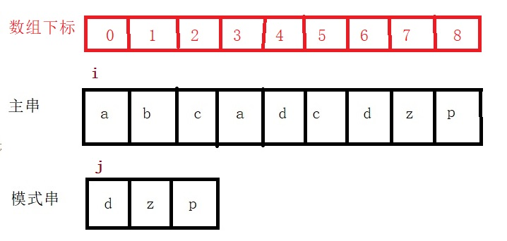

2.游标i指向主串开始位置,游标j指向模式串开始位置，第一次匹配开始,游标i指向的a和游标j指向的d不匹配，然后，主串立马去找它的末尾，这个末尾是指相对于模式串的后面一个，就是主串下标是3的位置找到了a,接着游标j开始从模式串的头遍历到尾，看模式串是否有这个元素a,发现没有，接着主串游标i就直接跳到了下标是3的下一个位置，就是下标是4的位置,模式串的游标j回退到模式串起点，等待下一次匹配。结果如下图

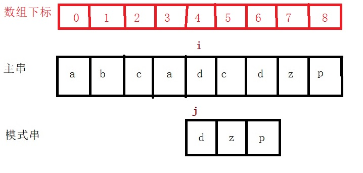

3.主串与模式串游标继续匹配比较，发现游标i对应的和游标j对应的相等，所以i和j同时前进，此时i指向了下标是5的位置，此时又发现不对应了，完了，主串又生气了，直接去找相对于模式串的末尾的下一个位置，就是下标是7的位置，此元素是z,然后，让游标j从头开始找有没有一个等于z的值，j在模式串第二个位置找到了这个值，然后啊，主串的游标i从当前位置4跳到了6的位置，跳动长度=(模式串末尾位置2-模式串找到该值的位置1)+1,就是数字2，所以从游标i从4直接跳到了6上，最终结果如下图。

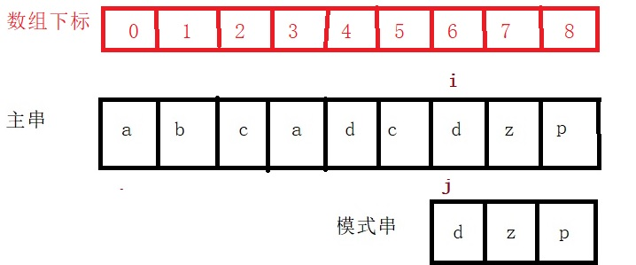

4.此时游标i和j继续匹配，发现i和j指向的相等，同时向前进1，又相等，继续前进，又相等，模式串结束了，所以匹配成功。

> 好了，上面就是一个完整的Sunday算法匹配过程，你可能觉的好复杂啊，可能是我讲的不好，我的原因，其实我这个例子讲这么长，因为这个例子把Sunday算法所有跳转情况都用到了，为了给您分析一个面面俱到的例子嘛。

有了上面的分析过程，我来给您总结下Sunday算法的过程，您根据这个过程再去看上面的例子，就一定恍然大雾了，哦写错了，是恍然大悟了，千万别雾啊。

1. 主串和模式串左边对齐,逐个的比较
2. 当发现某个位置不匹配时，主串去查看当前对齐后未参与匹配的位置index1的值(相对于模式串最后位置的下一个)，然后模式串去从头到尾遍历，看自己是否存在这个值
   + 如果不存在这个值，好，主串直接从index1+1位置开始于模式串进行新一轮匹配
   + 如果存在这个值，这里需要注意，存在的话，还得向后继续找，找模式串最后一次出现这个值的位置index2,计算出模式串最后一个元素位置-index2+1的值，这个值就是
  主串直接从开始匹配的位置跳过的长度到下一个待匹配的位置。
3. 循环执行步骤1和2，直到匹配结束。

好了，总结完成。哦，忘记了一个问题，总结里面有句话，匹配不成功时，主串拿末尾未参与匹配的值，模式串从头找这个值，当模式串找到了这个值，还得继续找后面有没有这个值，最后返回的是最后一次出现这个值的位置。这句话是重点，我必须解释下，为什么要选择最后一次出现这个值的位置？当模式串存在这个值时，主串最后跳的距离是这个值到模式串末尾距离再加1的长度，所以如果，你选择靠前面出现的，那跳到这个距离就会变大，有可能错过了第一次就匹配上的串，是不是这个道理啊。

####接下来，我们用这个算法再来模拟下开始BF算法解决的那个案例。

1. 游标i和j分别指向主串和模式串的开头位置

2.发现第一个位置就不匹配，所以主串直接去相对于模式串的尾部的下一个位置就是下标是3的位置找到元素d,然后模式串从头到尾遍历，看是否有这个值，发现模式串无该值，所以，主串直接跳到下标是4的位置开始和模式串匹配了。如下图

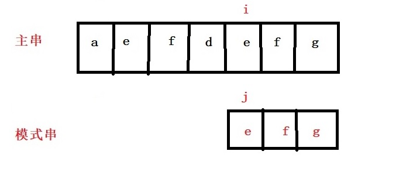

3.继续进行，发现匹配成功了，是不是很牛逼。之所以展示这个，就是给你说这个算法跳的有多快。

**代码**

	//Sunday算法
	int String::Sunday()
	{
		int i, j,  temp, index[100] = {0};
		char ch;
		//记录模式串每个字符最后出现的位置(相对于模式串)
		for (i = 0; i < s2.length(); i++)
		{
			j = i;
			index[i] = j;
			while (j != s2.length())
			{
				if (s2[j] == s2[i])
				{
					index[i] = j;
				}
				j++;
			}
			cout << i<<" "<<index[i] << "\n";
		}
		/*
		1.每次先在主串里和模式串逐个字符匹配
		2.当遇到不匹配时，立马去主串对应下一个起点处找一个字符位置是index
		3.此时将该字符在模式串里面从头到尾对应的找
		4.如果没找到，就将主串的游标直接移动到index+1,模式串回归到0
		5.如果找到了,先确定模式串找到的位置x,然后查看此元素在模式串最后出现位置y，让主串的游标直接加上模式串长度-最后位置
		*/
	
	
		
		for (i = 0; i < s1.length(); )
		{
			temp = i;//temp主串游标
			j = 0;//j模式串游标
			while (s1[temp]==s2[j])
			{
				temp++;
				j++;
				if (j == s2.length())
				{
					return i;
				}
			}
			//此时主串下标temp,模式串下标j不匹配了,来到主串下一个起点ch
			ch = s1[i + s2.length()];
			//在模式串，从头找，是否存在与ch相等的值
			j = 0;
			while (s2[j]!=ch)
			{
				j++;
				if (j == s2.length())
				{
					break;
				}
			}
			//判断是否找到了这个值ch
			if (j == s2.length())//没有找到
			{
				i += s2.length() + 1;
			}
			else//找到了
			{
				i += s2.length() - index[j];
			}
		}
		return -1;
	}

	

