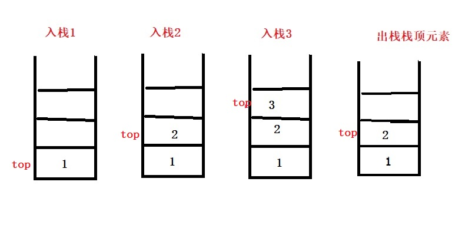
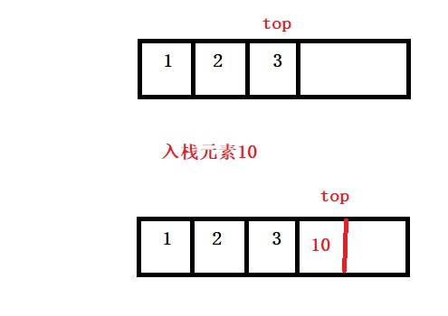
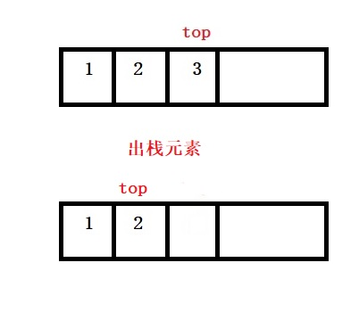
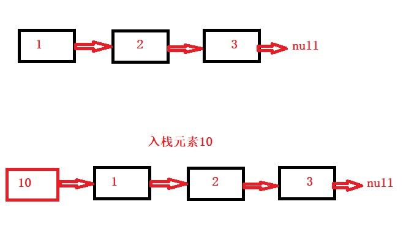
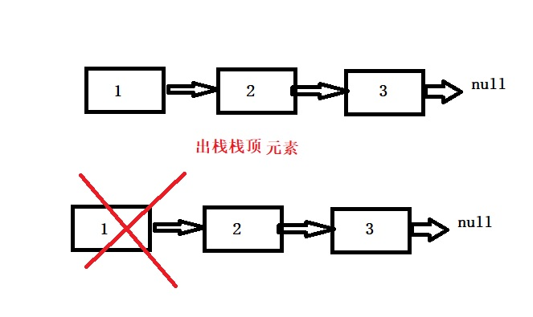
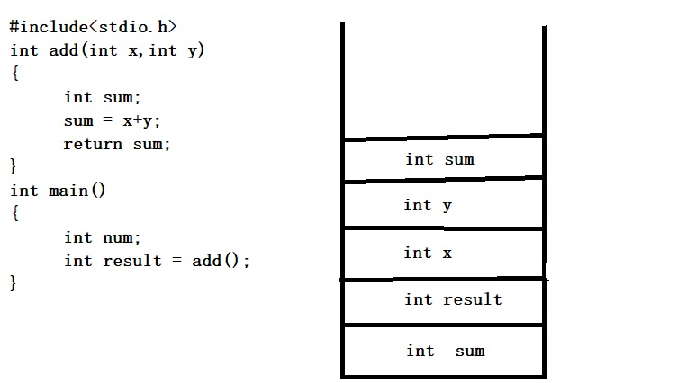

<h2 style="color:red">栈</h2>

> 栈是一种操作受限制的线性表,它只允许在一端进行插入和删除。绝大多数编程语言都有堆栈模型，它是一种局部变量回收机制，它是如何工作？讲完今天的栈，我们来分析下这种机制。

栈是有数组和一个栈顶指针构成(此处的指针不是c语言里的*p),该指针就是代表标记栈顶元素位置的。每次元素都只能从一端入栈，且只能从这一端出栈。很容易分析，它的入栈和出栈事件复杂度是0(1).下图是一个栈操作流程

栈的代码还是比较容易实现的，控制好一端插入和删除就可以了。主流上，有两种栈，顺序栈和链式栈。大学课本的顺序栈是定义好空间大小的，其实我们可以和c++的STL库一样，设计一个顺序栈的自动扩容版本。 至于链栈，我们为了保证入栈和出栈时间复杂度保持0(1),所以必须采用头插法进行模拟栈，如果是尾插法，还得每次走到最后面，当然，有人可能会问，我设计个循环双链表就可以了，可以是可以，不过，这不是更麻烦了吗？下面我将贴出顺序栈和链栈的核心代码。
	

顺序栈（可自动扩容）

顺序栈就是用数组模拟栈，为了设计方便，我们用数组的尾部模拟栈顶，每次入栈元素时，都视作插入一个元素到数组的末尾，然后更新栈顶指针，出栈时，我们就删除最后一个元素，模拟出栈，更新栈顶指针。

**图示分析顺序栈**

1.模拟入栈

入栈元素10，直接将10插入到数组最后，更新top指向。

2.模拟出栈

出栈就是直接将栈顶top指向的删除，top减去1.

	//入栈操作
	void push(struct Stack *stack,int data)
	{
		//栈满了，自动扩容
		if (stack->top + 1 == stack->size)
		{
			int temp,*p;
			temp = stack->size;
			stack->size = stack->size * 2;
			p = (int *)malloc(sizeof(int)*stack->size);
			for (int i = 0; i < temp; i++)
			{
				p[i] = stack->data[i];
			}
			free(stack->data);
			stack->data = NULL;
			stack->data = p;
			stack->data[++stack->top] = data;
		}
		//不满，正常操作
		else {
			stack->data[++stack->top] = data;
		}
	}
	//出栈
	int pop(struct Stack *stack)
	{
		if (stack->top == -1)
		{
			return -999;
		}
		else {
			return stack->data[stack->top--];
		}
	}

链式栈

链式栈就是链表，只不过规定了链表的一些插入和删除顺序，进而可以模拟栈的过程。

原理：在单链表的基础上，每次插入节点时，都采取头插法，用首节点模拟栈顶元素，当要插入时，直接插在首节点前面，然后讲栈顶指针指向插入的节点，删除操作时，控制只能删除链表最前面的节点，这样的两个控制，就很好的模拟了栈的特点。

**图示分析链式栈**

1.模拟入栈

入栈就是头插法，将新节点插入最前面作为栈顶元素

2.模拟出栈

出栈就是直接删除头节点，将新的头节点作为栈顶。

	//入栈
	void LinkStack_push(struct LinkStack * s, int data)
	{
		struct Node *temp;
		temp = (struct Node*)malloc(sizeof(struct Node));
		temp->data = data;
		temp->next = s->head->next;
		s->head->next = temp;
		s->size++;
	}
	//出栈
	int LinkStack_pop(struct LinkStack * s)
	{
		if (s->head->next == NULL)
		{
			return -999;
		}
		else {
			struct Node *temp = s->head->next;
			int data = temp->data;
			s->head->next = temp->next;
			free(temp);
			temp = NULL;
			return data;
		}
	}

看完了栈的实现，现在我们来分析下前面的问题，堆栈模型的垃圾回收机制。我还是直接上图距离子吧。

这个c语言，大家都应该会吧，首先我们的清楚函数定义的变量是局部变量，定义一个出来，就分配了指定类型大小的空间，此时的定义变量就是入栈操作，而函数结束执行完成后，栈会依次退栈操作，例如上面的操作，add函数执行完成后，sum释放，接着y释放，x释放，然后main函数结束后，result释放，num释放。好了，这个就是模拟一个简单的内存在栈模拟。

总结

栈看起来不常用，其实它应用于许多地方，在后面的递归，树的遍历非递归等，都可以用到栈。所以说，掌握栈是我们必须要做到的。

