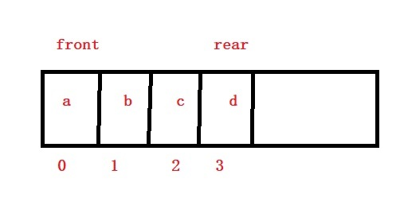
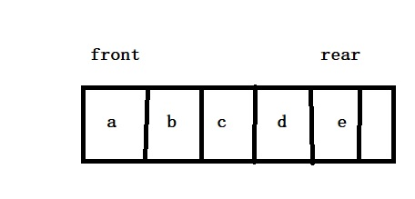
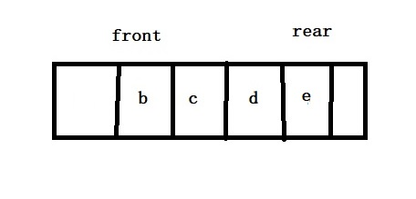
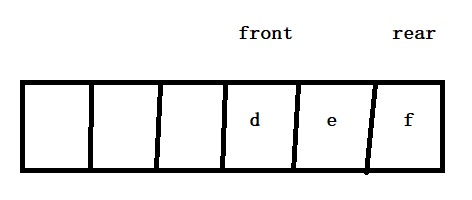
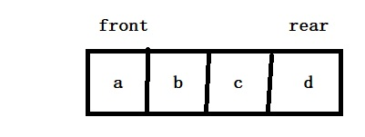
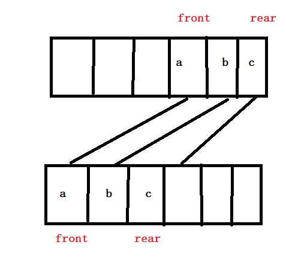
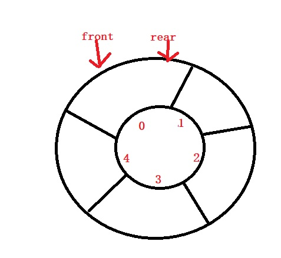
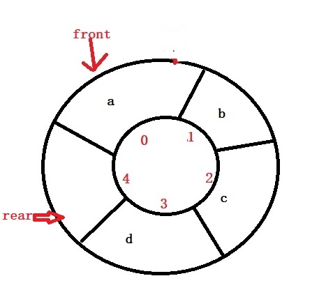
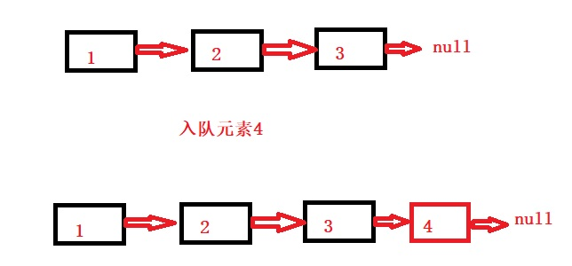
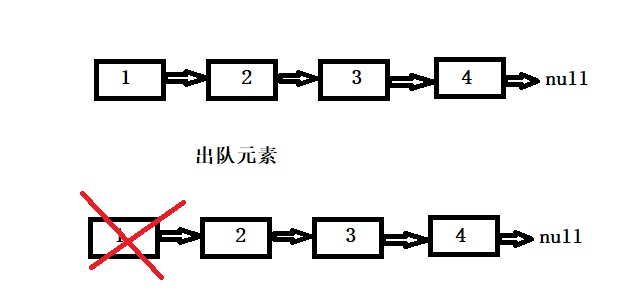

# **队列**
董泽平 2019/8/9

#### 如何理解队列？
队列这个概念非常好理解。你可以把它理解成排队买火车票，购票的人只能从队伍的最后面进入，并且每次出去的总是队头的那个。

我们知道栈支持入栈和出栈的操作，和栈类似，队列支持入队和出队操作。最基本的队列有两大类，**顺序队列**和**链式队列**,顺序队列又可以细分为两类，**普通顺序队列**和**循环队列**

接下来，就让我们一一分析这几大类队列吧。

#### 第一类：顺序队列
原理:顺序队列是用数组模拟的，并且添加两个哨兵front和rear(大学课本称之为头指针和尾指针),front指向队列第一个元素，rear指向队列的最后一个元素(有的课本，或者网上把队尾指针指向了最后一个元素的下一个)其实队尾指针指向最后一个还是指向最后一个元素的下一个，都是可以的，没有标准的规范。只不过，当我们rear指向不同，最后判断队列满了的条件就不同了。

看上面的演示，队列头front一直指向队列头a,队尾rear指向的是队列元素的最后一个元素

上图演示的是我入队列元素e后的情况，直接将它放在最后，更新rear指针指向它

继续出队一个元素，此时front指向了新的队头b。

**下面是顺序队列代码(支持自动扩容)**
	
	//队列初始化
	void Queue_Init(struct Queue * queue)
	{
		queue->front = 0;
		queue->rear = 0;
		queue->size = 1;
		queue->data = (int*)malloc(sizeof(int)*queue->size);
	}
	//入队列(队尾指向队列最后一个元素下一个位置)
	void inQueue(struct Queue * queue, int data)
	{
		//队列满了,自动扩容
		if (queue->rear == queue->size)
		{
			int temp;
			temp = queue->size;
			queue->size = queue->size * 2;
			int *q = (int*)malloc(sizeof(int)*queue->size);
			for (int i = queue->front; i < queue->rear; i++)
			{
				q[i] = queue->data[i];
			}
			free(queue->data);
			queue->data = NULL;
			queue->data = q;
			queue->data[queue->rear++] = data;
		}
		else {
			queue->data[queue->rear++] = data;
		}
	}
	//出队列元素
	int outQueue(struct Queue * queue)
	{
		if (queue->front == queue->rear)
		{
			return 999;
		}
		else {
			return queue->data[queue->front++];
		}
	}

**总结**

+ 我们让队首指针总是指向队列的头(第一个元素),队尾指针总是指向队列的最后元素或者最后一个元素的下一个位置。
+ 此处的指针在实际代码中并不是指针，就是一个下标的标记，说指针是为了形象
+ 头指针指向队列头，队尾指针为什么要指向最后一个元素的下一个？
     这个不是必要条件，你完全可以自己设置队尾指针指向最后一个元素的。
+ 我们还会发现，这种队列存在**"假溢出"**现象,即随着元素的不断出队列，然后我们入队元素时，只能在后面进入，队列前面的空间无法被使用。
	

#### 第二类：顺序队列(改进版)

上图所示，当队列出现假溢出到元素无法入队列，这个状态十分不乐观，明明前面有空间，可是现在队列就是满额状态，元素无法入队列。此时，我们就需要对顺序队列进行升级，下面升级策略。

1. 我们可以先判断队头指针是否指向了数组下标0的元素，队头指针指向了0，且队尾指针指向了数组最后，那就证明队列是全满状态，确实无法继续入队列了，如下图。

2.如果队头指针指向不是0，而队尾指针指向了最后，证明存在假溢出现象，就是指前面还有空间可以入队列，此时我们可以将数据全部搬移到头部去，并修改队列的头指针和尾指针指向，具体操作如下图所示.

TIP.经过上述的操作，我们实现了空间的高效利用，但是带来了严重的性能问题，因为当发生了假溢出现象时，我们需要做数据搬移，这个时候，入队列的事件复杂度由之前的0(1)改变成了0(n),而根本问题就出在队列的数据搬迁问题上，我们继续探究。

**队列升级版代码**

    //完整的入队操作       
	void Queue_push(struct Queue *q,int data)
	{
		if (q->rear == q->size)
		{
			//队列空间全利用--自动扩容
			if (q->front == 0)
			{
				q->size = 2 * q->size;
				int temp = q->size;
				int *p = (int*)malloc(sizeof(int)*q->size);
				for (int i = 0; i < temp; i++)
				{
					p[i] = q->data[i];
				}
				free(q->data);
				q->data = p;
				q->data[q->rear++] = data;
			}
			//队列空间出现假溢出，数据搬迁至前面
			else {
				int count = 0;
				for (int i = 0; i < (q->rear - q->front); i++)
				{
					q->data[i] = q->data[q->front++];
					count++;
				}
				q->front = 0;
				q->rear = count;
			}
		}
		else {
			q->data[q->rear++] = data;
		}
	}

#### 第三类：顺序队列(终极版本-循环队列)

> 上面我们依次讲了顺序队列存在假溢出的问题，并讲解了它的升级版，完美解决了它的假溢出问题，可是最后我们发现升级版的队列又出现了数据搬迁的问题，让原本入队列的操作变得复杂起来，这一节，我们将退出完美版本的顺序队列---循环队列。

循环队列完美解决了上面的两个问题，队列的假溢出现象和数据搬移带来的事件复杂度问题。上图是一个空的循环队列。

**注意点：**

前面我们讲front指向队列的头，rear指向队列的最后一个元素或者最后一个元素的下一个位置，到了循环队列，就变得严格了，它的front还是指向队列的第一个元素，它的尾巴rear只能是指向队列最后一个元素的下一个位置。这样设计的原因：为了区分队列空和满的条件.看下面的分析

比如说，我们在上面空循环队列基础上，添加元素a,b,c,d,如上图所示，此时rear指针指向了下标为4的，我们就可以认为队列为满，如果说我们让规则改变，让rear指针指向队列最后元素的位置，现在我们如果在一个空队列基础加入一个元素，此时front=rear都指向了这个元素，但是初始的队列空的条件也是front=rear,如何区分，所以循环队列的rear指向是严格的。

循环队列的判定

+ 下列公式的size是队列的长度，比如上图的size就是5
+ 队列空的条件fornt==rear
+ 队列满的条件(rear+1)%size = front
+ 队列当前元素个数(rear-front+size)%size
+ 入队操作rear = (q->rear + 1) % q->size;
+ 出对操作q->front = (q->front + 1) % q->size;
+ 综上，循环队列存储满时，会空出一个空间没有利用。（为了标记队列是否满）

#### 第四类：链队

链队就是在链表的基础上模拟的，入队就是将元素添加到链表的尾部，出队列就是删除链表的第一个元素节点。

1.链表入队

2.链表出队

**链队代码**

	//初始化
	void Link_Queue_Init(struct Link_Queue *q)
	{
		q->head = (struct Node*)malloc(sizeof(struct Node));
		q->head->next = NULL;
		q->front = q->head->next;
		q->rear = q->head;
	}
	//入队
	void inQueue(struct Link_Queue *q, int data)
	{
		struct Node *temp,*p;
		temp = (struct Node*)malloc(sizeof(struct Node));
		temp->data = data;
		temp->next = q->rear->next;
		q->rear->next = temp;
		q->rear = temp;
		q->front = q->head->next;
	}
	//出队
	int outQueue(struct Link_Queue *q)
	{
		if (q->front == NULL)
		{
			return 999;
		}
		else {
			struct Node *temp;
			temp = q->front;
			q->head->next = temp->next;
			free(temp);
			q->front = q->head->next;
		}
	}