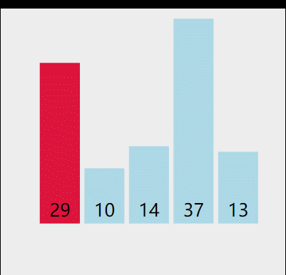
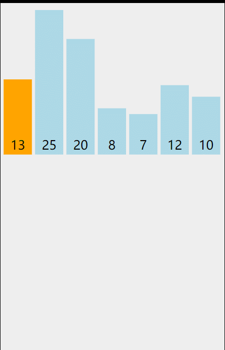

## 十大排序（1）

我们把10大排序算法可以划分为三大类学习，今天先学习第一大类基础排序算法

+ 冒泡排序
+ 选择排序
+ 插入排序

### 1.冒泡排序

**分析**：冒泡排序每次都是从第一个元素开始往上冒泡，总是拿当前元素和下一个元素作比较。一趟结束后总能选出待排序中最大的元素
1.当前元素小于等于下一个元素时，不交换，直接让下一个元素继续往上冒泡
2.当前元素大于下一个元素时，与其交换值，继续网上冒泡。
我们可以看动图分析我这两句话。

	
	void sort_Bubble(int* arr, int len)
	{
		int temp,flag;
		for (int i = 0; i < len; i++)
		{
			flag = 1;
			for (int j = 0; j < len-i-1; j++)
			{
				if (arr[j] > arr[j+1])
				{
					temp = arr[j];
					arr[j] = arr[j+1];
					arr[j+1] = temp;
					flag = 0;
				}
			}
			//一趟没发生交换，数据已经排序OK
			if (flag == 1)
			{
				return;
			}
		}
	}

代码有一句话，一趟没发生交换数据，数据就已经排序好了，这个避免了重复冒泡的可能。我来举例子解释下这句话意思
例子1：有一串数字  1， 2，3，4，5从第一个元素一趟冒泡上去，是不是一次都没交换数据，所以直接程序结束冒泡
例子2：有一串数字  1，2，3，5，4 从第一个元素一趟冒泡上去，发生了交换，所以证明当前元素未有序,继续冒泡

总结：
1.综上所述，冒泡排序的最好事件复杂度是0(n)---数组已经有序，需要遍历一遍，查看是否发生交换数据
2.冒泡排序最差时间复杂度是0(n^2)
3.冒泡排序平均时间复杂度是0(n^2)

### 2.选择排序

**分析**:对比冒泡排序，我们发现选择排序也是通过交换数据来排序，但是选择排序一趟只发生一次或者不发生交换，而冒泡排序就是一直往上冒泡，条件成立就交换数据。

1.选择排序每次先找当前未排序元素的最小值，确定其位置
2.将固定位置的值与最小位置值交换。

	void sort_Chocie(int* arr, int len)
	{
		int min,index;
		for (int i = 0; i < len; i++)
		{
			min = arr[i];
			index = i;
			for (int j = i +1 ; j < len; j++)
			{
				if (arr[j] < min)
				{
					min = arr[j];
					index = j;
				}
			}
			if (index!=i)
			{
				int temp = arr[index];
				arr[index] = arr[i];
				arr[i] = temp;
			}
		}
	}
	
总结：
1.选择排序宗旨是先选择（找待排序中最大或者最小）再交换位置
2.最好时间复杂度=最差时间复杂度=平均时间复杂度=0(n^2)

### 3.插入排序

**分析**：插入排序的核心是，从第二个元素开始(默认第一个元素是有序的)往前遍历，比它自己大的就一直继续往前走，直到遇见第一个小于等于自己的元素，将自己放在这个位置的后面

注意：每向前走一步，前面那个元素就要填充到当前位置(仔细看图)

	void sort_Insert(int* arr, int len)
	{
		int data,index;
		for (int i = 1; i < len; i++)
		{
			data = arr[i];
			index = i-1;
			while (index >= 0 && data < arr[index])
			{
				
				arr[index+1] = arr[index];
				index--;
			}
			arr[index + 1] = data;
		}               
	}

总结：
1.插入排序就是从第二个元素一直到最后一个元素向前遍历，寻找第一个一个比自己小的位置，将自己放在这个位置的后面。
2.插入排序最好时间复杂度0(n),当数组有序时，每个元素都不会移动，只是遍历第二个元素到最后一个元素。所以最好时间复杂度是0(n)
最差时间复杂度=平均时间复杂度=0(n^2)
