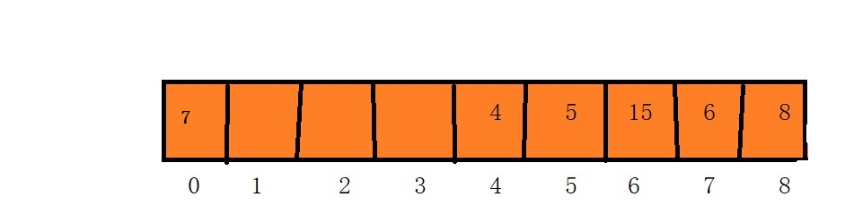

## 散列表
1.什么是散列表？
散列表就是通过一个映射函数，把每个数据映射为一个数组下标，按照下标存储起来，当我们访问这个数据时，只需要通过映射函数计算出下标，就可以找到这个数。

2.散列表映射函数
从散列表定义来看，散列表最重要的是设计映射函数，映射函数决定效率和减少地址冲突，常见的映射函数有下面的几个。。。

+ 直接定址法
+ 数学分析法
+ 除留取余法
+ 随机数法

3.散列表的冲突问题
不管我们设计的散列函数多牛逼。都无法避免数据映射冲突问题，冲突就是两个数据经过映射函数处理后得到的数据是一样的。这个时候不可能把它两放一起吧。因此发明了解决地址冲突问题的办法

+ 开放地址法
+ 拉链法
+ 多哈希法

下面我们用两种解决冲突的办法去实现一个完整的散列表。

#### 一：开放地址法
1.首先准备大小为9的数组。设计映射函数是除留取余法。

映射函数:key = data % size(size就是散列表长度,data就是数据)

2.假设我们有数据5,4,8,15,6,7时，对应散列表情况,我们按照设计的映射函数逐个将数据放入到散列表,整个过程如下图所示。

  + 首先元素5，5%9=5,所以找到下标是5的位置放5，
  + 接着元素4，4%9=4,所以找到下标是4的位置放4,
  + 接着元素8，8%9=8,所以找到下标是8的位置放8,
  + 接着元素15，15%9=6,所以找到下标是6的位置放15
  + 接着元素6，6%9=6,发现下标6号位置又有了元素，发生了冲突，继续往后找第一个空的位置，来到了下标是7的位置，直接放进去。
  + 接着元素7，7%9=7，发现下标7号位置有了元素，发生了冲突，继续往后找第一个空的位置，来到了下标是0的位置，直接放进去。(开放地址法可以从后搜索到前面)
 

3.现在我们已经学会了如何插入数据到散列表，现在开始发挥它的威力了。散列表设计的本质就是用于搜索查找记录。

假设我们还是用上面已经插入好数据的散列表，我们分别要查找数据6，7，9

+ 查找元素6，我们按照映射函数，直接代入6计算，6%9=6,直接去下标是6的位置找，发现此位置有元素，继续往后找，来到了下标是7的位置，找到了数组6，查找成功。
+ 查找元素5，我们按照映射函数，直接带入5计算，5%9=5，直接去下标是5的位置找，发现找到了，查找成功。
+ 查找元素9，我们按照映射函数，直接带入9计算，9%9=0,直接去下标是0的位置找，发现此位置有元素，继续往后找，发现此位置是空，停止查找，查找失败。（停止原因你可以好好想想，它插入数据时会挨个放，不会跳着放）。

**开放地址法的代码**

	//具有自动扩容性的散列表(装载因子最大为0.75时自动扩容)
	Hash_Table_Array::Hash_Table_Array()
	{
		this->maxSize = 10;
		this->data = new int[this->maxSize];
		this->size = 0;
		for (int i = 0; i < this->maxSize; i++)
		{
			this->data[i] = 99999;//标记数组初始值(标空)
		}
	}
	//数据的插入
	void Hash_Table_Array::Insert(int data)
	{
		int *newData,i,index;
		//1.每次插入数据前，先检测是否超过了最大装载因子
		if (this->size*1.0 >= this->maxSize*0.75)
		{
			newData = new int[this->maxSize * 2];
			for (i = 0; i < this->maxSize * 2; i++)
			{
				newData[i] = 99999;
			}
			//将原数据重新映射地址
			for (i = 0; i < this->maxSize;i++)
			{
				
				if (this->data[i] != 99999)
				{
					index = this->data[i] % (2 * this->maxSize);
					while (newData[index] != 99999)
					{
						index = (index + 1) % (2 * this->maxSize);
					}
					newData[index] = this->data[i];
				}
			}
			this->maxSize = 2 * this->maxSize;
			delete[] this->data;
			this->data = newData;
			index = data % this->maxSize;
			//开放地址法
			while (this->data[index] != 99999)
			{
				index = (index + 1) % this->maxSize;
			}
			this->data[index] = data;
			this->size++;
		}
		else {
			index = data % this->maxSize;
			//开放地址法
			while (this->data[index]!=99999)
			{
				index = (index + 1) % this->maxSize;
			}
			this->data[index] = data;
			this->size++;
		}
	}

	//数据的查询
	int Hash_Table_Array::isFind(int data)
	{
		int index,sum=0;
		index = data % this->maxSize;
		//开放地址法
		while (this->data[index] != data)
		{
			index = (index + 1) % this->maxSize;
			sum++;
			//如果继续查找数据为空，或者回到原点，表示该数据不存在
			if (this->data[index] == 99999 || sum == this->maxSize)
			{
				return -1;
			}
		}
		return index;
	}

### 二：链地址法
1.首先准备大小为10的边表数组,设计映射函数仍然是除留取余法,处理冲突的办法时链地址法

映射函数: key=data%size

2.假设我们有数据5,4,8,15,6按个插入，如下图所示

+ 首先元素5%10=5,所以链接到第5个边表节点，
+ 接着元素4%10=4,所以链接到第4个边表节点,
+ 接着元素8%10=8,所以链接到第8个边表节点,
+ 接着元素15%10=5,有冲突，直接链接到位置5的链表节点后面去
+ 接着元素6%10=6,所以链接到第6个边表节点

3.链地址法的查找

假设我们要查找数据15，8，9

+ 查找数据15，按照映射函数15%10=5,直接去对应边表下标是5下面找，逐个遍历该位置链表结构，找到了15，查找成功。
+ 查找数据8，按照映射函数8%10=8,直接去对应边表下标是8下面找，逐个遍历该位置链表结构，找到了8，查找成功。
+ 查找数据9，按照映射函数9%10=9,直接去对应边表下标是9下面找，逐个遍历该位置链表结构，发现链表是空，查找失败。

4.链地址法的代码
	
	//初始化处理
	Hash_Table_List::Hash_Table_List()
	{
		int i;
		this->len = 0;
		this->length = 10;
		this->head = new Node[10];
		for (i = 0; i < 10; i++)
		{
			this->head[i].data = i;
			this->head[i].next = NULL;
		}
	}
	//插入数据
	void Hash_Table_List::Insert(int data)
	{
		//超过装载因子，自动扩容
		Node *newHead,*p,*q;
		int i,value,index;
		if (this->len*1.0 >= this->length * 0.75)
		{
			newHead = new Node[this->length * 2];
			for (i = 0; i < this->length * 2; i++)
			{
				newHead[i].data = i;
				newHead[i].next = NULL;
			}
			//将旧数据，逐个重新映射到新的散列表上
			for (i = 0; i < this->length; i++)
			{
				p = this->head[i].next;
				while (p)
				{
					//原数据
					value = p->data;
					//映射后地址
					index = p->data % (this->length * 2);
					//根据地址，放到新散列表的后面
					q = new Node;
					q->data = value;
					q->next = newHead[index].next;
					newHead[index].next = q;
					//删除旧散列表边表结构
					this->head[i].next = p->next;
					delete p;
					p = this->head[i].next;
				}
			}
			if (this->head)
			{
				delete[] this->head;
			}
			this->head = newHead;
			this->length = this->length * 2;
	
			//插入数据进去
			index = data % this->length;
			q = new Node;
			q->data = data;
			q->next = this->head[index].next;
			this->head[index].next = q;
			this->len++;
		}
		//没有超过装载因子，不需要扩容
		else
		{
			index = data % this->length;
			q = new Node;
			q->data = data;
			q->next = this->head[index].next;
			this->head[index].next = q;
			this->len++;
		}
	}
	

	//查找处理
	int Hash_Table_List::isFind(int data)
	{
		Node *p;
		int index;
		index = data %this->length;
		p = this->head[index].next;
		while (p != NULL && p->data != data)
		{
			p = p->next;
		}
		if (p == NULL)
		{
			return -1;//没找到
		}
		//返回链表的下标
		else {
			return index;
		}
	}

### 获取完整代码

 我分别用C，C++，JAVA三种主流语言编写了完整代码，请大家指导批正，一起学习。

 [点击查看](https://github.com/dong199903/Data-and-Struct/tree/master/Dong)
