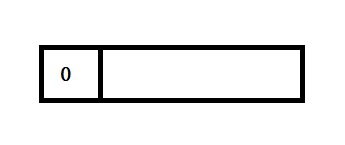

<h2 style="color:red">分支限界</h2>

####1.分支限界的简介
> 分枝限界是通过广度优先搜索的问题的解空间树，对比回溯算法，分支限界算法每个节点只有一次机会成为拓展节点,同样的，可以通过限界条件，提前舍去不必要的搜索。

####2.解题步骤
> 针对不同问题，合理的确定一个限界函数，根据限界函数估计每个节点的上界或者下届(根据题意)然后筛选拓展节点，直到叶子节点为止。

####3.解题框架
> 分枝限界算法主要用两类数据结构去完成，一类是队列，自己设定每个节点的上下界，另一类是优先队列(堆),根据题目设定大根堆还是小根堆
> 
>下面我将举出三个经典的例子，分别用两种框架去求解。
<h3 style="color:red">问题1</h3>
**0-1背包**

这个问题前面已经出现了，就是在有限的容量下选取物品，让背包装的物品总价值最大。这里我们用分支限界的思想去求解。根据解题框架里描述的，我们举例分析。

**算法步骤：**

1. 设定最优价值lastV是无穷小，设定两个限界条件，一个是每当加入一个物品前，判断是否超重，超重则剪枝，反之则入队列.另一个条件是每当加入一个物品前，判断物品最大上界是否大于最优解,大于最优解则入队列，反之剪枝。特别注意，lastV在非叶子节点时不会修改（因为到了叶子节点，所有物品才判断结束）每当是叶子节点，在判断物品上界大于最优解时，就修改lastV等于这个物品上界。
2. 准备一个队列，入队列一个空节点，求此节点加入后当前总重量，总价值，和可获得价值的上界，根据步骤一判断是否入队列
3. 出队列一个节点，将其孩子节点逐个按照步骤一判断。循环步骤3，直到队列空.

**举例分析**

|物品编号|重量|价值|
|----|----|----|
|1|16|45|
|2|15|25|
|3|15|25|

每个节点我们有三个信息，分别是加入当前物品时总重量，总价值，和上界价值。其中红色的标记是每个节点的编号，首先是根节点，表示未加入任何物品，所以对应的物品重量和价值都是0，它对应的价值上界是68（在背包容量足够情况下，装入所有剩余物品，所以可以装入物品1，此时背包还剩15，只能装入物品2的一部分，按照比例装入剩下14/15*25=23，再加上物品1的价值45等于68）然后按照步骤一和二，设定当前最优价值是无穷小-99999，当前节点大于最优解，入队列。

接着按照步骤三，出队列节点0，逐个判断其孩子节点，0号节点的左孩子表示加入物品1，对应的总重量，总价值，价值上界是(16,45,68),总重量没超过背包最大容量30，且最大上界大于最优解，入队。同理右孩子2也满足条件入队列。

继续出队列节点1，逐个判断其左右孩子，首先是3，当加入节点3时，对应的那一层代表加入物品2，此时的总重量是16+15=31，超重，剪枝叶。接着对应节点4，对应那一层表示不加入物品2，此时的总重量，总价值，价值上界都满足条件，入队列。

继续出队节点2，逐个判断其左右孩子，发现对应左右孩子都满足条件，都入队列。

继续出队列节点4，逐个判断其左右孩子，首先是节点7，对应的那一层是物品3，已经是叶子节点了(到达最后一个物品，就是叶子)，7代表加入物品3时，总重量是16+0+15=31，超重了，剪枝。接着是节点8，对应的总重量和总价值和上界价值分别是16，45，45，且因为此节点是叶子节点，又因为此节点大于最优解-9999，所以修改最优解是45。

继续出队5，逐个判断其左右孩子，发现左孩子成立，且上界价值大于当前最优价值45，因为节点9是叶子，所以修改最优价值是50，然后入队9。接着判断右孩子10，发现此时的右孩子上界价值是25，小于当前最优价值，所以剪枝掉。

继续出队节点6，逐个判断左右孩子，首先是节点11，改节点的上界价值小于当前最优，剪枝，接着节点12，也是上界价值小于当前最优价值，剪枝。

最后，逐个出队，结束，找出了最大价值就是50.

**代码**

	//求当前节点的最大上界价值
	void bound(struct Node *n, int index,int *weight, int *value, int maxWeight)
	{
		int lever = n[index].lever;//当前节点层次
		int sumW = n[index].weight;
		int sumV = n[index].value;
		while (sumW <= maxWeight && lever<countPack)
		{
			sumW += weight[lever];
			sumV += value[lever];
			lever++;
		}
		if (lever < countPack)//未能全部装
		{
			n[index].up = sumV + (maxWeight - sumW)*value[lever] / weight[lever];
		}
		else {//全部装入
			n[index].up = sumV;
		}
	}
	//0-1背包
	void package(int *weight, int *value, int maxWeight)
	{
		int *queue,count=0,front,rear,top,index=0;
		front = rear = 0;
		countPack = 3;//物品数量------------------------根据物品个数修改
		queue = (int*)malloc(sizeof(int) * 100);
		struct Node *n;//根节点
		n = (struct Node*)malloc(sizeof(struct Node) * 100);
		n[index].lever = n[index].value = n[index].weight = n[index].no = 0;
		bound(n, index,weight, value, maxWeight);
		//让根节点入队
		queue[rear++] = n[index].no;
		while (front != rear)
		{
			//出队列元素
			top = queue[front];//拿到编号
			front++;
			//求左孩子上界,当前重量，价值，层数,编号
			n[2 * top + 1].no = n[top].no + 1;//编号
			n[2 * top + 1].lever = n[top].lever + 1;//层数
			n[2 * top + 1].weight = n[top].weight +weight[n[2 * top + 1].lever];//重量
			n[2 * top + 1].value = n[top].value + value[n[2 * top + 1].lever];//价值
			bound(n, 2 * top + 1, weight, value, maxWeight);
			//左孩子满足条件，入队列
			if (n[2 * top + 1].up > maxValue && n[2 * top + 1].weight <= maxWeight)
			{
				//当次左孩子已经时叶子节点，如果大于当前最优解，不入队(可入可不入，不入最好),修改最优解
				if (n[2 * top + 1].lever == countPack)
				{
					if (n[2 * top + 1].value > maxValue)
					{
						maxValue = n[2 * top + 1].value;
					}
				}
				else {
					queue[rear++] = n[2 * top + 1].no;
				}
	
			}
			////求右孩子上界,当前重量，价值，层数
			n[2 * top + 2].no = n[top].no + 2;//编号
			n[2 * top + 2].lever = n[top].lever + 1;//层数
			n[2 * top + 2].weight = n[top].weight; //重量
			n[2 * top + 2].value = n[top].value;//价值
			bound(n, 2 * top + 2, weight, value, maxWeight);
			//右孩子满足条件，入队列
			if (n[2 * top + 2].up > maxValue)
			{
				//当次右孩子已经时叶子节点，如果大于当前最优解，不入队(可入可不入，不入最好),修改最优解
				if (n[2 * top + 2].lever == countPack)
				{
					if (n[2 * top + 2].value > maxValue)
					{
						maxValue = n[2 * top + 2].value;
					}
				}
				else {
					queue[rear++] = n[2 * top + 2].no;
				}
			}
		}
		printf_s("最大价值是:%d ", maxValue);
	}

<h3 style="color:red">问题2</h3>
**图的单源最短路径**

**算法步骤：**

1. 准备一个队列，再准备dis数组和path数组，分别保存各点到原点的最短距离和路径。设计剪枝条件，当前节点到队列头节点的距离+队列头的dis值<当前节点的dis值则入队列，反之剪枝。
2. 出队头元素，逐个按照剪枝条件判断孩子节点，依次入队列。
3. 重复步骤二，直到队列空。

假设求其它点到原点0的最短路径。

首先入队列原点0，然后出队列头就是0，逐个判断与其他相连接边的顶点，首先是点2，发现dis[0]+data[0][2]<dis[2]，所以入队列2，并修改dis[2]=dis[0]+data[0][2]，和path[2]=0;同理，点4和5也成立，入队列，同时更新dis和path。

继续出队列元素2，和2连接的是3，dis[2]+data[2][3]<dis[3]。所以入队列3，并修改dis[3]=dis[2]+data[2][3],更新path[2]=3;

继续出队列4，4连接的点是3和5，发现满足限定条件，且3和5都在队列，直接修改它们的dis值和path值就行。

继续出队列5，此时5没有边连接。

继续出队列3，发现于3连接的是5，并满足限定条件，更新dis[5]和path[5]的值。顶点5入队

继续出队列5，无其它边连接，队列空，结束。此时的dis数组和path数组分别保存其它点到原点0的最短距离和最短距离的路径。

**代码**

	//单源最短路径问题
	void minPath()
	{
		int data[MAX][MAX],dis[MAX];//二维矩阵存储顶点间距离
		int numEdge,numVer,x,y,w,temp;
		int queue[MAX], front, rear, top,path[MAX];
		front = rear = 0;
		printf("请输入图的点数量和边个数 ");
		scanf_s("%d%d", &numVer,&numEdge);
		//初始化图的权值
		for (int i = 0; i < MAX; i++)
		{
			for (int j = 0; j < MAX; j++)
			{
				data[i][j] = INF;
				dis[j] = INF;
				path[j] = -1;
				if (i == j)
				{
					data[i][j] = 0;
				}
			}
		}
		for (int i = 0; i < numEdge; i++)
		{
			printf("请输入每条边点的下标和权值: ");
			scanf_s("%d%d%d", &x, &y,&w);
			data[x][y] = w;
		}
		//开始求解,假设求下标0到其它点的最短距离
		queue[rear++] = 0;
		dis[0] = 0;
		while (front != rear)
		{
			//出队头元素
			top = queue[front++];
			for (int i = 0; i < numVer; i++)
			{
				//存在更短路径，将该点入队列。
				if (data[top][i] < INF&& i!=top && dis[top] + data[top][i] < dis[i])
				{
					dis[i] = dis[top] + data[top][i];
					path[i] = top;
					//如果不在队列，再入队。
					temp = 0;
					for (int j = front; j <= rear; j++)
					{
						if (queue[j] == i)
						{
							temp = 1;
							break;
						}
					}
					if (temp == 0)
					{
						queue[rear++] = i;
					}
				}
			}
		}
		//输出最短距离
		for (int i = 1; i < numVer; i++)
		{
			printf_s("%d",dis[i]);
		}
	}

<h3 style="color:red">问题3</h3>
**活动安排**

有n个任务需要分配给n个人执行，每个任务只可以分配给一个人，每个人只可以执行一项任务，每个人执行不同任务所花费的成本也不同，求出总成本最小的方案。

|人员|任务1|任务2|任务3|任务4|
|----|----|----|----|----|
|1|9|2|7|8|
|2|6|4|3|7|
|3|5|8|1|8|
|4|7|6|9|4|
此时就是4个人，4个任务，求出最小成本的方案。

**问题剖析**

前一节，我们用到回溯算法求求解，当时用到回溯的空间树类型树排列树。此处我们将继续用分枝限界算法去求解这个问题，首先我们直到分枝限界的本质就是用队列实现，设计一个很好的限界函数，类比0-1背包的分支限界过程，我们求出每个节点的任务成本的下界值，注意此处的节点应该设计成每层节点给对应的编号的人选择不同任务，所以如果是n个人就是n叉树。可能讲的模糊，直接上图分析。

上面的就是演示的第一个人的选择，cost存储的是当前给第i个人安排不同任务时的总成本，mincost是每个节点在当前选择的基础上，花费最小的成本，类比0-1背包的限界条件，当每个节点的mincot小于最优成本时，才可以拓展，同样的和0-1背包一样，初始的最优成本是无穷大，只有扩展到了叶子节点，小于最优成本时，才可以修改最优成本的值，此时拓展继续。当队列空时，最优成本就是我们要的。

**代码**

	void bound_Branch::assign_Task()
	{
		//设置每个人对应每个任务的成本
		int cost[4][4] = { 9,2,7,8,6,4,3,7,5,8,1,8,7,6,9,4 }, front, rear;
		task queue[MAX], node1, node2, top;//队列
		//入队列根节点
		node1.lever = node1.cost = front = rear = 0;
		for (int i = 0; i < 4; i++)
		{
			node1.temp[i] = 0;//任务未分配
		}
		getLow(&node1, cost);
		queue[rear++] = node1;
		while (front != rear)
		{
			top = queue[front++];//出队
								 //对下一人分配任务，
			for (int i = 0; i < 4; i++)
			{
				if (top.temp[i] == 0)//当前任务未被分配,将该任务分配给此人。
				{
					for (int j = 0; j < 4; j++)//复制temp到node2
					{
						node2.temp[j] = top.temp[j];
					}
					node2.temp[i] = 1;
					node2.lever = top.lever + 1;
					node2.cost = top.cost + cost[node2.lever][i];
					getLow(&node2, cost);//求下届
					if (node2.down < minCost)
					{
						if (node2.lever == 3)//到达叶子节点
						{
							//for (int k = 0; k < 4; k++)
							//{
							//printf_s("%d ", node2.temp[k]);
							//}
							//printf_s("\n");
							minCost = node2.cost;
							//printf_s("%d\n", minCost);
							queue[rear++] = node2;
						}
						else {
							queue[rear++] = node2;
						}
					}
				}
			}
		}
		printf_s("%d", minCost);
	}
		
	//求解下届
	void bound_Branch::getLow(task * t, int(*cost)[4])
	{
		int sum = 0;
		for (int i = t->lever; i < 4; i++)
		{
			int min = 9999;
			for (int j = 0; j < 4; j++)
			{
				if (t->temp[j] == 0 && cost[i][j] < min)
				{
					min = cost[i][j];
				}
			}
			sum += min;
		}
		t->down = sum + t->cost;
	
	}

