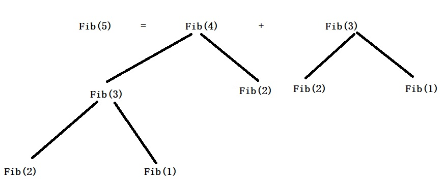
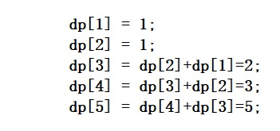
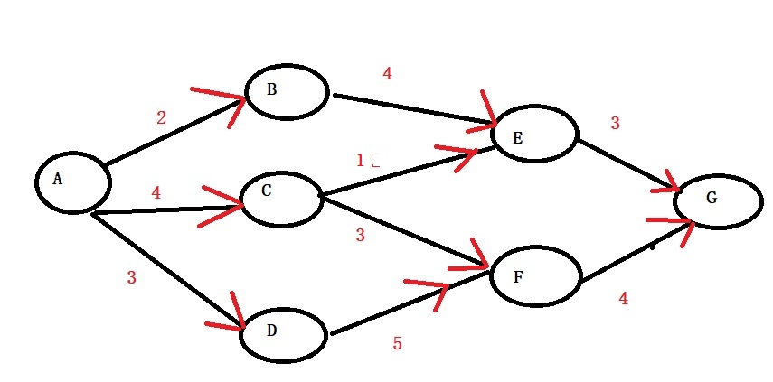
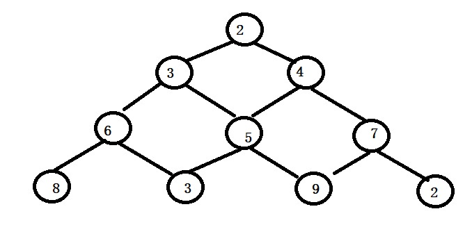
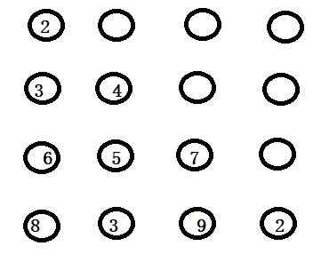

## 动态规划

> 动态规划是一种高性能的牛逼算法，由美国的R.Bellman提出，它是动态就是体现在此算法是基于一个递推公式或者说是多个初始公式和递归公式，在求解当前问题的解时，我们只需要按照递推公式，直接由上一层结果推导出来，而不是从头一步步计算，它的效率客观，但是它有一个不好的情况，就是难，难在你要通过所给的问题，找出它是否满足动态规划算法的范畴，难在你要根据题目找出它的递推公式。(我好像说多了，难也要上)

####因为动态规划在课本里面将的时候，前面全是什么杂七杂八的推导，看的人头大，此节我将直接用例题带你走进动态规划，了解它的基本性值和求解一般思路。

###问题1：斐波那契数列

斐波那契数列定义

Fib(n)=1---------------------------------n=1时

Fib(n)=1---------------------------------n=2时

Fib(n)=Fib(n-1)+Fib(n-2)------------n>2时

我们如果按照之前的做法，就是用递归求解它，递归算法如下

	int Fib(int n)
	{
		if (n == 1 || n == 2)
		{
			return 1;
		}
		return Fib(n - 1) + Fib(n - 2);
	}
现在我们来分析下这个递归代码，假设我们现在求Fib(5),整个求解过程如下

**分析:**
上面是求Fib(5)的示意图，Fib(5) = Fib(4)+Fib(3),求Fib(4)时，由去求Fib(3)+Fib(2),求Fib(3)时，由去求Fib(2)+Fib(1),我们发现个问题，就是Fib(3)被重复计算了，如果这个N更大，那么重复计算的数字更多，这不是提高了时间复杂度？我们如何解决这个重复计算问题？我们可以换一种角度思考，是否可以将每次计算的结果保存在数组里，计算当前问题时，如果需要用到上一次的值，直接取出来就ok,不用从头再来。好基于这个思路，我在改造下斐波那契代码。

	int Fib(int n)
	{
		int dp[100] = {0};
		dp[1] = dp[2] = 1;
		for (int i = 3; i <= n; i++)
		{
			dp[i] = dp[i - 1] + dp[i - 2];
		}
		return dp[n];
	}

下面是整个求Fib(5)的流程，对比前面的递归，我们发现这个就直接取出之前数据的结果，解决了重复计算数据的问题。

###问题2：两地点最短路径

假设A处有一个水库，现在需要铺设一条管道到G处，边上的数字代表距离，现在我们要找出最短的距离，如何实现？想到这里，我们既可以用单源最短路径求法，又可以用贝尔曼算法，不过今天我们的主题是动态规划，这个例子可以很好的用动态思想去求解。

**分析：**

我们设置一个dis数组，保存当前点到A点的最短距离，那么每次我们都去一步步逼近到终点，当我们要计算当前位置到A最短距离时，我们只需要根据前面的点，去求得当前点的最短距离，那么我们可以设计一个动态规划转移方程 dis[i] = MIN (dis[i-1] + data[i-1] [i]);此处的data就是一个二维矩阵，存储每两个点的距离。

1. 初始dis[A] = 0;
2. 求点B,C,D.
   + dis[B] = dis[A] + AB = 2;(前面只有一个点A)
   + dis[C] = dis[A] + AC = 4;(前面只有一个点A)
   + dis[D] = dis[A] + AD = 3;(前面只有一个点A)
3. 求点E，F.
   + dis[E] = dis[B] + BE =6,dis[E] = dis[C] + CE = 5,所以dis[E] = 5
   + dis[F] = dis[C] + CF =7,dis[F] = dis[D] + DF = 8,所以dis[F] = 7
4. 求点G
   + dis[G] = dis[E] +EG = 8,dis[G] = dis[F] +FG = 11,所以dis[G] = 8.

最后直接根据dis[G] = 10,得到了A到G的最短距离是8.此处就完美的解释了动态规划的思想。

###动态规划初步总结

根据上面两个例子的学习，我们可能大概知道了动态规划的一部分，明白它如何计算，如何实现真正意义的动态。现在我们整理下用动态规划求解题目的过程和方法。

**性质**

1. 最优化性质，问题的最优解所包含的子问题的解也是最优的，比如上面两个问题我们总是先求最优子问题的解，然后根据子问题解逐步逼近到最终解。
2. 无后效性，某状态决策一旦确定，那么后面的决策不会影响这个决策，比如上面我们求子问题的第一步到第n步之间，都是一次性确立，后面不会改变。
3. 有重叠子问题，比如前面两个问题，它们如果按照正常思路求解，都要知道前一阶段的解，前一阶段又是同样的道理，每次都是重复子问题的累积。

**解题步骤**

1. 划分阶段，我们总是将大问题，划分成小问题，用小问题解逐步逼近到大问题的解
2. 确定状态转移方程，这个是动态规划的关键，看上面的两个题，我们都写出了它的转移方程，转移方程就好比每个子问题的公式，直接套用。
3. 寻找边界，就是确定算法何时结束。
###问题3：最大连续子序列和

问题描述

给定一个有n个整数的序列，求出其中最大连续子序列的和，例如(-2,11,-4,13,-5,-2),它的最大连续子序列和是20，所构成的连续子序列就是11，-4，13.

求解思路

根据上面的总结，我们知道动态规划的核心就是确定动态转移方程和边界。本题的动态转移方程是什么?我们用dp[i]表示当前位置的最大连续子序列和。

首先第一个边界条件是dp[0] = 0;
第二个我们可以考虑，判断dp[i-1] 加上当前的值与当前值比较，如果dp[i-1]+data[i]都小于data[i],证明dp[i-1]肯定是个负数，那么肯定越加越小，那么我就没必要加入前面那个dp[i-1]。直接更新dp[i] = data[i];

总结的动态转移方程就是

1. dp[0] = 0------------------------------------i=0
2. max(dp[i-1]+data[i] , data[i])-----------i>0

**算法代码**

	void maxSum()
	{
		int data[] = { 0,-2,11,-4,13,-5,-2 };//0位置不用
		int len = sizeof(data) / sizeof(int);
		int *dp,max=-9999;
		dp = (int *)malloc(sizeof(int) * len);
		dp[0] = 0;
		for (int i = 1; i < len; i++)
		{
			if (dp[i - 1] + data[i] > data[i])
			{
				dp[i] = dp[i - 1] + data[i];
			}
			else
			{
				dp[i] = data[i];
			}
		}
	
		//直接找出dp数组最大，就是最大结果
		for (int i = 0; i < len; i++)
		{
			if (dp[i] > max)
			{
				max = dp[i];
			}
		}
		printf_s("最大连续子序列和是: %d", max);
	}

###问题4：三角形最短路径

**问题描述**

给定一个高度是n的整数三角形，找出从顶部到底部的最短路径，每个点只能走下一层的相邻点，如下图，是一个高度是4的三角形，输出的最短路径就是2，3，5，3，路径和是13

**求解思路**

首先我们这个三角形一定是用二维数组表示的，实际在二维数组的排列是这样的，如下图
首先我们得对比分析上图，推导每个点可以走的路，假设现在坐标是(x，y)那么该点往下一层走只能走两个点(x+1,y+1)和(x+1,y).我们用二维数组data[i][j]表示每个点坐标和值，用动态数组dp[i][j]来表示从顶部0,0走到当前点的最短路径和。接下来我们分析下动态转移方程和边界问题。

1. dp[0][0] = data[0][0]----------------------------------------------------顶部边界

2. dp[i][0] = dp[i-1][0]+data[i][0]-----------------------------------------第1列边界

3. dp[i][i] = dp[i-1][i-1]+data[i];-------------------------------------------对角线边界
4. dp[i][j] = MIN(dp[i-1][j-1],dp[i-1][j]) +data[i][j]----------------------其它正常情况(存在两个指向的)

**举例分析**

我们按照上面的图例，从顶部到最底部，找一条最短路径。在顶部时,dp[0][0] = 2,来到第二层，首先数字3是第一列边界，只能从数字2到达，所以dp[1][0]=5,数字4是对角线的边界，只能是对角线过来的，dp[1][1]=6,来到了第三层，首先数字6，dp[2][0]=11,接下来数字5，它的前驱是两个路，数字3，或者数字4过来的，我们查是最3和4对应的dp值，发现数字3的dp更小，所以我们选择数字3那条路，数字5的dp就是dp[1][0]+5=10,接下来数字7又是对角线，边界问题，直接加上上一层dp,dp[2][2]=13.后面的就是这个规律。到了最底部，结束。

**代码**

	    //三角形最短路径
		void minPath()
		{
			int i, j, high,**data,**dp,**pre,min,index,num;
			printf_s("输入三角形的高度: ");
			scanf_s("%d", &high);
			data = (int **)malloc(sizeof(int *)*high);
			dp = (int **)malloc(sizeof(int *)*high);
			pre = (int **)malloc(sizeof(int *)*high);
			//输入三角形(二维数组里)
			for (i = 0; i < high; i++)
			{
				data[i] = (int *)malloc(sizeof(int) * high);
				dp[i] = (int *)malloc(sizeof(int) * high);
				pre[i] = (int *)malloc(sizeof(int) * high);
				for (j = 0; j <= i;j++)
				{
					scanf_s("%d", &data[i][j]);
				}
			}
			
			//初始化边界问题
			dp[0][0] = data[0][0];
			pre[0][0] = -1;
			for (i = 1; i < high; i++)
			{
				dp[i][i] = dp[i - 1][i - 1] + data[i][i];
				dp[i][0] = dp[i - 1][0] + data[i][0];
				pre[i][i] = i-1;
				pre[i][0] = 0;
			}
			//其它正常情况
			for (i = 1; i < high; i++)
			{
				for (j = 1; j < high; j++)
				{
					if (i != j &&j != 0)
					{
						if (dp[i - 1][j - 1] > dp[i - 1][j])
						{
							dp[i][j] = dp[i - 1][j] + data[i][j];
							pre[i][j] = j;
						}
						else {
							dp[i][j] = dp[i - 1][j-1] + data[i][j];
							pre[i][j] = j-1;
						}
					}
				}
			}
			//找出最短距离
			min = dp[high - 1][0];
			index = 0;
			for (i = 1; i < high; i++)
			{
				if (dp[high-1][i] < min)
				{
					min = dp[high-1][i];
					index = i;
				}
			}
			printf_s("最短距离是:%d它的路径是: ",min);
			num = high-1;
			while (num!=0)
			{
				printf("%d ",data[num][index]);
				index = pre[num][index];
				num--;	
			}
			printf_s("%d\n", data[0][0]);
		}

###问题5：最长递增子序列

**问题描述**

给定一个无序的整数序列数组，求其中最长递增子序列的长度，例如a[]={2,1,5,3,6,4,8,9,7}n=9,这个数组的最长递增子序列就是{1,3,4,8,9}长度是5。

**求解思路**

首先我们知道每一个单独的数字，就可认为它是递增的，我么还是设计dp数组，对应下标的dp表示当前位置最长子序列长度。首先是边界问题，每个单独的数字都是视为递增的，dp[i] = 1(初始情况),然后我们继续设立转移方程，dp[i] = max(dp[i],dp[j]+1),其中0<j<i;让j从0开始一直遍历到i的前一个位置，只要j对应的数字小于i对应的数字，我们就去判断dp[j]+1，和dp[j]谁大，谁大dp[i]就等于这个数。可能说的模糊，我会举例子的,先把dP方程列出来。

1. dp[i] = 1,------------------------------------------0<i<n
2. dp[i] = max(dp[i],dp[j]+1)----------------------0<j<i(只要data[i]>data[j])

**举例分析**

数列就是上面的a[] = {2,1,5,3,6,4,8,9,7} 长度是9

1. 我们首先是数字2，直接dp[0]=1,因为它是第一个，不用判断、
2. 接着是数字1，直接dp[1]=1,从第一个数字一直判断到它前一个，它前面只有2，且小于这个数，退出。
3. 接着是数字5，直接dp[2]=1,从第一个数字一直判断到它前一个，首先是数字2，它大于数字2，所以进行比较dp[2]和dp[0]+1,此处的加一很好理解，5大于2，所以在2对应的递增子序列长度加上1，去表示5的递增子序列长度，因为dp[0]+1大于当前的dp[2],更新dp[2]=dp[0]+1就是2,继续来到数字1，它还是大于数字1，继续比较dp[2]和dp[1]+1,此时等于dp[1]+1,所以不修改dp[2]值，继续，发现遍历结束，退出。
4. 接着是数字3，直接dp[3] = 1，
   + 3>2,dp[0]+1>dp[3],更新dp[3]=2
   + 3>1,dp[1]+1=dp[3],不更新
   + 3<5,不更新
5. 接着是数字6，直接dp[4]=1,
   + 6>2,dp[0]+1>dp[4],更新dp[4]=2,
   + 6>1,dp[1]+1=dp[4],不更新
   + 6>5,dp[2]+1>dp[4],更新dp[4]=3,
   + 6>3,dp[3]+1=dp[4],不更新
6. 。。。。。。。。依次类推

**代码**

	//最长递增子序列
	void maxLen()
	{
		int len, *data,i,j,*dp,max;
		printf_s("输入你的数组长度: ");
		scanf_s("%d", &len);
		data = (int *)malloc(sizeof(int) * len);
		dp = (int *)malloc(sizeof(int) * len);
		for (i = 0; i < len; i++)
		{
			scanf_s("%d", &data[i]);
		}
		for (i = 0; i < len; i++)
		{
			dp[i] = 1;
			for (j = 0; j < i; j++)
			{
				if (data[j] < data[i])
				{
					if (dp[j] + 1 > dp[i])
					{
						dp[i] = dp[j] + 1;
					}
				}
			}
		}
		max = dp[0];
		//找出最大长度
		for (i = 1; i < len; i++)
		{
			if (dp[i] > max)
			{
				max = dp[i];
			}
		}
		printf_s("%d", max);
	}

###问题6：0-1背包

**问题描述**

前面已经多次出现了0-1背包问题，关于描述我就简单说下，给你一个有容量的背包，现在有n个物品，每个物品对应不同的价值，现在要求你装入不同的物品，要求在不超过背包容量前提下，要求背包装入物品的价值最大。

假设我们给定背包的最大容量W=10，现在给你5个物品。它们的重量数组是w={2,2,6,5,4},它们的价值数组是v={6,3,5,4,6}。

**求解思路**

我们还是按照动态规划的设计步骤，设计二维数组dp[i][j],其中这个dp[i][j]表示在已经考虑了物品1，2，3，，i时，背包容量为j的情况下，背包的最大价值。

那么我们可以试着列出边界和转移方程组

1. dp[i][0] = 0(背包容量为0，任何物品都不能装入,价值就是0)
2. dp[0][i] = value(背包现在装入物品0，value视情况，如果物品0可以放入，value=v[0],如果不能，value就是0)
3. dp[i][j] = dp[i-1][j] (物品i放不下了)
4. dp[i][j] = max(dp[i-1][j],dp[i-1][j-w[i]] +v[i]) (在放入物品i和不放入物品i里面选择最优解)

此方程中的前三条容易理解，其中第二条就是初始物品0作为边界。第四条比较抽象，其中第四条的规则时，目前背包可以放入第i个物品，现在要你选择放还是不放这个物品，这时候肯定有人要问，肯定放啊，为什么要这么沙雕一步骤？能放进去，价值不是更大？那么你的问题是很好的，我前几次理解也是这么理解的，后来写了一遍dp展开式，明白了此处的放是这么个意思，dp[i][j]本质是我在对第i个物品进行抉择时，有j容量的背包，此时背包里面什么也没放，现在就是让你选择，你是拿这j容量的背包去装第0到i-1之间物品的最优价值还是拿它去装第i个物品加上剩余容量可以装入的物品的最优值，此时我们不清楚，因此此处要比较一番，如果感觉我没说明白，你可以继续看下面的例子(dp展开式)

**示例分析**

+ dp[0][0]=0，dp[0][1]=0,dp[0][2]=6,因为背包此时的容量是2,0是第一件物品，就是边界，直接放入。dp[0][3] = 6,dp[0][4]=6......dp[0][10]=6.s
+ dp[1][0]=0,dp[1][1]=0,dp[1][2]=max(dp[0][2],dp[0][0]+v[1])=6就是在选择物品1和不选择之间挑选价值最大的就是6.后面的依次类推。
+ 下面就是完整的dp数组

|物品编号/背包容量|0|1|2|3|4|5|6|7|8|9|10|
|----|----|----|----|----|----|----|----|----|----|----|----|
|0|0|0|6|6|6|6|6|6|6|6|6|
|1|0|6|6|9|9|9|9|9|9|9|9|
|2|0|0|6|6|9|9|9|9|11|11|14|
|3|0|0|6|6|9|9|9|10|11|13|14|
|4|0|0|6|6|9|9|12|12|15|15|15|

**代码**

	//0-1背包
	void package()
	{
		int w[] = { 2,2,6,5,4 };
		int v[] = { 6,3,5,4,6 };
		int len = 5, maxWeight = 10,i,j,weight;//dp数组存储结果
		int dp[MAX][MAX];
		weight = maxWeight;//weight存储当前背包剩余容量
		for (i = 0; i < len; i++)
		{
			dp[i][0] = 0;
		}
		for (i = 0; i <= weight; i++)
		{
			if (w[0] <= i)//第一个物品是边界值，
			{
				dp[0][i] = v[0];
			}
			else
			{
				dp[0][i] = 0;
			}
		}
		
		for (i = 1; i < len; i++)
		{
			for (j = 0; j <= weight; j++)
			{
				//是否可以放下第i个物品
				if (j >= w[i])
				{
					if (dp[i - 1][j] > dp[i - 1][j - w[i]] + v[i])
					{
						dp[i][j] = dp[i - 1][j];
					}
					else
					{
						dp[i][j] = dp[i - 1][j - w[i]] + v[i];
					}
				}
				else
				{
					dp[i][j] = dp[i - 1][j];
				}
			}
		}
	
		for (i = 0; i < len; i++)
		{
			for (j = 0; j <= weight; j++)
			{
				printf_s("%d ", dp[i][j]);
			}
			printf_s("\n");
		}
		printf_s("最大价值%d\n",dp[4][10]);
		//逆序推导选择的物品
		len--;
		while (len > 0)
		{
			if (dp[len][weight] != dp[len - 1][weight])//选择物品len
			{
				printf_s("物品%d被选中\n", len+1);
				weight -= w[len];
			}
			len--;
		}
		if(weight!=0)
		{
		        printf_s("物品%d被选中\n", len+1);
		}
	}

###问题7：完全背包

**问题描述**
完全背包是0-1背包的升级版，和0-1背包题目一摸一样，就是在0-1背包基础上，添加一条规则，每个物品可以被选择多次。现在我们假设有三件物品n=3,物品对应的重量和价值分别是weight={3,4,2} ,value={4,5,3},背包的容量是7，求背包装载的最大价值(每个物品可以被选择多次)

**求解思路**

既然它是由0-1背包进化的，那么它也和0-1背包的状态转移方程基本一样。此时我们仍然设立dp[i][j]表示选择第i个物品时，背包容量是j的情况下的最大价值，然后考虑边界，还是当背包容量是0时，价值是0，dp[i][0]=0,接着继续初始化边界，以第一个物品作为边界，dp[0][j],在容量j不同情况下，dp[0][j]也是不同的。下表就是对边界物品1的初始情况。

|dp/容量|0|1|2|3|4|5|6|7|
|----|----|----|----|----|----|----|----|
|dp[0][j]|0|0|0|4|4|4|8|8|

dp转移方程如下

+ dp[i][0]=0------------------------------------------背包无法装入
+ dp[0][i]=value--------------------------------------上面表格
+ dp[i][j]=MAX(dp[i-1][j-w[i]*k] +v[i]*k)-------------在装入与不装选择(物品i可以放入，必须满足k*w[i]<=j)

对于转移方程1和2都可以理解，有人可能疑惑，方程3咋在0-1背包基础上大变啊，你分析的对，因为我还没说k是什么(我的错),k就是这个方程的关键，它就是物品i选择了几件，它从0开始一直递增到背包装不下的临界值，那么不装入物品i如何在方程中体现？当k取0值时，表示装入0件物品i，化简就是dp[i][j]=dp[i-1][j],是不是又和0-1背包的不装物品i的转移方程一样了。下面表格是完整的dp数组

|背包编号/背包容量|0|1|2|3|4|5|6|7|
|----|----|----|----|----|----|----|----|----|
|0|0|0|0|4|4|4|8|8|
|1|0|0|0|4|5|5|8|9|
|2|0|0|3|4|6|7|9|10|

	//完全背包
	void full_Pack()
	{
		int weight[] = {3, 4, 2};
		int value[] = { 4,5,3 };
		int len = 3, maxWeight = 7;
		int dp[MAX][MAX],i,j,k,max,count[MAX][MAX];
		//初始化边界
		for (i = 0; i < len; i++)
		{
			dp[i][0] = 0;
		}
		for (i = 0; i <= maxWeight; i++)
		{
			for (k = 0; k*weight[0] <= i; k++)//背包容量足够，放入物品0越多，价值越大。
			{
				dp[0][i] = k*value[0];
				count[0][i] = k;
			}
		}
		//开始
		for (i = 1; i < len; i++)
		{
			for (j = 1; j <= maxWeight; j++)
			{
				max = dp[i][0];
				dp[i][j] = max;
				count[i][j] = 0;
				for (k = 0; k*weight[i] <= j; k++)
				{
					if (dp[i - 1][j - weight[i] * k] + value[i] * k > max)
					{
						max = dp[i - 1][j - weight[i] * k] + value[i] * k;
						dp[i][j] = max;
						count[i][j] = k;
					}
				}
			}
		}
		printf_s("最大价值: %d\n", dp[2][7]);
		//输出选择物品
		len--;
		while (len >= 0)
		{
			printf_s("%d %d\n", len + 1, count[len][maxWeight]);
			maxWeight -= weight[len] * count[len][maxWeight];
			len--;
		}
	}

###动态规划的空间优化：滚动数组

此处我们在浅谈滚动数组，首先我们得知道滚动数组是什么？

> 在求解动态规划问题中，我们常常会用规划dp数组存放问题的解，因为此dp数组不断滚动刷新着，这时我们可对数组下标特殊处理，让每一次操作只使用若干个值，这种操作就是滚动数组，目的就是为了压缩空间。

此处我只举一个简单例子，后面的大家可以自行拓展丰富。

我举得例子就是我们上面将的第一个斐波那契数列，先观察下它的动态规划写法代码。

	//改造前的
	int Fib(int n)
	{
		int dp[100] = {0};
		dp[1] = dp[2] = 1;
		for (int i = 3; i <= n; i++)
		{
			dp[i] = dp[i - 1] + dp[i - 2];
		}
		return dp[n];
	}
此处我申请的是100个空间大小的数组，实际我们通常申请大小所求数列n大小的空间，那么我再通过改造代码，你可以观察下滚动数组的奇妙之处。

	//改造后的
	int Fib(int n)
	{
		int dp[3];
		dp[1] = dp[2] = 1;
		for (int i = 3; i <= n; i++)
		{
			dp[i % 3] = dp[(i - 2) % 3] + dp[(i - 1) % 3];
		}
		return dp[n % 3];
	}

此时你会发现，仅仅用到了3个空间我们就完成了任意fib(n)的求法，直接将空间复杂度由0(n)降低为o(1),是不是很牛逼啊。好了，我只是浅谈滚动数组，关于它如何构造，如何更好设计，还需大家一起努力探索。