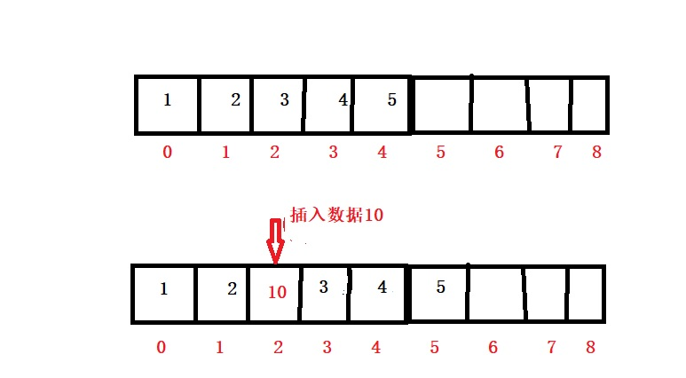
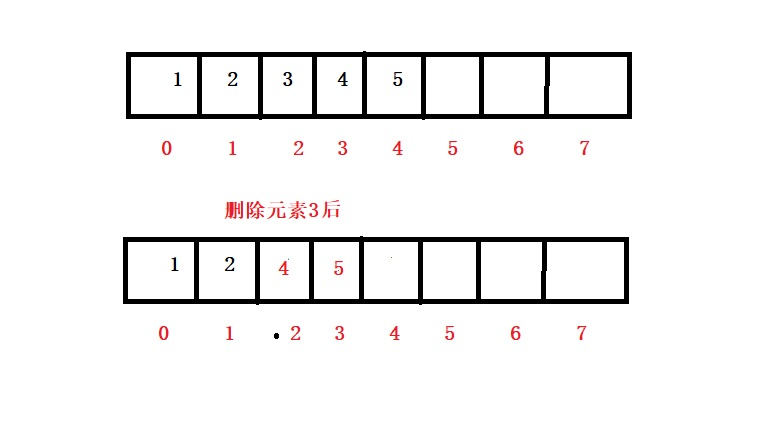

<h2 style=="color:red">数组</h2>

> 数组是一种线性的数据结构，它用一组连续的存储空间来存储数据相同的数据

对于数组，相必大家都知道吧，不管是C,Java,Python,JavaScript,Go语言等等都有数组，由于JavaScript是一门弱语言，它设计数组可以存储不同数据类型。下面我们来分析下数组的增删改查操作和它的性能

查找和修改

数组中查找和替换都是通过下标直接操作的，时间复杂度都是0(1),提醒下，此处的查找是指给定一个数组下标，找出数组对应的元素。

添加元素

看上图，就很容易知道，数组在指定位置插入数据时，需要将改位置后面的数据都向后移动一个位置。这个操作就很头疼，最好情况下，插入数据在数组的末尾时间复杂度是0(1),最坏情况下，数据插入在最前面，事件复杂度是0(n),因为插入数据的位置是随机的，等概率模型，所以平均事件复杂度是1*(1/n) + 2*(1/n) + 3*(1/n) + ....n*(1/n) = 0(n),

删除元素

看上图，我们可以发现，数组在删除指定元素时，需要将该位置后面的数据都向前移动一个位置，和插入一样，同样这个事情也是数组的弊端，删除末尾始据时它的最好时间复杂度就是0(1)，当删除第一个元素时，时间复杂度是0(n)。它的平均时间复杂度是0(n)

总结

数组总体来说很简单，但是它十分十分十分重要，因为它是后面数据结构的基础，许多都是参考它的优点和缺点的问题来设计的。当然，你也会发现数组不能自动扩容，其实，好多新的编程语言都涉及了自动扩容的数组，扩容系数大多是1.5--2左右。后面是我自己实现的可扩容的数组，系数是2

	#include "Array.h"
	#include<iostream>
	using namespace std;
	template<class T>
	Array<T>::Array()
	{
		this->index = 0;
		this->length = 1;
		this->data = new T[this->length];
	}
	
	template<class T>
	Array<T>::~Array()
	{
		this->index = this->length = 0;
		if (this->data)
		{
			delete[] data;
			data = NULL;
		}
	}
	
	template<class T>
	void Array<T>::Array_Append(T data)
	{
		if (this->index == this->length)
		{
			this->length = 2 * this->index;
			T* newData = new T[this->length];
			for (int i = 0; i < this->index; i++)
			{
				newData[i] = this->data[i];
			}
			delete[] this->data;
			this->data = newData;
			this->data[this->index] = data;
			this->index++;
		}
		else {
			this->data[this->index] = data;
			this->index++;
		}
	}
	//插入
	template<class T>
	void Array<T>::Array_Insert(int index, T data)
	{
		if (index <= 0 || index > this->index + 1)
		{
			return;
		}
		if (this->index == this->length)
		{
			this->length = 2 * this->index;
			T* newData = new T[this->length];
			for (int i = 0; i < this->index; i++)
			{
				newData[i] = this->data[i];
			}
			delete[] this->data;
			this->data = newData;
		}
		for (int i = this->index; i >= index; i--)
		{
			this->data[i] = this->data[i - 1];
		}
		this->data[index - 1] = data;
		this->index++;
	}
	//删除
	template<class T>
	void Array<T>::Array_Delete(int index)
	{
		if (index <= 0 || index >this->index)
		{
			return;
		}
		else {
			for (int i = index - 1; i < this->index - 1; i++)
			{
				this->data[i] = this->data[i + 1];
			}
			this->index--;
		}
	}
	
	template<class T>
	void Array<T>::Array_Print()
	{
		for (int i = 0; i < this->index; i++)
		{
			cout << this->data[i] << " ";
		}
		cout << endl;
	}
	
	template<class T>
	int Array<T>::getLen()
	{
		return this->index;
	}
	
	template<class T>
	bool Array<T>::isEmpty()
	{
		return this->index==0;
	}

