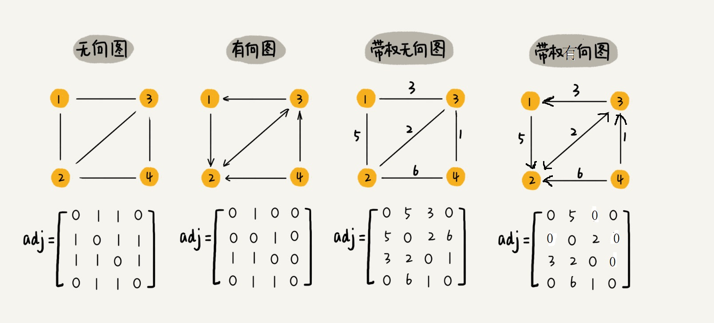
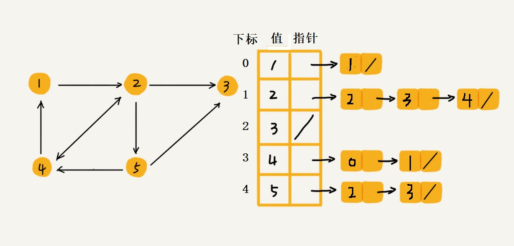

## 图

如何理解图？
前面我们学习了线性表，链表，树等基础数据结构，图这种数据结构就是它们的综合利用。我们都知道，图有边和顶点组成，图的知识点比较多，我这里只是简单从数据结构简要分析。

###1.图的种类

+ 根据方向:无向图和有向图
+ 根据权值：无权图和有权图

###2.图的术语

+ 度：度的概念是针对图的顶点而言的，在无向图中，度表示某个顶点周围有几个顶点与其相连接，在有向图中，分为入度和出度的概念，入度表示该顶点周围多少个点指向自己，出度表示该顶点指向几个点

+ 带权图：就是图中边上面的数据，描述边的附加信息。

+ 联系qq软件的例子，入度就是全服有多少人加你好友，出度就是你加了多少人好友，当然这个是矛盾的，qq软件设计的图是双向的，你加了它必然它也加了你，真正体现出度和入度的经典软件就是微博，你关注别人，别人不一定关注你，哈哈，是不是很sao.带权图就是qq软件里面的亲密度，每两个人之间的权值不一样，亲密度就不同。

###3.图的存储

####邻接矩阵

我们发现，当用邻接矩阵无向存储图时，矩阵是左对角线对称的，数据只保存一半就行，其余一半和上半部分是一样的，也就是说，我们白白浪费空间去存储。
还有，如果我们存储的是稀疏图，那么这种空间浪费更严重，但是这种存储方式优点也十分明显，我们要查询两个点的信息和关联时，十分快速。

	void creat_Graph_Matrix(struct MGraph *g)
	{
		int x1, x2;
		printf("请输入图的顶点个数和边的个数: ");
		scanf_s("%d%d", &g->numVretexes, &g->numEdges);
		g->vetex = (char*)malloc(sizeof(char)*g->numVretexes);
		g->data = (int**)malloc(sizeof(int*)*g->numVretexes);
		for (int i = 0; i < g->numVretexes; i++)
		{
			g->data[i] = (int*)malloc(sizeof(int)*g->numVretexes);
		}
		for (int i = 0; i < g->numVretexes; i++)
		{
			for (int j = 0; j < g->numVretexes; j++)
			{
				g->data[i][j] = 0;//初始化为无连接
			}
		}
		for (int i = 0; i < g->numEdges; i++)
		{
			getchar();//吸收空格
			printf("请输入第%d个顶点信息: ", i + 1);
			scanf_s("%c", &g->vetex[i]);
		}
		
		for (int i = 0; i < g->numEdges; i++)
		{
			printf("请输入第%d条边两个端点的下标 ",i+1);
			scanf_s("%d%d", &x1, &x2);
			g->data[x1][x2] = 1;//代表两点相连接构成边
			g->data[x2][x1] = 1;
		}
	}

###邻接表

邻接表就弥补了邻接矩阵造成空间浪费的情况，我们有多少边，就连接多少次，但是我们都知道数据结构的一大特性，就是时间和空间不可兼得，要求空间小，时间复杂度就会高，当我们需要知道某个点的连接信息时，需要逐个遍历才可以。

**注意点**:邻接表的存储可能网上有各类版本，我这个是我们大学教材的标准模式，首先图中每个节点都是存储在边表结构，所以有对应的下标，和对应的值，和指向下一个顶点的指针。图中我们指向下一个节点的值是存储顶点对应的下标。而不是存储对应顶点的值。例如顶点信息是1的节点，它的下标是0，它连接的顶点是2，对应数组下标就是1，所以链表存储是1。

	void creat_Graph_List(struct LGraph_List *g)
	{
		int x1, x2;
		printf("请输入图的顶点个数和边个数 ");
		scanf_s("%d%d", &g->numVretexes, &g->numEdges);
		g->list = (struct LGraph*)malloc(sizeof(struct LGraph)*g->numVretexes);
		printf("请输入图的顶点信息 ");
		for (int i = 0; i < g->numVretexes; i++)
		{
			getchar();
			scanf_s("%c", &g->list[i].data);
			printf("%c", g->list[i].data);
			g->list[i].head = NULL;
		}
		printf("请输入图的边信息\n ");
		for (int i = 0; i < g->numEdges; i++)
		{
			printf("请输入第%d条边的端点下标: ", i + 1);
			scanf_s("%d%d", &x1, &x2);
			struct Node *s1, *s2;
			s1 = (struct Node*)malloc(sizeof(struct Node));
			s2 = (struct Node*)malloc(sizeof(struct Node));
			s1->index = x1;
			s2->index = x2;
			s1->next = g->list[x2].head;
			g->list[x2].head = s1;
			s2->next = g->list[x1].head;
			g->list[x1].head = s2;
		}
	}

