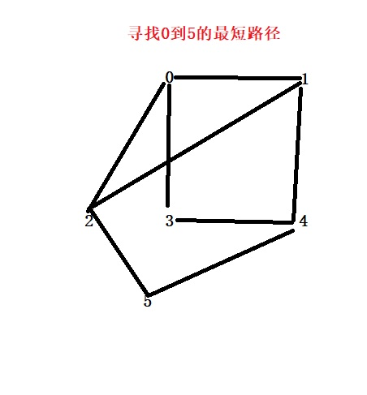
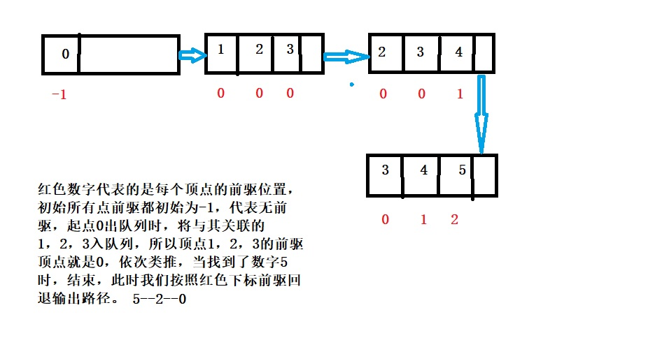

<h2 style="color:red">图的深搜和广搜</h2>

> 前面一篇是利用深搜和广搜进行图的顶点的遍历，今天我们则是真正的搜索目标位置

<h3 style="color:blue">图的深搜算法</h3>

问题：假设现在有一无向图，我现在要给你一个起始点和终点，如果可以走通请输出一条简单路径。

思考：我们可以考虑用深度搜索去求解此问题，我们假设用邻接矩阵存储这个图。我们需要设计一个形参数组保存路径。

关键点：算法的设计关键就是利用深搜递归可以回退参数的特点去求解，但是由于普通数组，传递的参数都是实参，我们需要自定义伪数组去实现真正的形参，这样我们可以回退结果。(大家可以推导下)

	//深搜的辅助操作
	void Find_Path(struct MGraph *g, char obj1, char obj2)
	{
		int index1, index2,*temp;
		struct Array arr;
		arr.len = 0;
		temp = (int*)malloc(sizeof(int) * g->numVretexes);
		for (int i = 0; i < g->numVretexes; i++)
		{
			if (g->vetex[i] == obj1)
			{
				index1 = i;
			}
			if (g->vetex[i] == obj2)
			{
				index2 = i;
			}
			temp[i] = 0;
		}
		DFS_Search(g, arr, temp, index1, index2);
	}

	//深搜的核心
	void DFS_Search(struct MGraph *g, struct Array arr,int *temp, int obj1, int obj2)
	{
		temp[obj1] = 1;
		arr.data[arr.len++] = obj1;
		if (obj1 == obj2)//找到了路径，输出路径
		{
			for (int i = 0; i < arr.len; i++)
			{
				printf("%c ", g->vetex[i]);
			}
			printf("\n");
		}
		for (int j = 0; j < g->numVretexes; j++)
		{
			if (g->data[obj1][j] != 0 && temp[j]==0)//有关联的点
			{
				DFS_Search(g, arr,temp, j, obj2);
			}
		}
	}
	

<h3 style="color:blue">图的广搜算法</h3>

问题：假设现在有一无向图，我现在要给你一个起始点和终点，请输出一条最短的行走方案。(最短就是指走过的边数最少)

思考：针对无权图的最短，就是利用广度搜索算法去寻找合适的路径

关键点：算法设计的关键就是在广度遍历的基础上，加上前驱数组标记每个顶点的前驱顶点位置，当找到了结束点后，就可以逆序遍历输出路径了。

我们用广搜的辅助队列模拟整个流程

	void Find_Path(struct MGraph *g, char obj1, char obj2)
	{
		int index1, index2, *temp,*pre,*queue,front,rear,num;
		temp = (int*)malloc(sizeof(int) * g->numVretexes);
		queue = (int*)malloc(sizeof(int) * g->numVretexes);//辅助队列
		pre = (int*)malloc(sizeof(int) * g->numVretexes);
		front = rear = 0;
		for (int i = 0; i < g->numVretexes; i++)
		{
			temp[i] = 0;
			pre[i] = -1;//前驱顶点
			if (obj1 == g->vetex[i])
			{
				index1 = i;
			}
			if (obj2 == g->vetex[i])
			{
				index2 = i;
			}
		}
		queue[rear++] = index1;
		temp[index1] = 1;
		while (front != rear)
		{
			num = queue[front++];
			if (num == index2)//找到了目标点，逆序打印路径
			{
				while (pre[num]!=-1)
				{
					printf("%c ", g->vetex[num]);
					num = pre[num];
				}
				printf("%c ", g->vetex[num]);
				printf("\n");
			}
			//出队列时，将所有有关联的点入队列
			for (int i = 0; i < g->numVretexes; i++)
			{
				if (g->data[num][i] != 0 && temp[i] == 0)
				{
					temp[i] = 1;
					queue[rear++] = i;
					pre[i] = num;//设置顶点的前驱
				}
			}
		}
	}