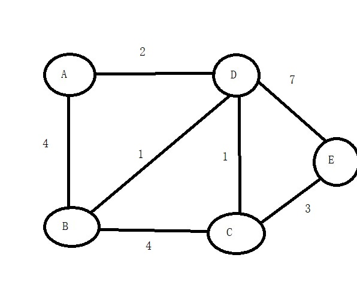
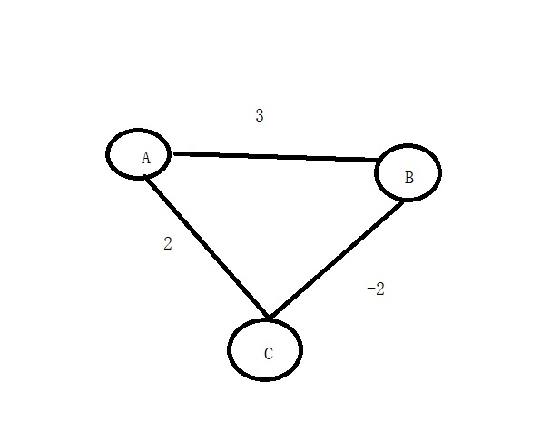
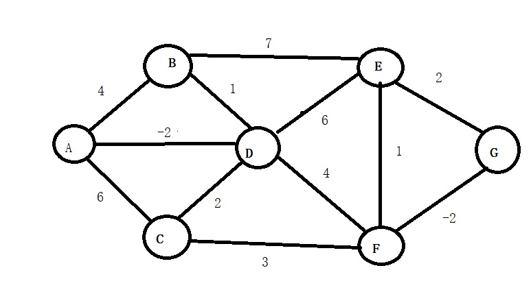

<h2 style="color:red">图的最短路径</h2>

+ 迪杰斯特拉算法
+ 贝尔曼-福特算法
+ 弗洛伊德算法
+ SPFA算法(**中国西南交通大学段凡丁发明**)

> 最短路径问题分为两类，一大类是求一个顶点到其余各顶点的最短路径问题，另一大类是求各个顶点间最短路径问题。

<h3 style="color:blue">迪杰斯特拉</h3>

> 迪杰斯特拉算法就是求解一个点到其余各点的最短路径算法，无向图带权图和有向带权图都适用。缺点是不适用权值为负数的图(后面会讲解原因)

算法步骤

1. 初始的点为起点，我们用s集合存储已经确定最短路径的点的集合，那么s={v},起点加入。其余各个点到v点的权值存储在dis数组里，不是直接连接的点距离都是无穷大
2. 从dis数组选出一个顶点u，这个点u到v点距离最小，把u加入s集合表示u已经确定了最短路径
3. 以点u为中介点，将除了s集合存储的点以外的其余点逐个判断，如果某个点x存在dis[u]+u点到x点距离<dis[x],就更新x的路径。
4. 重复2，3步骤，直到s集合包含了所有点。

我们还是直接上图看完整流程

首先我们先准备几个辅助数组,我们假设从点A为起点，找其它点到点A的最短路径

|节点|A|B|C|D|E|
|----|----|----|----|
|下标|0|1|2|3|4|
|权重|0|4|∞|2|∞|
|标记|1|0|0|0|0|
|前驱|-1|0|-1|0|-1|

我来说明下，这几个数组的作用
权重数组存储每个点到A点的最短距离 
前驱数组存储的是每个点前驱点下标，例如B点前驱是0，表示B和A连接,前驱是A 
标记数组存储的是当前点是否已经找到了最短路径。 
接下来我们准备工作做好了，开始干活了!

1.按照算法步骤，找出没被标记点中权重最小的点，我们找到了D点，将D点标记为1，表示D点以确认最短路径，然后以D点为中介判断未标记点，首先来到了B点，权重数组中B对应的是4，根据算法步骤3，我们计算出权重数组D+BD距离2+1=3 < 4(4就是权重数组B的值)所以B当前有一条路径比之前近，所以修改了B点对应的权重为3，同时更新它的前驱是D的下标。意思就是经过D点到B，更加近。同理继续看下一个未被标记的点C，继续计算权重数组D+CD距离 2+1=3 <∞,拿C点也要修改权重为3，同时更新C点前驱是D，继续看下一个未被标记点E，发现权重数组D+DE=9<∞,所以也修改E点权重为9，同步更新它的前驱是D。如下表就是第一次更新后的结果

|节点|A|B|C|D|E|
|----|----|----|----|
|下标|0|1|2|3|4|
|权重|0|3|3|2|9|
|标记|1|0|0|1|0|
|前驱|-1|3|3|0|3|

2.找出当前表中未标记点权重最小的，来到了B点和C点，我们选择B(随便哪一个都行)将B标记为1，接着逐个判断未被标记点，首先是C，权重数组B+BC距离 3+4 >3所以不修改。又来到了E，权重数组B+BE 3+∞ >9 ,也不修改，如下表就是第二次更新的结果

|节点|A|B|C|D|E|
|----|----|----|----|
|下标|0|1|2|3|4|
|权重|0|3|3|2|9|
|标记|1|1|0|1|0|
|前驱|-1|3|3|0|3|

3.找出当前表中未被标价点权重最小的是C点，将C点标记为1，然后判断未被标记的，只剩E点，权重数组C+CE距离 3+3<9 所以修改E点权重是6，更行E点前驱是C的下标，如下表就是第三次更新的结果

|节点|A|B|C|D|E|
|----|----|----|----|
|下标|0|1|2|3|4|
|权重|0|3|3|2|6|
|标记|1|1|1|1|0|
|前驱|-1|3|3|0|2|

4.找出最小，只剩下E点，直接标记E点是1，结束。

|节点|A|B|C|D|E|
|----|----|----|----|
|下标|0|1|2|3|4|
|权重|0|3|3|2|6|
|标记|1|1|1|1|1|
|前驱|-1|3|3|0|2|

有了上面一张表，我们就可以求出每个点到A点的最短路径了，我举两个点例子。

首先是点B，根据前驱下标进行寻找，B前驱下标是3，对应点D，所以B点前驱是D，接着D点前驱下标是0，对应点A，接着A点前驱下标是-1，退出。所以整个逆序路径就是B-D-A

接着看E点，前驱下标是2就是C点，C点前驱是3是D点，D点前驱下标是0，是A点，A点前驱是-1，退出,整个逆序路径是E-C-D-A

	//迪杰斯特拉算法
	void Dijkstra(struct MGraph *g, char obj)
	{
		int *temp, *dis, *pre,index,min,k;
		temp = (int*)malloc(sizeof(int) * g->numVretexes);
		dis = (int*)malloc(sizeof(int) * g->numVretexes);
		pre = (int*)malloc(sizeof(int) * g->numVretexes);
		//找出源节点的位置
		for (int i = 0; i < g->numVretexes; i++)
		{
			if (g->vetex[i] == obj)
			{
				index = i;
				break;
			}
		}
		//初始化辅助数组
		for (int i = 0; i < g->numVretexes; i++)
		{
			temp[i] = 0;
			pre[i] = -1;
			dis[i] = g->data[index][i];
		}
		temp[index] = 1;
		for (int i = 1; i < g->numVretexes; i++)
		{
			min = MAX;
			//找出当前dis存储最小的下标
			for (int j = 0; j < g->numVretexes; j++)
			{
				if (temp[j] == 0 && g->data[index][j] < min)
				{
					min = g->data[index][j];
					k = j;//标记最小值的位置
				}
			}
			temp[k] = 1;
			index = k;
			//从该点开始，逐个判断并修改dis数组
			for (int j = 0; j < g->numVretexes; j++)
			{
				if (temp[j] == 0 && (g->data[k][j] + dis[k]) < dis[j])
				{
					dis[j] = g->data[k][j] + dis[k];
					pre[j] = k;
				}
			}
		}
	
		//dis数组就是源点到各个点的最短路径
		for (int i = 0; i < g->numVretexes;i++)
		{
			printf("%c-->%c(%d)\n", obj, g->vetex[i], dis[i]);
		}
		printf("\n");
	}

<h3 style="color:blue">贝尔曼-福特</h3>

首先我们在这里回答下，为什么迪杰斯特拉算法不可以计算带负权的图。我们直接举例子分析吧

看这个图，存在带负权的边，现在我们按照迪杰斯特拉算法去求解A点到其它点的最短路径问题。

|节点信息|A|B|C|
|----|----|----|----|
|下标|0|1|2|
|权重|0|3|2|
|前驱|-1|0|0|
|标记|1|0|0|

首先选出权重最小的是点C，标记点C是1，然后判断未被标记点D 权重数组C+CB距离<权重数组B,所以修改点B对应的权重是0，且更行它的前驱是2.接着只剩下点B，标记它，完成。最终的表如下

|节点信息|A|B|C|
|----|----|----|----|
|下标|0|1|2|
|权重|0|0|2|
|前驱|-1|2|0|
|标记|1|1|1|

根据表发现，A点到C点的最短距离是2，可是我们一眼可以发现，从A到B再到C的距离是1，所以迪杰斯特拉不成立啊。什么原因？仔细看迪杰斯特拉算法的特性。它每次都找出当前权重数组最小的，找到后，就确认了这个点已经是最近的。可是如果后面其他边可能会存在负数边，会让这个点距离目标点更近。讲的有点绕，大家还是看图分析吧。

贝尔曼-福特求解思路

>为了能够求解带又负值的单原最短路径问题，贝尔曼-福特从原点逐次绕过其它点，通过松弛操作以达到缩短终点的最短路径方法。 
什么是松弛操作？我举个例子，假设权重数组A存储的是3,权重数组B存储的是10，而点A到B有一条边距离是2，那么你说是不是应该修改权重数组B存储的值了，先到达A点，再到达点B的距离仅仅是5。

1. 我们准备两个数组，一个是path数组，就是前驱数组，存储路径的，另一个就是dis数组，存储权重.将它们初始化
2. 因为有n个点,所以最多有n-1条边,所以需要执行n-1次松弛
3. 对n个点都进行判断,每次判断都要与其余剩下点结合松弛边找出最短路径.

总结下,就是对于图的每条边,将每个点进行边的松弛判断,条件成立,修改dis数组

看下面一个例子

我们初始信息全在这个表里,还是从A点是原点,求其他点到A的最短路径

|顶点信息|A|B|C|D|E|F|G|
|----|----|----|----|----|----|----|----|
|下标|0|1|2|3|4|5|6|
|dis(权重)|0|4|6|-2|∞|∞|∞|
|pre(前驱)|-1|0|0|-1|-1|-1|-1|

为了看清整个过程,我列出了dis数组和pre数组整个过程表

|k|dis[0]|dis[1]|dis[2]|dis[3]|dis[4]|dis[5]|dis[6]|
|----|----|----|----|----|----|
|0|0|-1|0|-2|4|2|∞|
|1|0|-1|0|-2|4|2|0|
|2|0|-1|0|-2|2|-2|-4|
|3|0|-1|0|-2|-2|-6|-8|
|4|0|||||||
|5|0|||||||
|6|0|||||||

|k|pre[0]|pre[1]|pre[2]|pre[3]|pre[4]|pre[5]|pre[6]|
|----|----|----|----|----|----|
|0|-1|3|3|0|3|3|-1|
|1|-1|3|3|0|3|3|5|
|2|-1|3|3|0|6|6|5|
|3|-1|3|3|0|6|6|5|
|4|-1|||||||
|5|-1|||||||
|6|-1|||||||

