## 十大排序（2）
今天先学习第二大类排序算法
+ 归并排序
+ 排序排序
+ 希尔排序
+ 堆排序

### 1.归并排序

分析：
利用归并的思想将待排序数据，先划分成一个个小块，在两两合并数据，最后整体有序

举例分析：
假设我们有数据arr[i..k...j],其中的i就是下界，j就是上界，k就是中间位置，我们要让整个数组有序。只需要让数组arr[i..k]有序，arr[k..j]也有序，然后让两个数组合并，那么整体就有序了。

	//归并排序
	void sort_Merge(int *arr, int low, int high)
	{
		int mid;
		if (low < high)
		{
			mid = (low + high) / 2;
			sort_Merge(arr, low, mid);
			sort_Merge(arr, mid+1, high);
			Merge(arr, low, mid, high);
		}
	}
	//数组合并
	void Merge(int *arr, int low, int mid, int high)
	{
		int *left, *right,i,j,n,m,k;
		n = mid - low + 1, m = high - mid;
		left = new int[n];
		right = new int[m];
		for (i = 0; i <= n; i++) 
		{
			left[i] = arr[low + i];
		}
		for (i = 0; i < m; i++)
		{
			right[i] = arr[mid + 1 + i];
		}
		i = 0,j = 0,k=low;
		while (i < n && j < m)
		{
			if (left[i] < right[j])
			{
				arr[k++] = left[i++];
			}
			else {
				arr[k++] = right[j++];
			}
		}
		while (i < n)
		{
			arr[k++] = left[i++];
		}
		while (j < m)
		{
			arr[k++] = right[j++];
		}
	}

总结：
1.因为归并排序，归并不会打乱相同元素相对位置，所以归并排序是稳定的算法
2.归并排序的最好时间复杂度=最坏时间复杂度=平均时间复杂度=0(nlog n)
3.归并排序性能牛逼，且稳定，但是实际开发很少用，就是因为，归并排序在归并的时候需要消耗内存，其空间复杂度是0(n).

### 2.快速排序
快速排序的基本思想就是
1.从数列中找到一个基准数字，随便找。
2.进行分区操作，将数列小于基准数字的放在前面，大于基准数字的放后面
3.递归分区，直到每个区域只剩一个数字(一个数字肯定有序)

> 网上一位大佬用大白话把快速排序描述了，我(太笨拙)就借鉴此人的高超讲解方法,此方法概括为**挖坑补坑加分治法**

一：初始待排序数组
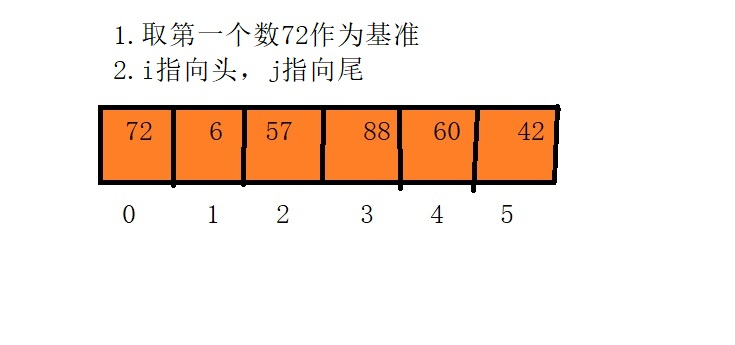
二：
首先基准值是72，i指向下标0，j指向下标5,将基准值看成一个坑，此时下标0位置是一个坑，那么从后面向前找一个小于基准值的数字去填这个坑，找到第一个小于基准值72的是42，所以42放到坑了，此时的i+1,(记住左边坑被填了i+1,,右边坑被填了j-1)所以i指向了1，j还是指向5，且下标5位置变成了一个坑,如下图，就是此时的状态。
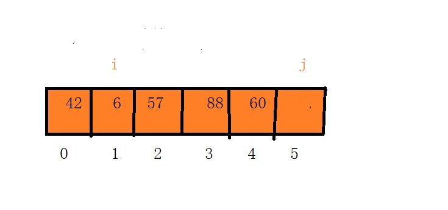

三：接下来i往后找，找到第一个大于等于72的数字，找到了88，下标是3，所以i停在了3的位置，将88补到坑里，所以下标5的坑里是88，j-1,j变成了4.且i的位置成了新坑，如下图所示
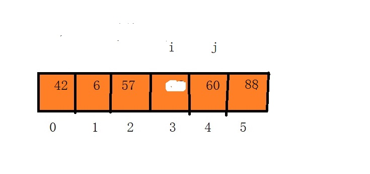

四：j继续向前找，找到第一个小于基准值72的，是60，将60放到坑里，i+1,i变成了4,此时i和j相等，分区结束，且新坑位置也是i和j的位置，将基准值放进去，如下图所示

上面演示的就是一次分区操作，然后按照分治，直到区间只剩一个元素。想着这个，十分容易写出代码

	//快速排序核心
	void sort_Qucik(int *arr, int low, int high)
	{
		if (low < high)
		{
			int index = partition(arr, low, high);
			sort_Qucik(arr, low, index - 1);
			sort_Qucik(arr, index+1, high);
		}
	}
	//分区
	int partition(int *arr, int low, int high)
	{
		int x = arr[low];//第一个数字为分区标价点
		int i = low, j = high;
		while (i < j)
		{
			//从右边开始找小于分区数字的
			while (i < j && arr[j] >= x)
			{
				j--;
			}
			if (i < j)
			{
				arr[i++] = arr[j];
			}
			//从左边开始找大于分区数字的
			while (i < j && arr[i] < x)
			{
				i++;
			}
			if (i < j)
			{
				arr[j--] = arr[i];
			}
		}
		//最终位置访问x
		arr[i] = x;
		return i;
	}

总结：
1.最好事件复杂度=平均时间复杂度=0(nlog n)
2.最坏时间复杂度=0(n^2)
3.快速排序是不稳定的算法
### 3.希尔排序
简介：希尔排序是分组插入排序，是对插入排序的升级。

该方法的基本思想是：先将整个待排元素序列分割成若干个子序列（由相隔某个“增量”的元素组成的）分别进行直接插入排序，然后依次缩减增量再进行排序，待整个序列中的元素基本有序（增量足够小）时，再对全体元素进行一次直接插入排序。因为直接插入排序在元素基本有序的情况下（接近最好情况），效率是很高的，因此希尔排序在时间效率上比前两种方法有较大提高。

**举例分析**：

以n=10的一个数组49, 38, 65, 97, 26, 13, 27, 49, 55, 4为例
每一步的演示有两个图片，上图是划分一组数据，下图是排序后的情况
####第一次：step = 10/2 = 5;
所以每一次步长是5，下标0和下标5是一组，下标1和下标6是一组，我用字母相同的表示一组。然后对每一组进行排序(插入排序)排序后的如图所示。
第一次排序后的数组是13,27,49,55,4,49,38,65,97,26

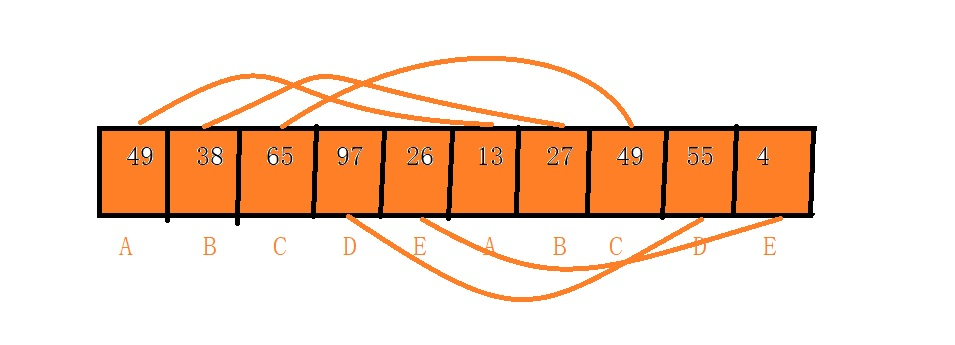
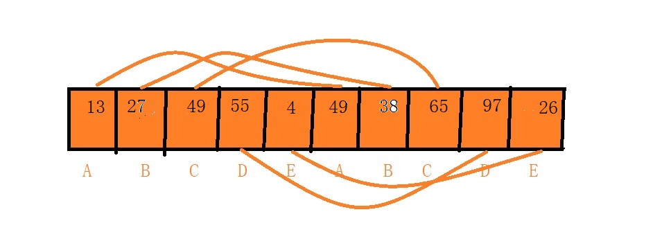

####第二次：step = 5/2 = 2;
所以每一次步长是2，下标0,2,4,6,8是一组，下标1,3,5,7,9是一组，我用字母相同的表示一组。然后对每一组进行排序(插入排序)排序后的如图所示。
第二次排序后的数组是4,26,13,27,38,49,49,55,97,65
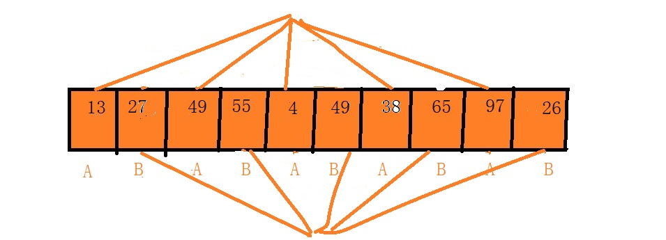

####第三次：step = 2/2 = 1;
所以每一次步长是1，下标0,1,2,3,4，5，6，7，8，9是一组。然后对这一组进行排序(插入排序)排序后的如图所示。
第三次排序后的数组是4,13,26,27,38,49,49,55,65,97

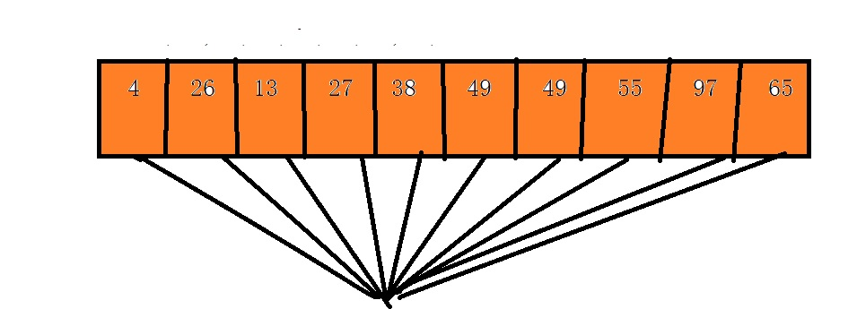

	
	void sort_Shell(int *arr, int len)
	{
		int step, i, j,data,index;
		for (step = len / 2; step > 0; step /= 2)
		{
			for (i = 0; i < step; i++)
			{
				//开始插入排序
				for (j = i+step; j < len; j += step)
				{
					data = arr[j];
					index = j - step;
					while (index >= i && data < arr[index])
					{
						arr[index + step] = arr[index];
						index = index - step;
					}
					arr[index + step] = data;
				}
			}
		}
	}

要想写出这段代码，必须先把上述过程写一遍，对比着写就可以写出来。
总结:
1.最好时间复杂度=最坏时间复杂度=平均复杂度=0(nlog n)
2.因为步长排序，所以希尔排序是不稳定的算法。

### 4.堆排序

堆排序是借助完全二叉树完成的，在树中，我们讲过，完全二叉树用数组存储(空间不会太浪费)。在讲解堆排序前，我们需要了解什么是堆?

问题:什么是堆?
堆有两种，大堆和小堆，我们分别用概念和图示表达。
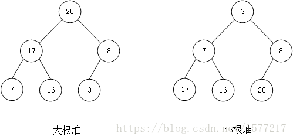
大根堆就是左图，所有节点总是大于其左右孩子节点的值。
小根堆就是右图，所有节点总是小于其左右孩子节点的值。

堆排序整个详细过程描述

#### 1.我们准备一个数组
array[3,7,8,20,16,17]
#### 2.数组对应的完全二叉树就是下图
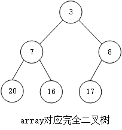
#### 3.我们先初始化堆，默认初始化为大堆
**初始化堆的关键，从倒数第一个非叶子节点开始调整，按照定义(大于左右孩子)，一直调整到根节点停止，初始的大堆就建立好了。
**
注意点1.完全二叉树下标是有特点的，第一个非叶子节点下标是len/2-1（默认下标从0开始）,
注意点2.堆中每个节点在调整时，并不是调整一次，要一直调整到叶子上停止

#### 4.在初始好的堆上，开始每次将第一个数，与最后一个数交换。然后len-1,（可理解为，将第一个数就是最大的数归入已经排序好的数组里,后面不考虑）,开始调整堆，，重复上述操作，直到len=1停止。

交换第一个与最后一个数据，如下图
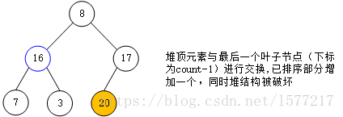

对应数组就是最后一个是最大的，不考虑了，如下图
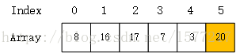

将交换数据后的堆调整，按照步骤3调整规则，如下图
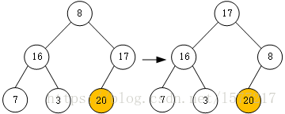

下面是整个过程图，如下图
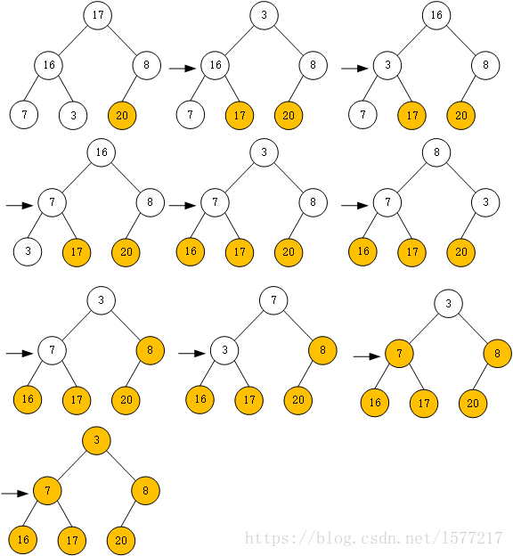
	
	//堆排序主体
	void sort_Heap(int *arr, int len)
	{
		//从非叶子节点到根节点开始调整，构建大顶堆
		for (int i = len / 2 - 1; i >= 0; i--)
		{
			adjust_Heap(arr, i,len);
		}
		print(arr, len);
		//开始堆排序过程
		for (int i = len-1; i > 0; i--)
		{
			int temp = arr[i];
			arr[i] = arr[0];
			arr[0] = temp;
			//交换数据结束，立马调整堆
			adjust_Heap(arr, 0, i);
		}
	}

	//堆调整代码
	void adjust_Heap(int *arr, int index,int len)
	{
		//从当前节点开始调整，一直向下走到最后一个非叶子节点
		int maxIndex,temp;
		while (index <= len/2-1)
		{
			maxIndex = index;
			//找出左右孩子和自己三个之间的最大值。
			if (2*index+1 <len && arr[maxIndex]< arr[2 * index+1])
			{
				maxIndex = 2 * index + 1;
			}
			if (2 * index + 2 < len && arr[maxIndex]< arr[2 * index + 2])
			{
				maxIndex = 2 * index + 2;
			}
			//如果找到的最大值不是自己，交换数据,继续向下调整堆.
			if (maxIndex != index)
			{
				temp = arr[maxIndex];
				arr[maxIndex] = arr[index];
				arr[index] = temp;
				index = maxIndex;
			}
			else
			{
				return ;
			}
		}
	}

上面所有讲解的都是堆排序，堆还有一个自己重要的两个操作
堆顶的删除和堆插入数据，其实堆排序中这两个思想都已经体现出来了。
#### 堆顶的删除
和堆排序的思想一样，将堆顶元素和最后一个元素交换，调整堆，向下调整，将len-1

#### 堆中插入数据

和堆排序的思想一样，将数据线插入到堆的最后一个位置，len+1,然后第一个从该插入节点父亲开始向上条调整，直到根。

**堆数据只有在初始化建堆，是从倒数第一个非叶子点到根，逐个的调整，每个都要向下调整，到叶子停止，在堆的删除中，交换头尾，将根向下调整，在堆的插入时，数据放到最后面，从该数据的父元素开始，向上调整。**

#### 堆的应用

**查找海量数据中的前k大或者小(实际应用到今日微博点击量前10等)**
如果你说微博的工程师，你将如何设计微博每日动态的前10点击量?

步骤一：我们假设数据量很大，超过几亿条点击查询，我们可以将每次浏览的数据遍历一遍。通过哈希值(设计好的)存储在哈希表中，如果这条数据在哈希表中有，在原数据+1，代表访问次数，没有的，根据哈希值，插入到哈希表里面，并设置访问记录为1,这样，我们的哈希表就存储了不重复的浏览记录，同时记录了不同记录的访问量。
步骤二：我们可以设计规模为k的小根堆(此处k为10)，我们给规模为k的小根堆全部初始化为0，然后依次遍历散列表。如果哪条数据大于堆顶数据，删除堆顶，将这条数据放到堆顶，向下调整堆。经过一轮遍历散列表，此时的小根堆就保存了前k大数据。
问题：为什么设计的小根堆？我可以通过排序，找出前k大啊.对于静态的数据，我们可以通过数组保存，我们可排序数据，时间复杂度0(nlog n),堆是0(klogn),可以等同，但是微博点击肯定是动态的，那个数据访问量是变化的，那么我们就需要每变化依次，排序依次事件复杂度就剧增o(n*nlogn),且数据假设重复性很低，数组开辟的空间岂不是很大的。而我们用堆，新数据产生是，计算哈希值，如果存在，給对应数据访问量+1，并判断是否入堆。整个过程，我们每次都是计算了哈希值 ,时间复杂度是0(nlogn)。

总结：
1.堆排序因为发生了位置交换，所以不是稳定的排序算法。
2.最好时间复杂度=最坏-平均=0(n logn)