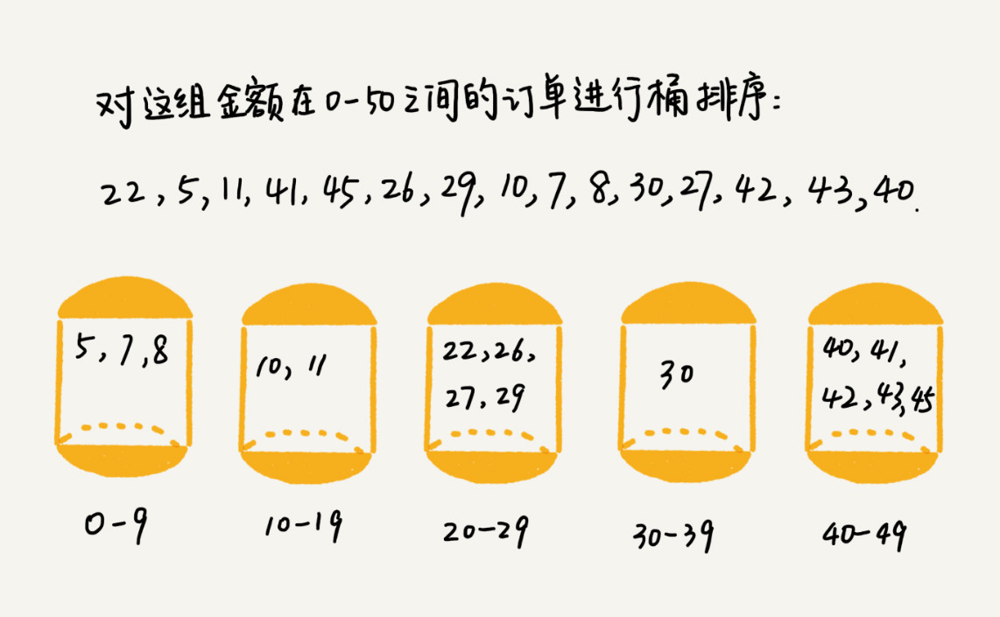

## 十大排序(3)

今天我们学习10大排序的第三大类0(n)时间复杂度的排序
+ 计数排序
+ 桶排序
+ 基数排序

### 1.计数排序

分析：

1。找出待排序数组arr1的最大和最小值（确定数字范围）
2。根据范围创建新数组arr2
3。arr1数组的值就是arr2数组对应的下标(注意是下标),遍历arr1数组，每个数字出现的次数就是arr2下标对应的数字加1，（arr2初始全是0，表示该下标数字未出现）
4。将arr2数组进行前缀相加
5。创建arr3保存排序后的数据
6。逆序遍历原数组arr1,根据每次遍历到的value找到arr2数组的位置，该位置存储的数字就是value在数组arr3的位置,然后将arr2数组位置对应数字-1(比较绕，看下面例子)
7。arr3就是最终结果

举例分析：
假设班级有8名考生，考生成绩存储在arr1,成绩分别是2，5，3，0，2，3，0，3
首先我们可以确定成绩的范围是0-5，然后根据范围创建新数组arr2,arr2的下标就是对应学生的分数,逐个遍历arr1,存入对应arr2数组里面去,arr2存储的是下标分数出现的次数
看下图就是arr2

看下标0，对应的数字是2，代表分数是0的考生是2位。(这下该懂了吧)
接下来就比较绕了(之前我也懵逼)，将arr2进行前缀相加,如下图

我们从后到前依次扫描数组 arr1。比如，当扫描到 3 时，我们去arr2数组查下标3对应的数字是7，这个数字代表小于等于3的数字有7个(包括自己3),所以把自己存储在新数组arr3下标为6的位置(数组下标从0开始),,依次进行遍历到arr1

	template<class T>
	void Sort<T>::sort_Count()
	{
		T min, max;
		int i;
		min = this->arr[0];
		max = this->arr[0];
		//找最小和最大值
		for (i = 1; i < this->len; i++)
		{
			
			if (arr[i] < min)
			{
				min = arr[i];
			}
			if (arr[i] > max)
			{
				max = arr[i];
			}
		}
		//按最小值和最大值创建数组
		T *arr2 = new T[max - min + 1];
		T num = 0 - min;//关键的一个数字
		for (i = 0; i < max - min + 1; i++)
		{
			arr2[i] = 0;
		}
		for (i = 0; i < this->len; i++)
		{
			arr2[this->arr[i] + num]++;
		}
		//将数组前缀相加
		for (i = 1; i < max - min + 1; i++) 
		{
			arr2[i] = arr2[i] + arr2[i - 1];
		}
		//创建arr3,逆序遍历原数组，按值找到temp数组位置
		T *arr3 = new T[this->len];
		for (i = this->len - 1; i >= 0; i--)
		{
			T index;//标记arr2数组下标
			index = this->arr[i] + num;
			arr3[arr2[index] - 1] = this->arr[i];
			arr2[index]--;
		}
		delete [] this->arr;
		this->arr = NULL;
		this->arr = arr3;
	}

疑惑点：
1.为什么不将第三部那个数组，逐个遍历出来，就产生了排序好的数组。（这个问题十分好）我之前也疑惑了好久，为什么要进行后面繁琐的步骤。呵呵，原因就是为了保持元素的稳定性

什么是算法的稳定性？
稳定性。这个概念是说，如果待排序的序列中存在值相等的元素，经过排序之后，相等元素之间的相对顺序保持不变

所以说，我们直接遍历第三步数组，是正确的，但是破坏了稳定性，因此后面是必须要的

2.算法稳定性的重要性
我们大学阶段排序都研究基础数据，实际开发中，大都是复杂数据类型，例如c++中各种类对象的排序，排序要求十分严格，这个时候，稳定性极其重要.

总结：
1.算法最差时间复杂度=最优时间复杂度=平均时间复杂度=0(n+k),k是数据范围。如果数据范围过大，耗内存就会巨大。
2.计数排序只适合数据范围较小的数据(核心)
3.计数排序是稳定的算法

### 2.桶排序

分析：
桶排序核心就三点。
第一步：确定映射关系，即确定桶的分布--这一步最关键，好的映射直接影响性能问题
第二步：遍历待排序数组，按照映射，将元素放到每个桶里
第三部：每个桶内数据进行排序。
第四步：从第一个桶到遍历，逐个取出数据。
桶分步是有序的，即第一个桶数据最小,依次类推

	template<class T>
	void Sort<T>::sort_Bucket()
	{
		int i,j;
		T max, hash;
		Node<T> *table,*p, *q, *temp;
		max = arr[0];
		table = new Node<T>[this->len];//桶
		for (i = 1; i < this->len; i++)
		{
			if (arr[i] > max)
			{
				max = arr[i];
			}
			table[i].next = NULL;//初始化桶
		}
		table[0].next = NULL;
		//遍历数组，分别入桶
		for (i = 0; i < this->len; i++)
		{
			hash = (arr[i] * this->len) / (max + 1);
			if (table[hash].next == NULL)
			{
				temp = new Node<T>;
				temp->data = this->arr[i];
				temp->next = table[hash].next;
				table[hash].next = temp;
			}
			else
			{
				temp = new Node<T>;
				temp->data = this->arr[i];
				q = &table[hash];
				p = table[hash].next;
				while (p != NULL && p->data <= temp->data)
				{
					q = q->next;
					p = p->next;
				}
				if (p == NULL)
				{
					temp->next = p;
					q->next = temp;
				}
				else {
					temp->next = p;
					q->next = temp;
				}
			}
		}
		//遍历桶，取出数据
		j = 0;
		for (i = 0; i < this->len; i++)
		{
			p = table[i].next;
			while (p != NULL)
			{
				this->arr[j++] = p->data;
				p = p->next;
			}
		}
	}

总结：
1.桶排序思路简单，但是核心要领就是映射函数选择恰当。
2.桶的个数接近于待排序元素的个数时，时间复杂度最低，最好。
3.桶排序多应用于外部排序中。
4.最好时间复杂度=平均时间复杂度=0(n+k),最坏复杂度是0(n^2)
最坏的情况就是，映射函数设计不合理，所有数据堆积到一个桶，所有数据遍历一遍，还要再桶里面排序就是0(n^2)了
5.桶排序是稳定的算法

### 3.基数排序

分析：
基数排序是按照低位先排序，然后收集；再按照高位排序，然后再收集；依次类推，直到最高位。有时候有些属性是有优先级顺序的，先按低优先级排序，再按高优先级排序。最后的次序就是高优先级高的在前，高优先级相同的低优先级高的在前。基数排序基于分别排序，分别收集，所以是稳定的。

大家看动图,然后在本子演示一遍就明白了!

	template<class T>
	void Sort<T>::sort_Radix()
	{
		//1.找出最大数
		T max;
		int i,count;
		max = this->arr[0];
		for (i = 0; i < this->len; i++)
		{
			if (this->arr[i] > max)
			{
				max = arr[i];
			}
		}
		//2.确定最大数的位数
		count = 0;
		while (max != 0)
		{
			max = max / 10;
			count++;
		}
		//3.从最低位开始逐个放数据，取数据
		Array<T> * arr = new Array<T>[10];//存放0--9的桶
		for (i = 0; i < 10; i++)
		{
			arr[i].data = new T[this->len];//每个桶的最大容量就是待排序数据
			arr[i].len = this->len;
		}
		for (i = 0; i < count; i++)
		{
	
		}
	}

总结：
1.基数排序的使用场合：**排序的项目是具有大范围但几位数的整数**
2.最好时间复杂度=最差时间复杂度=平均时间复杂度=0(n*k)=0(n)
3.基数排序是稳定的算法