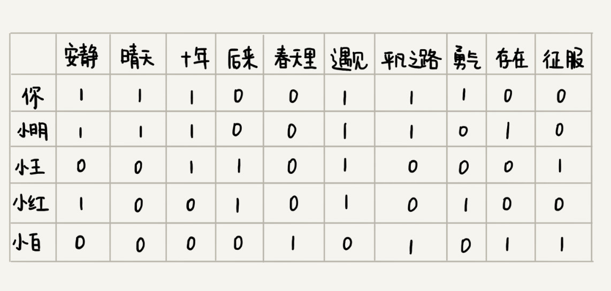
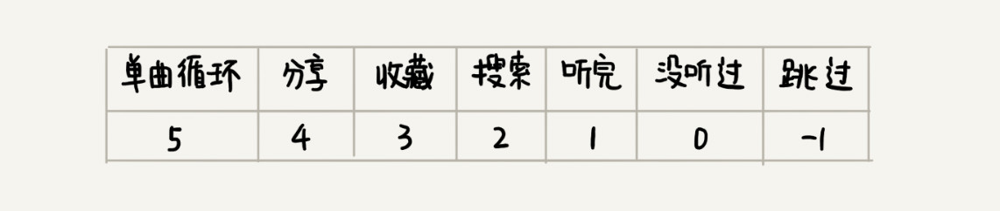
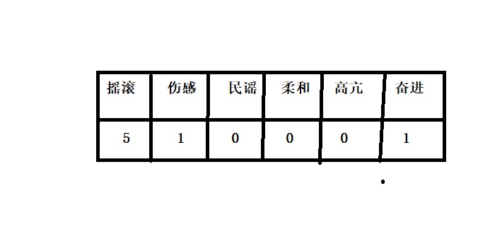

<h2 style="color:red">向量空间</h2>

<h4>前言:</h4>
生活中，我们大多数人都喜欢音乐，尤其是改革开放后的一代代门，现实中，我们大多用户都会去网易云，腾讯音乐，酷狗音乐等知名App上听歌，大家有没有发现。这些App都有每日推荐的功能，而且我门会惊奇的发现，这些推荐还真的是大致符合我们的口味，你们究竟又没有想过这些都是如何实现的？那么今天我们来浅谈推荐系统的原理和底层。

<h4>原理猜测:</h4>
基于这种音乐推荐，我们分为两类**用户**和**歌曲**

+ 根据其它用户和你有相同喜爱偏好的，把他的音乐推荐给你
+ 根据你喜欢的歌曲特征，海量搜索相似歌曲推荐给你

<h4 style="color:red">基于用户的推荐</h4>

我们可以设计一张表格去统计每一个用户对歌曲的喜爱，用1表示喜欢，0表示其它情况(可能没听过，所以不可以笼统的定义为不喜欢)，此时哪些用户和你喜欢的歌曲重复最多，我们可以判定你两口味一样。

看图，我们发现你和小明拥有的共同的爱好歌曲多，那么在开发时，我们可以判定你两口味一样，将小明歌曲推荐给你，但是这个共同爱好不能笼统去判断，我们可以设置一个阈值，当超过这个阈值，就自动判断出来。 
此时又有一个问题，就是仅仅根据数字1就判定用户喜欢这个歌？到底多喜欢？是否可以用具体值去判定？ 
当然，我们可以更具体地统计每个用户和你口味相似程度，对于每首歌曲，我们因该根据不同分数定义则这个人对这首歌曲多喜欢，看下图

每首歌曲都要去根据分数判断对这首歌程度。

此时我们是累加这些分数，根据分数最接近的去判断你两口味相似？这个看起来是可以的，但是在数学中，有一个专门定义数据接近相似度的，叫欧几里得距离，欧几里得是判断两个向量间距离的，此时我们可以把每个用户的歌曲定义成向量. 我先给大家回忆下向量的知识吧，一维空间向量就是1 ,2 ,3这些一个个单独的数字，二维空间向量就是(1,2)
(2,3)这些成对的坐标表示平面，三维空间向量就是立体的(1,2,3)三对数字去表示，类别n维空间就是(x,y,z,v,b...);

所以我们把每个用户都看成一个向量，对每个用户都和自己求距离，距离最近，可间接表示你两口味一致。

<h4 style="color:red">基于歌曲的推荐</h4>

基于歌曲的相似度推荐和上面的原理一样，我们可以脑洞打开的设计歌曲的特征向量，例如每首歌曲特征向量如下图

计算你的歌曲和其他歌曲的欧几里得距离，当这个距离接近某个阈值的时候，可判定这首歌可以推荐给你。 

> 
上面的两类就是我们生活的经典案例，我们只是简单的描述其中的一部分原理，可以发现算法的魅力所在和强大的创造力，希望大家理解算法爱上算法。

