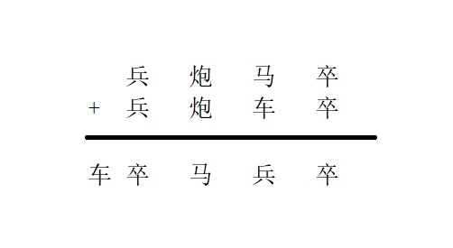

## 回溯算法

#### 1.回溯法的简介
回溯法就是在尝试穷举搜素的同时，当发现某一步走不通时，可以回退到前一步，继续寻找问题的解。

#### 2.回溯法的解题步骤

+ 针对问题确定问题的解空间树，问题的解空间树可以包含问题的一个解或者多个可行解。
+ 根据题目要求，确定树的扩展搜索规则。
+ 用深度搜索的方式搜索解空间树，并在搜索的同时可以采用剪枝函数去避免不必要的搜索，其中，搜索的方式可以采取递归和非递归去回溯

####3.回溯的种类
我们大致可以将回溯问题分为两大类问题上，一类是排列树问题，一类是子集树问题。
大多的算法都是这两类，但是千万不可局限这两类树空间，我当时每次做题就非得把这个题架构到这两类树上，看属于哪个用哪个，一定要灵活处理，有其它类的解空间树

> 接下来我会通过解析几个经典的题目，细细的从空间树，回溯方式，和代码的几个角度去解析回溯法，希望你能坚持看完。

<h3 style="color:red">问题1</h3>
> 给一个数列，求该数列的幂级

**分析**:首先我来帮大家回忆下幂级的概念，我直接举例子吧，我表达可能不清晰，直接举例子写，你就会了。

（1，2，3）的幂级是(),(1),(2),(3),(1,2),(1,3),(2,3),(1,2,3),第一个括号里面是空集的意思。我们仔细分析，这个是回溯的哪个种类?子集树？还是排列树？其它？当然，你肯定可以分析出这个是子集树。

**画解空间**:

我来分析下我画的子集树，树的左边总是代表不选择当前的数字。右边总是代表选择当前的数字。首先根节点初始是空集，走到第二层，第二层是对数字1的选择与否，走左边，集合是1，走右边集合还是空的，继续往第三层扩展，集合1走左边选择数字2，集合变(1,2),走右边集合不选择数字2，集合还是(1),右边同样的道理。继续向下扩展，直到数字3被扩展进去，结束。此时得到的解空间树就是我们的幂级了。是不是很神奇

**代码部分**

	void Get_Power_Set(int *arr1, int *arr2, int len, int index)
	{
		//回溯到叶子时，直接打印幂集
		if (index >= len)
		{
			printf("( ");
			for (int i = 0; i < len; i++)
			{
				if (arr2[i] != 0)
				{
					printf("%d ", arr2[i]);
				}
			}
			printf(")\n");
		}
		else
		{
			//选择这个数字
			arr2[index] = arr1[index];
			Get_Power_Set(arr1, arr2, len, index + 1);
			//不选择这个数字
			arr2[index] = 0;
			Get_Power_Set(arr1, arr2, len, index + 1);
		}
	}

<h3 style="color:red">问题2</h3>

> 在象棋算法里，每个棋子都代表0-9中数字，每个棋子代表的数字不一样。有下图的一个算式，请用回溯法推导出兵炮马卒车分别代表哪些数字

**分析**：我们用穷举法很容易计算出这个题，但是我们现在要求用回溯法解决这个题。
首先我们分析问题的空间树是哪一类？这个我当时就纠结是子集树还是排列树，其实都不是的。

**画解空间树**

因为数字太多了，我画了一部分，第二层就是兵的可选择的数字0-9，那么下一层马的就得少一个数字的选择.一直往下到车，一直比上一层少一个数字的选则，总共除去根节点就5层。

**代码**

<h3 style="color:red">问题3</h3>
简单0/1背包问题：有n个重量分别为w1,w2,w3..的背包对应的价值分别是v1,v2,v3,..
给定一个容量为W的背包，设计装入物品，使得背包价值最大，注意此处的条件是两个，所选择物品重量恰好等于容量和物品总价值最大。下图是不同物品的价值和重量

|物品编号|重量|价值|
|----|----|----|
|1|5|4|
|2|3|4|
|3|2|3|
|4|1|1|

**背包的最大容量设置为6**

**分析**
首先，对于每个物品，我们都是选择与不选择问题，那解空间就是子集树，其次，由于要求容量不能超过背包容量，这个就涉及剪枝函数了，就是当加入某个物品时，超过了背包最大容量，我们就剪枝，停止向下找。其实还存在一个剪枝函数，这个不容易发现，就是当我们考虑某件物品装入时，如果把剩余物品都装入，都不能装满背包，那也要剪枝，因为题目要求的是刚好填满背包。

**空间树**

首先初始物品总重量是0，总价值也是0。 进入第一层时，走左边代表选择物品1，走右边不选择物品1，当选择了物品1时，对应的总重和价值就是(5,4)进行剪枝函数判断，此时的总重量没有超过背包最大容量，不剪枝，进行第二个剪枝函数的判断，当加入其它所有剩余物品时，可以撑满背包，也不剪枝。当不选择物品1时，对应的总重和价值就是(0，0)进行剪枝函数判断，首席按容量不超过背包，其次加入其它剩余物品，也可以盛满，不剪枝。  
接下来就是第二层(5,4)节点的拓展了，向左是选择物品2，此时的总重和总价值是(8,8),我们发现超过了背包容量，进行剪枝，所以左边停止搜素了，右边代表不选择，因此总重和总价这不变，还是(5,4)，搜先容量没超过，其次加上剩余物品总重量也可以超过容量，也不用剪枝。然后是第二层(0,0)节点的扩展了，走左边选择物品2,此时总重量没超过背包容量，同样的，加上剩余物品可以盛满背包，所以不用被剪枝，此时的总重和总价值更新为(3,4),走右边表示不选择物品2，背包容量足够，但是加上剩余物品，不足以撑满背标，剪枝。  
因为后面步骤和上面都一样，所以大家按照上图手动推导就行了。

**代码**

<h3 style="color:red">问题4</h3>
有n个集装箱要装入一艘轮船，轮船的载重量为W，现在要从集装箱中选出若干个，使得它们重量和等于W，且要求货物的个数最少。
假设我们题目的W是10，n = 5,每个货物的重量是5,2,6,4,3

**分析**
这里的每个货物都是选择与不选择问题，所以肯定是解空间是子集树问题。和背包问题一样，左分支的剪枝条件是当前总重量不超过最大载重量，右分枝的剪枝条件是当前剩余物品加上当前选择物品总重量大于载重量。在满足条件里面挑选出集装箱个数最少的就是问题的解了。

**解空间树**

####问题5
求解任务分配问题
####问题6
n皇后问题
####问题7
全排列问题
####问题8
活动安排问题

