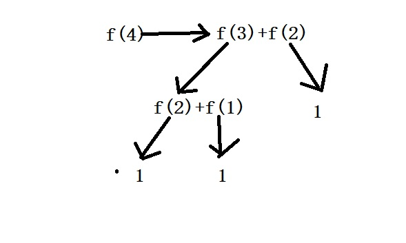
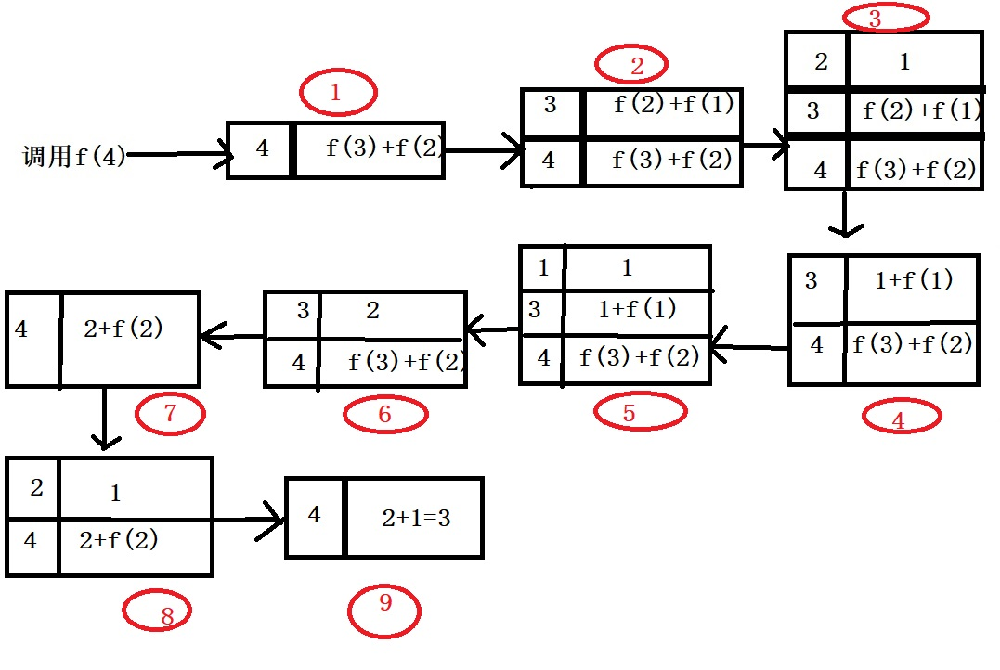
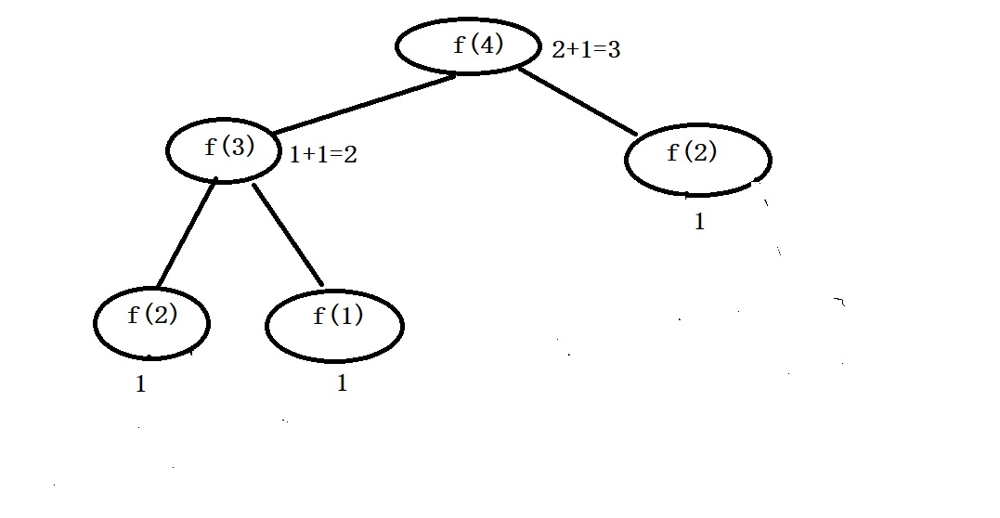

<h2 style="color: red">递归模型</h2>
本章节，我们共同去解决大学阶段遇到的递归问题，是如何执行代码的。

这里我将用三种方式去剖析递归执行顺序

<ul>
	<li style="color:red">顺序分析法</li>
	<li style="color:red">栈模拟法</li>
	<li style="color:red">递归树处理法</li>
</ul>

我们先准备一个斐波拉契数列的定义

Fib(n)=1---------------------------------n=1时                  
	
Fib(n)=1---------------------------------n=2时                      

Fib(n) = Fib(n-1)+Fib(n-2)---------------n>2时

对应的递归算法如下

	int Fib(int n)
	{
		if(n==1 || n==2)
		{
			return 1;
		}else
		{
			return Fib(n-1)+Fib(n-2);
		}
	}

<h4>第一类:顺序分析法</h4>

这里我们假设求Fib(4)的值。既然是顺序分析法，就是一步步手动推导代码执行顺序，（整个过程比较繁杂，容易出错误）

我们来看整个过程，要求F（4），递归直接进入f(3)+f(2),然后f(3)和f(2)分别进入自己的递归函数，分解过程如上图所示，
所以f(4) = f(3)+f(2) = f(2)+f(1)+f(2) = 1+1+1 = 3;

<h4>第二类:栈模拟法</h4>
>在程序语言中，都有一个系统栈，这个栈帧大小不固定，都是由当前函数的局部变量有关，寄存器指向当前栈顶，每次新建一个局部变量时，入栈，每次遇到局部变量释放时，出栈。

在本程序中，每次进入一个新递归口，都会入栈保存，当一个递归口结束声明周期时，退栈。
第一次看可能看不懂整个流程，我来分析前3个，后面大家可以自己推导。

首先f(4)进入递归，产生了f(3)+f(2)入栈，然后f(3)在前面，先进入f(3)递归，开辟了f(2)+f(1)入栈,接下来因为f(2)在前，直接产生了数字1，入栈。发现1之后递归结束，层层释放，并放回到了f(2)那里，所以f(2)=1此时的图4中的，就是f(2)+f(1)变成了1+f(1),此时调用f(1),开辟了数字1，入栈，然后退出并带回数字1到f(1)，此时栈的1+f(1)那一层变成2，后面的就是同样的道理，层层回退到栈空，返回数字3为止。

<h4>第二类:递归树</h4>

我们可以发现递归树是比较形象和不易出错的梳理递归的方式。

