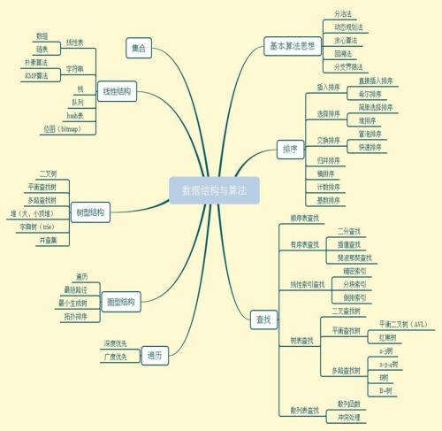

<h2 style="color:red">Data Structure Budget Metho-数据结构与算法</h2>

## 目录

* [背景介绍](#背景介绍)
* [项目介绍](#项目介绍)
* [使用说明](#使用说明)
  * [获取代码](#获取代码)
  * [运行环境](#运行环境)
  * [案例特色](#案例特色)
     * [内置md文档讲解](#md文档)
     * [包含详细代码设计](#代码)
  * [其它](#其它)
    
## 背景介绍

> 此数据结构完整文档讲解和代码是我在大二暑假(军训无聊做的) 
> 
做这个的目的，一个是答应我大一社长去给他将一些算法，其实他很强，有上进心，我只是尝试去做的。另一个目的就是我大二暑假被拉去军训(秘密)

## 项目介绍
此算法设计的初衷就是用最直白的话，加上最朴素的语言表达最复杂的数据结构与算法。 

目前网上各种数据结构与算法书籍层出不穷，我在学习阶段也去阅读过，发现晦涩难懂都是形容好的，复杂的简直是天方夜谭啊，为此我去尝试结合自己的代码特色去加上md文档讲解算法和数据结构的本质去简化算法，所以就设计出第一版的数据结构算法文档。 

希望大家来互相指导，参考的讲解的文档去认识算法，我个人能力还是比较low,难免出许多错误，代码也是仅仅测试了2遍，可能也会没考虑到边界值问题。有兴趣的同学，可以去学习并联系我。

## 使用说明

+ 首先我写这个，必须要求你得先系统的学过数据结构与算法，不需要太熟悉，但也不能是完全的小白吧。
+ 在你有了一定基础后，先阅读文档，每篇都很短，可能不足的地方也很多的，希望批评指正。
+ 接着去参考我写的代码去剖析，不同于大学课本那种，我参考c++的STL,性值，大多数有自动扩容性值，但是还是考虑算法的本质问题。
+ 最后，就是自己一定要动手尝试去写出代码，做做笔记啥的。

> 总的说下，如果想看讲解文档，您可以百度搜**简书**,在里面搜索董泽平就可以找到我写的专辑了。当然您感觉自己外网速度可以就在github的笔记专栏直接看。

## 获取代码

代码就在文件名为Dong的下面，点进去你会看到下面四个文件夹分枝

+ C
+ C++
+ Java
+ md(笔记)

## 文档的阅读

如果你感觉在Github上阅读文档和代码不舒服，你可以下载下来代码部分，文档部分你完全不用下载，我已经将文档同步发布到简书App上面了，你可以在这里浏览，评论，我有空会回复在座的。后面附上简书地址。在关注栏，搜索我的名字:董泽平

简书地址：<https://www.jianshu.com/> 
搜索栏搜索董泽平就可以看到我了

**后续，我可能会将文档继续更新，并发布到我的个人网站上面，或者我的其它东西上，后面上的课还很多，多多谅解哦**

## 关于我

我先笑笑，本人是延安大学的本科生，这个文档是我在北京理工大学交流学习时，当时两个月参加了国庆阅兵训练，期间闲的没事干，就写了这些专辑。图片是我经常一个人呆的地方--北理综教，经历过许多美好学习记忆，此处晚上空气清爽，学习氛围恰到好处。说多了...

谢谢大家阅读和指正哦!
